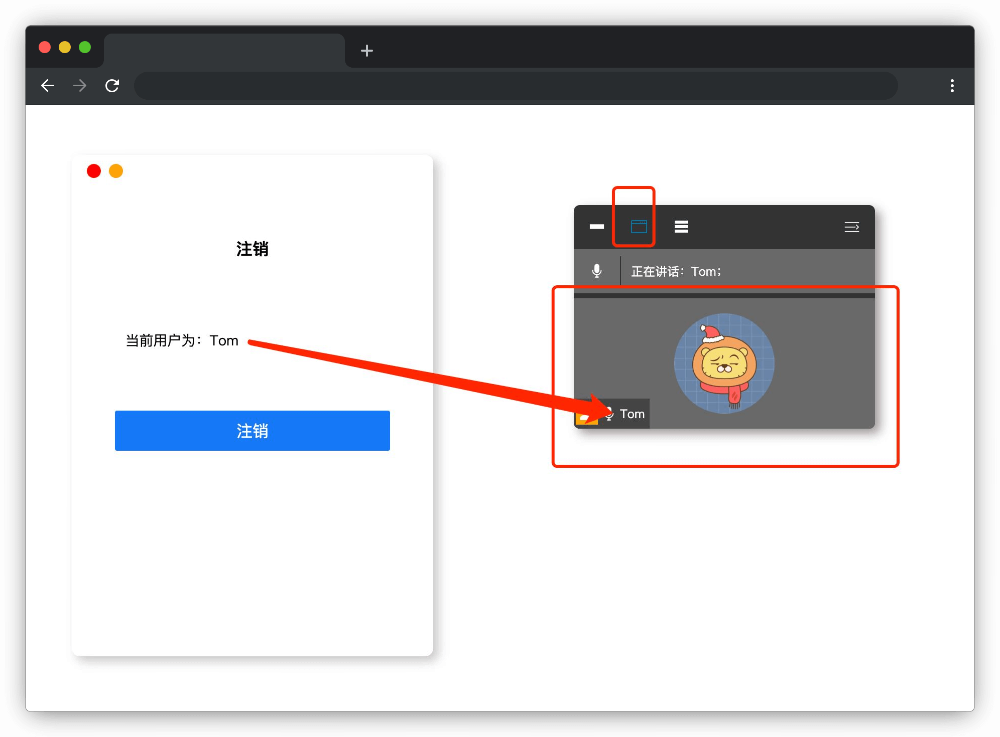

# 一起会议吧

## 介绍

网络会议已经成为当下最流行的会议模式，为网络会议提供支持的当然是一些优秀的会议软件。

本题需要在已提供的基础项目中使用 Vue 2.x 知识完善代码，最终实现**网络会议软件中，参会人员列表的几个展示效果**。

## 准备

开始答题前，需要先打开本题的项目代码文件夹，目录结构如下：

```txt
├── effect.gif
├── index.html
├── css
├── images
└── js
    ├── axios.min.js
    ├── userList.json
    └── vue.js
```

其中：

- `effect.gif` 是最终实现的效果图。
- `index.html` 是主页面。
- `css` 是样式文件夹。
- `images` 是图片文件夹。
- `js/axios.min.js` 是 axios 文件。
- `js/userList.json` 是需要请求的数据文件。
- `js/vue.js` 是 Vue 2.x 文件。

注意：打开环境后发现缺少项目代码，请手动键入下述命令进行下载：

```bash
cd /home/project
wget https://labfile.oss.aliyuncs.com/courses/9788/07.zip && unzip 07.zip && rm 07.zip
```

在浏览器中预览 `index.html` 页面，显示如下所示：



## 目标

请在 `index.html` 文件中补全代码，最终实现**网络会议中参会人员列表的几个展示效果**。

具体需求如下：

1. 实现**异步数据读取和渲染**功能。

- 使用 axios 异步获取 `./js/userList.json` 中的用户数据（注意：调试完成后请将请求地址写死为 `./js/userList.json`），并显示在**登录窗口**及**参会人员窗口**中。效果如下：


2. 实现**登录、注销切换**功能。

- 在登录窗口选取用户登录后，登录窗口切换为注销窗口，具体变化为：**登录**标题变为**注销**字样；**选择用户**下拉框变为显示**当前登录用户名**；**登录**按钮变为**注销**按钮。**参会人员窗口**显示，并**默认只显示**当前**登录用户信息**。效果如下：


- 在注销窗口点击注销按钮后，注销窗口切换为登录窗口，参会人员窗口消失。效果如下：


3. 实现**参会列表中的首位用户始终为登录用户**功能。

- 参会列表中的首位用户始终为登录用户。效果如下：


4. 实现**用户窗口显隐切换**功能。

- 通过点击**隐藏参会用户窗口**或**显示参会用户窗口**按钮图标，可切换**参会人员窗口**的显隐。效果如下：


5. 实现**用户列表显示效果切换**功能。

- 点击**显示所有参会人员**的按钮图标，图标变色（即 **`class=active`**），**参会人员窗口**内的人员列表显示所有参会人员信息。效果如下：


> 注意，参会人员列表中用户名称前面的黄色小图标，代表的是该成员为会议发起者，与当前登录用户无关。与之对应的 `./js/userList.json` 中的字段为 `isHost`，其中 **`"isHost": true`** 为会议发起人，**`"isHost": false`** 为普通参会成员。

- 点击最左侧的**不显示参会人员列表**的按钮图标，图标变色（即 **`class=active`**），**参会人员窗口**内的人员列表隐藏。效果如下：


- 点击**只显示当前登录用户**的按钮图标，图标变色（即 **`class=active`**），**参会人员窗口**内的人员列表中只显示当前登录用户信息。效果如下：


完成后的效果见文件夹下面的 gif 图，图片名称为 `effect.gif`（提示：可以通过 VS Code 或者浏览器预览 gif 图片）。

注意：本题涉及到的登录/注销流程仅为当前题目需要而设计，非真实场景模拟。

## 规定

- 请勿修改 `index.html` 文件外的任何内容。
- 请严格按照上述要求来完成代码，页面中需要显示的文本内容，与具体说明里的内容保持一致，不要自定义，以免造成无法判题通过。
- 请严格按照考试步骤操作，切勿修改考试默认提供项目中的文件名称、文件夹路径、class 名、id 名、图片名等，以免造成无法判题通过。

## 判分标准

- 实现异步数据读取功能，得 5 分。
- 实现登录、注销切换功能，得 4 分。
- 实现参会列表首位用户始终为登录用户功能，得 3 分。
- 实现用户窗口显隐切换功能，得 2 分。
- 实现用户列表显示效果切换功能，得 6 分。
