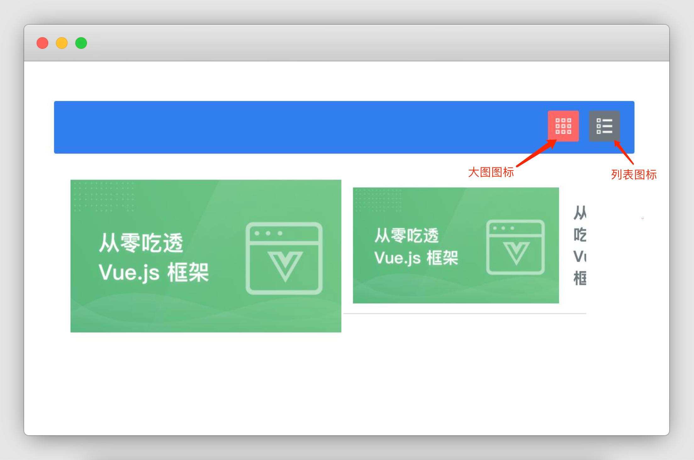
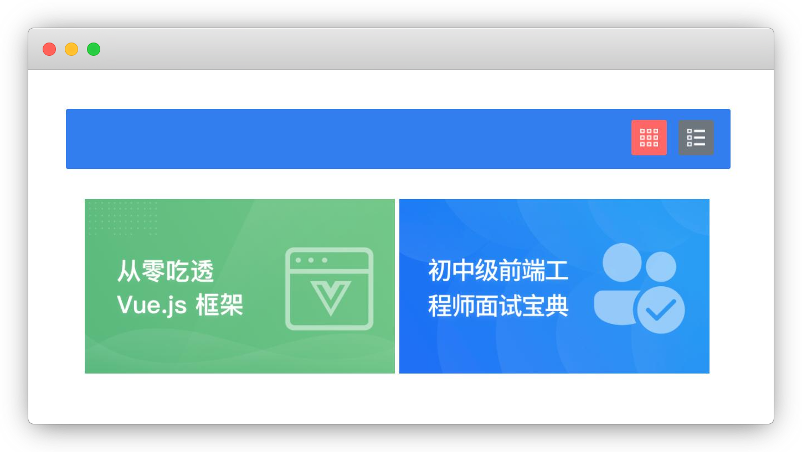

# 布局切换

## 介绍

经常用手机购物的同学或许见过这种功能，在浏览商品列表的时候，我们通过点击一个小小的按钮图标，就能快速将数据列表在大图（通常是两列）和列表两种布局间来回切换。

本题需要在已提供的基础项目中使用 Vue 2.x 知识，实现**切换商品列表布局**的功能。

## 准备

开始答题前，需要先打开本题的项目文件夹，目录结构如下：

```txt
├── effect.gif
├── goodsList.json
├── css
├── images
├── index.html
└── js
    ├── axios.min.js
    └── vue.js
```

其中：

- `effect.gif` 是最终实现的效果图。
- `goodsList.json` 是请求需要用到的数据。
- `css` 是样式文件夹。
- `images` 是图片文件夹。
- `js/vue.js` 是 Vue2.x 文件。
- `js/axios.min.js` 是 axios 文件。
- `index.html` 是页面布局及逻辑。

注意：打开环境后发现缺少项目代码，请手动键入下述命令进行下载：

```bash
cd /home/project
wget https://labfile.oss.aliyuncs.com/courses/9791/07.zip && unzip 07.zip && rm 07.zip
```

使用 live server 插件启动项目，并在浏览器中预览 `index.html` 页面，显示如下：



当前并未实现**数据异步加载和点击右上方按钮切换布局**的效果。

**注意：一定要通过 live server 插件启动项目，避免项目无法访问，影响做题。**

## 目标

请在 `index.html` 文件中补全代码，最终实现数据渲染及切换布局的效果。

具体需求如下：

1. 完成数据请求（数据来源 `goodsList.json`，请勿修改该文件中提供的数据）。在项目目录下已经提供了 `axios`，考生可自行选择是否使用。效果如下：



2. 点击“列表效果”的图标，图标背景色变为红色（即 `class=active`），“大图效果”的图标背景色变为灰色（即 `class=active` 被移除），布局切换为列表效果。效果如下：


3. 点击“大图效果”的图标，图标背景色变为红色（即 `class=active`），“列表效果”的图标背景色变为灰色（即 `class=active` 被移除），布局切换为大图效果。效果如下：


完成后的效果见文件夹下面的 gif 图，图片名称为 `effect.gif`（提示：可以通过 VS Code 或者浏览器预览 gif 图片）。

## 规定

- 请严格按照考试步骤操作，切勿修改考试默认提供项目中的文件名称、文件夹路径等。
- 请勿修改项目中提供的 `id`、`class`、函数名等名称，以免造成无法判题通过。
- 请勿修改 `goodsList.json` 文件中提供的数据。

## 判分标准

- 本题完全实现题目目标得满分，否则得 0 分。
