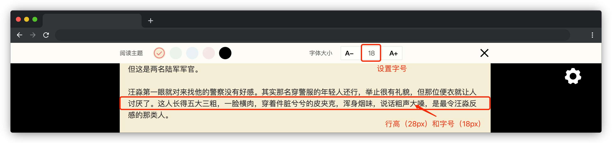

# 阅读吧

## 介绍

“读万卷书，行万里路”，无论你现在贫穷或富有，身和心一定要有一个在路上。那么，在快节奏的今天，人们是如何利用碎片化的时间去阅读的呢？没错，那就是电子书了。有了它，我们就可以随时随地，想读就读～

本题需要在已提供的基础项目中使用 Vue 2.x 完善代码，最终**实现一个简易的电子书阅读器**。

## 准备

开始答题前，需要先打开本题的项目文件夹，目录结构如下：

```txt
├── effect.gif
├── index.html
├── css
└── js
    └── vue.js
```

其中：

- `effect.gif` 是最终实现的效果图。
- `index.html` 是主页面。
- `css` 是样式文件夹。
- `js/vue.js` 是 Vue 2.x 文件。

注意：打开环境后发现缺少项目代码，请手动键入下述命令进行下载：

```bash
cd /home/project
wget https://labfile.oss.aliyuncs.com/courses/9790/07.zip && unzip 07.zip && rm 07.zip
```

在浏览器中预览 `index.html` 页面，显示如下所示：



## 目标

请在 `index.html` 文件中补全代码，最终实现以下功能：

1. 实现**头部工具栏显隐**功能。

- **头部工具栏**中的**关闭图标**和**页面右上侧**的**设置图标**，可以进行**头部工具栏**的**显隐切换**。效果如下：


2. 实现**设置阅读主题**功能。

- 点击头部工具栏**阅读主题**后面任意一个圆形色块，该色块显示勾选状态（即 **`.icon-selected`**），同时阅读区的背景色修改为该色块对应颜色。效果如下：


- 当阅读区的背景色为黑色时，阅读区的字体色为白色（即 **`#ffffff`**），其它背景色对应的字体颜色为黑色（即 **`#333333`**）。


3. 实现**设置字体大小**功能。

- 点击工具栏中 “A-” 或 “A+” 按钮，阅读区的字体大小呈 2px 递减或递增，并将字号同步更新到 “A-” 和 “A+” 之间的元素（即 **`.lang`**）中，需要注意的是：**字体最小为 12px，最大为 48px**，且阅读区的行高（即 **`line-height`** CSS 属性）始终比其字体大小多 10px。


完成后的效果见文件夹下面的 gif 图，图片名称为 `effect.gif`（提示：可以通过 VS Code 或者浏览器预览 gif 图片）。

## 规定

- 请勿修改 `index.html` 文件外的任何内容。
- 请严格按照考试步骤操作，切勿修改考试默认提供项目中的文件名称、文件夹路径、class 名、id 名、图片名等，以免造成无法判题通过。

## 判分标准

- 实现头部工具栏显隐功能，得 4 分。
- 实现设置阅读主题功能，得 8 分。
- 实现设置字体大小功能，得 8 分。
