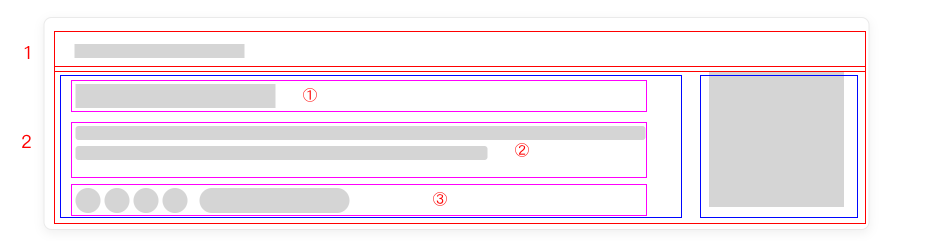
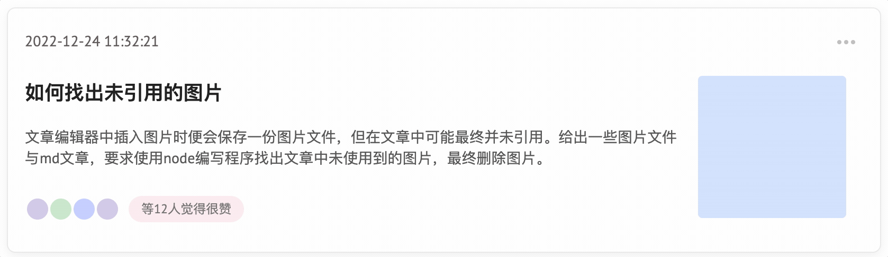

# 骨架屏

## 介绍

在网络较慢，需要长时间等待加载的情况下，骨架屏可以在详细页面元素未展现时，把 DOM 结构通过简单的方块或圆形勾勒出来，相对于传统的转圈等待与白屏来说，用户体验更好。下面请根据题目要求，使用 Vue 封装一个灵活的骨架屏组件。

## 准备

开始答题前，需要先打开本题的项目代码文件夹，目录结构如下：

```js
├── components
│   ├── List
│   │   ├── content.js
│   │   └── index.js
│   └── Skeleton
│       ├── index.js
│       └── item.js
├── css
│   └── style.css
├── effect.gif
├── index.html
└── lib
    └── vue.min.js
```

其中：

- `index.html` 是主页面。
- `components/list` 是提供的列表组件。
- `components/Skeleton` 是骨架屏组件。
- `lib` 是存放项目依赖的文件夹。
- `css` 是存放项目样式的文件夹。
- `effect.gif` 是项目目标完成效果图。

注意：打开环境后发现缺少项目代码，请复制下述命令至命令行进行下载。

```shell
wget https://labfile.oss.aliyuncs.com/courses/18213/dist_05.zip
unzip dist_05.zip
mv dist/* ./
rm -rf dist*
```

在浏览器中预览 `index.html`，显示如下所示：



## 目标

找到 `Skeleton/item.js` 中的 TODO 部分，完成以下目标：

1. 使用 `index.html` 中传递过去的数据 `paragraph`，并结合 **Vue 递归组件**的知识，完成骨架屏组件的编写。

**`paragraph` 中的属性说明如下：**

| 属性名     | 说明                                                                                                 |
| ---------- | ---------------------------------------------------------------------------------------------------- |
| `type`     | 骨架屏的容器类型，其属性值共有 `row`（行）、`col`（列）、`rect`（矩形）和 `circle`（圆形）四种类型。 |
| `style`    | 容器类型 `type` 为 `rect`（矩形）或 `circle`（圆形）对应的样式。                                     |
| `rowStyle` | 容器类型 `type` 为 `row`（行）时对应的样式。                                                         |
| `colStyle` | 容器类型 `type` 为 `col`（列）时对应的样式。                                                         |
| `rows`     | 类型 `type` 为 `row`（行）的容器数组，里面的每一个对象都是嵌套的子模块，即，`row`（行）容器。        |
| `cols`     | 类型 `type` 为 `col`（列）的容器数组，里面的每一个对象都是嵌套的子模块，即 `col`（列）容器。         |

**本题中的骨架屏结构图及说明如下：**


- 第一行（标记 1）为 1 个矩形占位。
- 第二行（标记 2）分为两列（蓝色框），左边一列为三行组成，右边一列为 1 个矩形占位。
- 第二行左边一列分别为如下构成：第一行（标记 ①）为 1 个矩形占位，第二行（标记 ②）为 2 个矩形占位，第三行（标记 ③）为 4 个圆形+1 个矩形占位。

**`type` 和 `DOM` 结构的对应关系如下：**

```html
<div class="ske-${type}-container">
  <div class="ske ske-${type}" :style="style">
    <!-- ...... 根据类型判断此处是否需要添加元素。TIPS: row 里面可以继续嵌套 row -->
  </div>
</div>
```

在上面的示例中：

- `${type}` 的值为对应的容器类型 `row`、`col`、`rect` 或 `circle`。
- `style` 表示 `class="ske ske-${type}"` 的元素对应的样式：

如果 `${type}` 是 `rect` 或 `circle` 则使用 `style` 属性。其 DOM 结构如下：

```html
<div class="ske-rect-container">
  <div class="ske ske-rect" :style="style"></div>
</div>
```

如果 `${type}` 是 `row` 或 `col`，则使用 `rowStyle` 或者 `colStyle` 属性。其 DOM 结构如下：

```html
<!-- rowStyle/colStyle 使用示例  -->
<div class="ske ske-row" :style="row.rowStyle" v-for="row in paragraph.rows">
  <!--此处代码省略...-->
</div>
```

2. 使用 `index.html` 中传递过去的数据 `active` 完成骨架屏组件的闪烁功能：如果 `active` 为 `true`, 则给容器类型 `type` 为 `rect`（矩形）或 `circle`（圆形）的组件内层 `class="ske ske-rect"` 或 `class="ske ske-circle"` 的元素添加类名 `.ske-ani`；否则不添加。

完成后效果如下：



## 规定

- 请严格按照考试步骤操作，切勿修改考试默认提供项目中的文件名称、文件夹路径、class 名、id 名、图片名等，以免造成无法判题通过。
- 满足需求后，保持 Web 服务处于可以正常访问状态，点击「提交检测」系统会自动检测。

## 判分标准

- 本题完全实现题目目标得满分，否则得 0 分。
