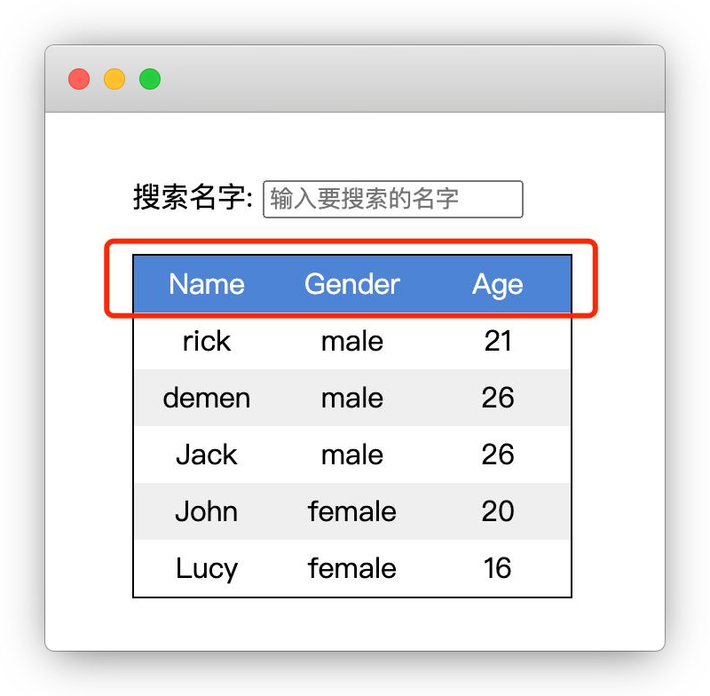

# 输入搜索联想

## 介绍

实际开发中经常会遇到这样一个需求，根据用户的输入内容，快速在表格中搜索匹配的数据并显示，该功能常被人们叫做“输入搜索联想”。

本题需要在已提供的基础项目中，使用 Vue 2.x 的知识实现该功能。

## 准备

开始答题前，需要先打开本题的项目文件夹，目录结构如下：

```txt
├── effect.gif
├── index.html
└── js
    └── vue.js
```

其中：

- `effect.gif` 是最终实现的效果图。
- `js/vue.js` 是 Vue 2.x 文件。
- `index.html` 是页面布局及功能实现的逻辑代码。

注意：打开环境后发现缺少项目代码，请手动键入下述命令进行下载：

```bash
cd /home/project
wget https://labfile.oss.aliyuncs.com/courses/10591/09.zip && unzip 09.zip && rm 09.zip
```


在浏览器中预览 `index.html` 页面，显示如下所示：



当前并未实现搜索联想的功能。

## 目标

请在 `index.html` 文件中补全代码，最终实现以下需求：

1. 页面数据表中表头**首字母大写**（注意：**不能是全大写**，请勿修改 `data` 选项中已提供的数据）。

效果如下：


2. 在搜索输入框中，输入相关单词或字母后（不区分大小写），显示每条数据的 `Name` 字段中包含该搜索内容的数据列表。

完成后的效果见文件夹下面的 gif 图，图片名称为 `effect.gif`（提示：可以通过 VS Code 或者浏览器预览 gif 图片）。

## 规定

- 请严格按照考试步骤操作，切勿修改考试默认提供项目中的文件名称、文件夹路径等。
- 请勿修改项目中提供的 `id`、`class`、函数名等名称，以免造成无法判题通过。
- 请勿修改 `data` 选项中已提供的数据。

## 判分标准

- 本题完全实现题目目标得满分，否则得 0 分。
