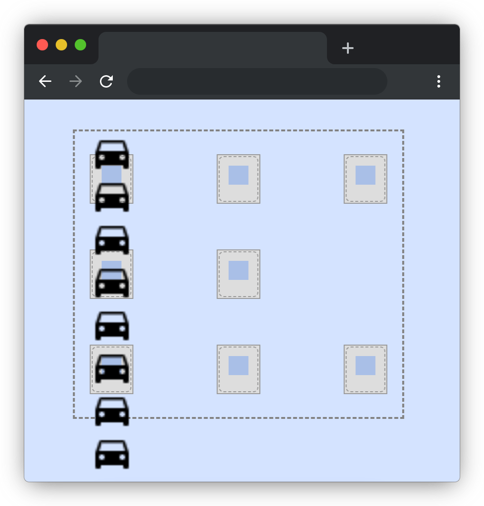
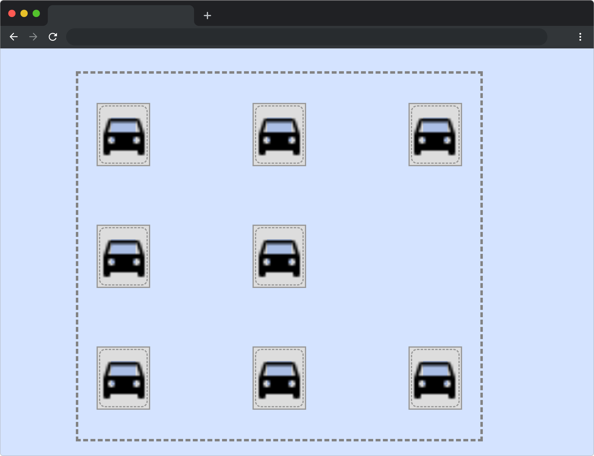

# 智能停车系统

## 介绍

蓝桥社区停车场正式对外开放，但由于停车位线标记不够完善，车主总是乱停乱放。为了使车辆有序的停放，现在给停车场绘制了醒目的停车位线。

本题需要在已提供的基础项目中，使用 CSS 让每辆车正确停放至停车位。

## 准备

开始答题前，需要先打开本题的项目代码文件夹，目录结构如下：

```bash
├── images
├── css
|   └── style.css
└── index.html
```

其中：

- `images` 是图片文件夹。
- `index.html` 是主页面。
- `css/style.css` 是待补充代码的 `css` 文件。

在浏览器中预览 `index.html` 页面效果如下：

  


## 目标

请使用 `Flex` 完善 `css/style.css` 中的 TODO 代码，让每辆车正确停放至停车位，最终实现下图效果。



提示：设置子元素为（`flex-wrap`）换行 ，在交叉轴上使用（`align-content`）两端对齐分布，在主轴上使用（`justify-content`）两端对齐分布。两端对齐分布效果即均匀排列每个元素，首个元素放置于起点，末尾元素放置于终点。

## 规定

- 请勿修改 `css/style.css` 文件外的任何内容。
- 请严格按照考试步骤操作，切勿修改考试默认提供项目中的文件名称、文件夹路径、class 名、id 名、图片名等，以免造成判题⽆法通过。

## 判分标准

- 本题完全实现题目目标得满分，否则得 0 分。

