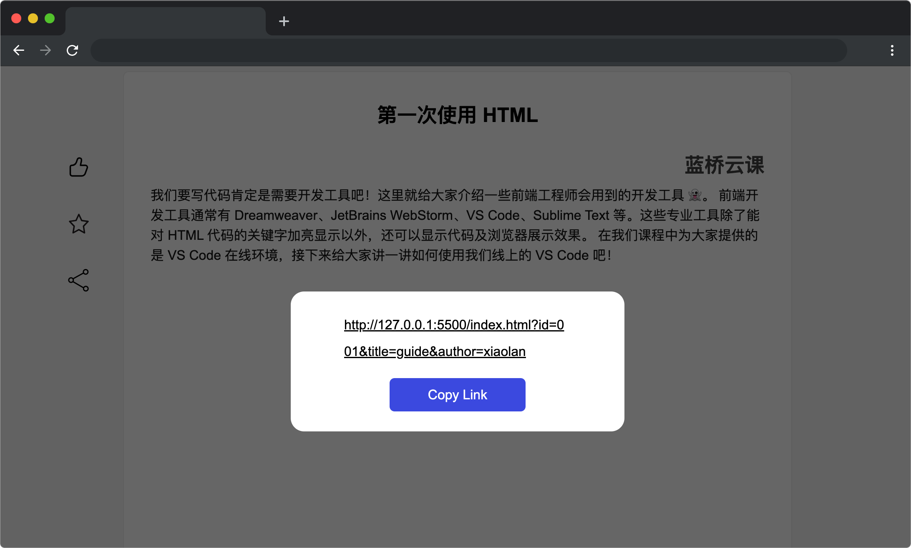

# 分享点滴

## 介绍

在数字时代，信息分享变得日益普遍和重要。无论是个人经历、知识技能还是创意想法，分享已经成为连接人与人之间的桥梁，是促进交流和学习的重要途径。用户可以分享自己的见解、经历、学习和创作，将点滴的智慧和灵感分享给世界。

本题需要在已提供的基础项目中使用 JS 知识封装一个函数，完成分享。

## 准备

开始答题前，需要先打开本题的项目代码文件夹，目录结构如下：

```bash
├── css
├── js
|   └── index.js
└── index.html
```

其中：

- `css` 是样式文件夹。
- `index.html` 是主页面。
- `js/index.js` 是待补充代码的 js 文件。

在浏览器中预览 `index.html` 页面效果如下：



## 目标

请在 `js/index.js` 文件中的 TODO 部分，完善 `appendParamsToURL` 函数，实现以下目标：

1. 将函数参数 `params` 对象属性与属性值转换为 `key=value` 的字符串形式拼接，并在每组属性拼接后通过 `&` 符号进行拼接，最终将拼接好的完整参数字符串和函数参数 `url` 进行拼接作为函数返回值进行返回。
2. 需要注意当 `url` 包含 `?` 符号，第一个参数会以 `&` 符号进行拼接；当 `url` 不包含 `?`，则**第一个参数**拼接会以 `?` 符号拼接，后续参数正常以 `&` 符号拼接。最后一个参数后面不需要拼接 `&` 符号。

**函数参数说明：**

- `url`: 目标 URL，将要附加参数的 URL，类型： `String`。
- `params`: 包含要附加到 URL 的参数对象，类型： `Object`。

**函数返回值说明：**

- `url`: 附加新的参数生成的 `URL`，类型：`String`。

测试用例如下：

**请注意以下用例仅供参考，实际判题时会修改测试用例，请保证代码的通用性。**

- 示例 1：`url` 不包含 `?` 符号

```js
const originalURL1 = 'https://example.com/page';
const parameters = {
  key1: 'value1',
  key2: 'value2',
};
console.log(appendParamsToURL(originalURL1, parameters));
```
函数返回结果为： `https://example.com/page?key1=value1&key2=value2`

- 示例 2：`url` 包含 `?` 符号

```js
const originalURL2 = 'https://example.com/page?id=001';
const parameters2 = {
  key3: 'value3',
  key4: 'value4',
};
console.log(appendParamsToURL(originalURL2, parameters2));

```
函数返回结果为：`https://example.com/page?id=001&key3=value3&key4=value4`

`appendParamsToURL` 函数编码完成后，点击左侧第三个分享图标，页面效果如下所示：
  


## 规定

- 请勿修改 `js/index.js` 文件外的任何内容。
- 判题时会随机提供不同参数对 `appendParamsToURL` 函数功能进行检测，请保证函数的通用性，不能仅对测试数据有效。
- 请严格按照考试步骤操作，切勿修改考试默认提供项目中的文件名称、文件夹路径、class 名、id 名、图片名等，以免造成判题⽆法通过。

## 判分标准

- 本题完全实现题目目标得满分，否则得 0 分。
