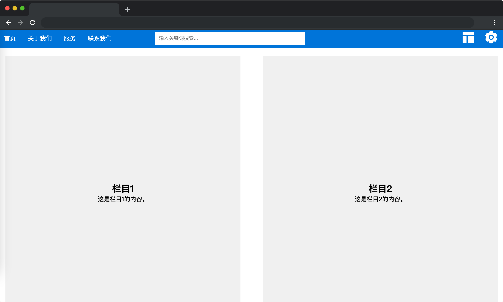

# 布局切换

## 介绍
 
为了提高用户体验，网站有时需要多种浏览模式。现在特邀请你为蓝桥官网设计具有经典、浏览和工具三种布局模式。使用户可以根据具体情况选择合适的模式，以便更好地浏览网页内容。

本题需要在已提供的基础项目中使用 JS 完善代码实现布局的切换。

## 准备

开始答题前，需要先打开本题的项目代码文件夹，目录结构如下：

```bash
├── css
├── images
├── index.html
├── effect.gif
└── js
    └── index.js
```

其中：

- `css` 是样式文件夹。
- `images` 是图片文件夹。
- `index.html` 是主页面。 
- `effect.gif` 是最终完成效果图。
- `js/index.js` 是待补充代码的 js 文件。

在浏览器中预览 `index.html` 页面效果如下：



## 目标

完善 `js/index.js` 的 TODO 部分的代码，实现被点击的模式元素（`class=layout-option`）处于激活状态，即添加一个类名（`active`），其他（`class=layout-option`）移除激活状态，即移除类名（`active`）。

最终效果可参考文件夹下面的 gif 图，图片名称为 `effect.gif`（提示：可以通过 VS Code 或者浏览器预览 gif 图片）。

## 规定

- 请勿修改 `js/index.js` 文件外的任何内容。
- 请严格按照考试步骤操作，切勿修改考试默认提供项目中的文件名称、文件夹路径、class 名、id 名、图片名等，以免造成判题⽆法通过。

## 判分标准

- 本题完全实现题目目标得满分，否则得 0 分。
