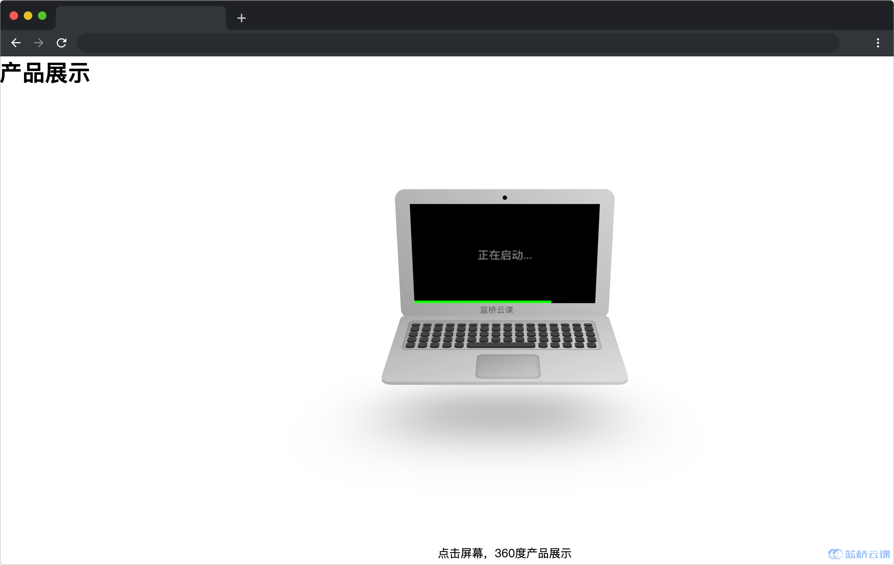

# 产品 360 度展示

## 介绍

在电子商务网站中，用户可以通过鼠标或手势交互实现 360 度全方位查看产品，提升用户体验。现在需要你设计一个 `Pipeline` 管道函数，用于控制 360 度展示产品的动画序列，通过管道连接各个动画步骤，使产品以流畅的方式呈现给用户。

## 准备

开始答题前，需要先打开本题的项目代码文件夹，目录结构如下：

```bash
├── css
├── effect.gif
├── js
│   ├── index.js
│   └── utils.js
└── index.html
```

其中：

- `css` 是样式文件夹。
- `index.html` 是主页面。
- `js/index.js` 是动画序列代码的 js 文件。
- `js/utils.js` 是待补充代码的 js 文件。
- `effect.gif` 是页面最终的效果图。

在浏览器中预览 `index.html` 页面效果如下：



## 目标

请在 `js/utils.js` 文件中的 TODO 部分，实现以下目标：

封装一个支持异步的 `pipeline` 管道函数，能够按顺序执行一系列异步操作，每个异步操作的结果将作为下一个异步操作的输入。

**函数参数说明：**

- `initialValue`：管道的初始值（即 `sequence` 中第一个函数的参数）。它是整个异步管道的起点。第一个异步步骤将以此值开始，并且后续步骤将在前一步骤的输出基础上进行。
- `sequence`：是一个由具有返回值和可以传参的函数组成的数组，函数可以是普通函数也可以是 Promise 函数。每个函数接收前一个步骤的输出（即该函数的参数是上一个函数的执行结果），并返回一个 Promise。这个数组定义了整个管道中的处理步骤和它们的顺序。

**函数返回值说明：**

- `pipeline` 函数返回一个 `Promise`，这个 `Promise` 最终解析为整个管道执行完成后的结果。

测试用例如下：

**请注意以下用例仅供参考，实际判题时会修改测试用例，请保证代码的通用性。**

- 示例 1：`sequence` 中都为普通函数

```js
function fn1(data){ 
    return data +'2.开始左转'
 }
 function fn2(data){ 
    return data+'3.开始右转'
 }
 pipeline('1.动画开始',[fn1, fn2]).then(res => {
     console.log(res)  
 })
// 打印结果为：'1.动画开始2.开始左转3.开始右转'
```

- 示例 2：`sequence` 中都为 `promise` 函数

```js
function fn1(data){ 
  return new Promise(resolve => {
	  resolve(data+'->执行第一个动画')
  })
}
function fn2(data){ 
  return new Promise(resolve => {
	  resolve(data+'->执行第二个动画')
  })
}
pipeline('动画开始',[fn1, fn2]).then(res => {
	console.log(res)
})
// 打印结果为：'动画开始->执行第一个动画->执行第二个动画' 
```

完成后，点击屏幕触发动画序列，最终效果可参考文件夹下面的 gif 图，图片名称为 `effect.gif`（提示：可以通过 VS Code 或者浏览器预览 gif 图片）。

## 规定

- 请勿修改 `js/utils.js` 文件外的任何内容。
- 判题时会随机提供不同参数对 `pipeline` 函数功能进行检测，请保证函数的通用性，不能仅对测试数据有效。
- 请严格按照考试步骤操作，切勿修改考试默认提供项目中的文件名称、文件夹路径、class 名、id 名、图片名等，以免造成判题⽆法通过。

## 判分标准

- `sequence` 参数都为普通函数且满足需求正确输出，得 5 分。
- `sequence` 参数都为 `promise` 函数且满足需求正确输出，得 5 分。
