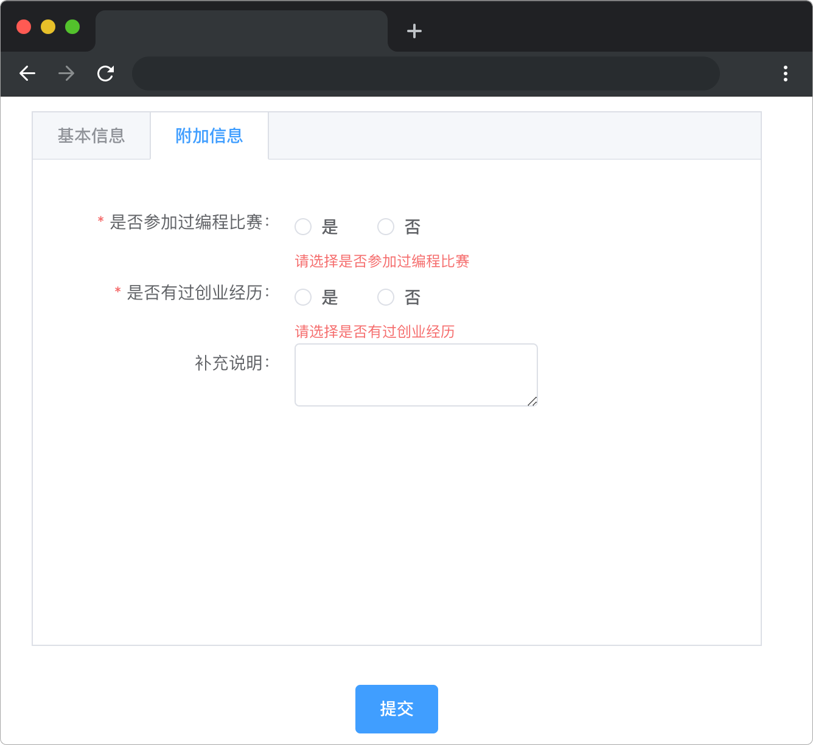

# 多表单校验

## 介绍

常见的收集信息的页面只有一个表单。但是在一些特殊情况下，一个页面可能同时存在多个表单，例如通过 `tab` 切换表单收集不同类别的信息，这时候就需要我们在表单提交时进行所有表单的校验，全部校验通过才能提交数据。

## 准备

开始答题前，需要先打开本题的项目代码文件夹，目录结构如下：

```bash
├── css
│   ├── element-plus.css
│   └── style.css
├── index.html
└── lib
```

其中：

- `css` 是样式文件夹。
- `lib` 是存放项目依赖的文件夹。
- `index.html` 是主页面。

在浏览器中预览 `index.html` 页面效果如下所示：



## 目标

完善 `index.html` TODO 部分，实现多表单校验功能。

两个表单校验规则（`rules`）如下：

- 姓名：必填。规则：只能输入汉字。提示：请输入姓名，只能输入汉字。
- 性别：必填。提示：请选择性别。
- 年龄：必填。提示：请输入年龄。
- 是否参加过编程比赛：必填。提示：请选择是否参加过编程比赛。
- 是否有过创业经历：必填。提示：请选择是否有过创业经历。

检验是否为汉字的正则表达式规则如下:

```js
const reg = /[^\u4e00-\u9fa5]/g;
```

表单添加好校验规则后，点击提交。效果如下：


本项目使用到的 `element-plus` 表单验证 API 如下：

**el-form 组件参数说明**

| 参数    | 说明         | 类型   |
| ------- | ------------ | ------ |
| `rules` | 表单验证规则 | object |

**rules 校验规则配置项说明**

| 参数        | 说明               | 类型           |
| ----------- | ------------------ | -------------- | 
| `required`  | 是否必填           | `boolean`      |
| `message`   | 提示文案           | `string`       |
| `trigger`   | 验证逻辑的触发方式 | `blur`/`change`|
| `validator` | 自定义校验规则     | `boolean`      |

自定义校验规则需要创建一个校验函数，参数为 `rule、value、callback`，校验通过调用 `callback` 回调即可，校验失败调用 `callback` 抛出异常信息。用法参考以下示例：

```js
const validatePassword = (rule, value, callback) => {
  if (value === "") {
    callback(new Error("请输入密码"));
  } else if (value !== ruleForm.pass) {
    callback(new Error("密码输入不一致"));
  } else {
    callback();
  }
};
```

## 规定

- 请严格按照考试步骤操作，切勿修改考试默认提供项目中的文件名称、文件夹路径、class 名、id 名、图片名等，以免造成判题⽆法通过。

## 判分标准

- 本题完全实现题目目标得满分，否则得 0 分。