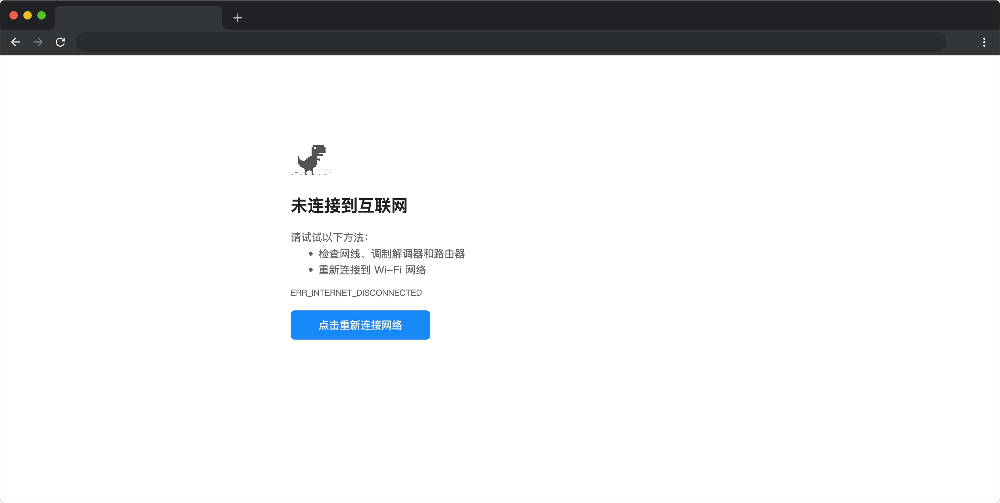

# 找回连接的奇幻之旅

## 介绍

在网络世界中，突然间失去了所有的连接。作为勇敢的冒险者，你将踏上一段惊险刺激的旅程，穿越充满谜题和挑战的网络景观，与神秘的网络幽灵对抗，解开断网之谜，找回失去的连接，带领人们重返数字世界。准备好迎接这场奇幻之旅吗？

## 准备

开始答题前，需要先打开本题的项目代码文件夹，目录结构如下：

```bash
├── css
├── images
├── index.html
├── effect.gif
└── js
    └── index.js
```

其中：

- `index.html` 是主页面。
- `css` 是样式文件夹。
- `images` 是图片文件夹。
- `effect.gif` 是项目最终完成的效果图。
- `js/index.js` 是待补充的 js 文件。

在浏览器中预览 `index.html` 页面效果如下：



## 目标

请在 `js/index.js` 文件中补充 `resetableOnce` 函数，实现在接收相同的函数时只执行一次。

**函数返回值说明：**

`resetableOnce` 函数的返回值为一个对象 ，格式为 ：`{runOnce:func, reset:func}`，对应说明如下：

- `runOnce`：一个函数，用于执行包装后的函数 `fn`。当第一次调用 `runOnce` 时，它将执行 `fn` 函数，并将结果保存，之后的每次调用将直接返回之前计算的结果。注意：**如果传入的函数（`fn`）不是同一个函数，则 `resetableOnce` 函数重新执行**。
- `reset` ：一个函数，用于重置包装后的函数的状态。调用 `reset` 后可以让下一次调用 `runOnce` 时，再次执行 `fn` 函数。

函数使用示例如下：

```js
// 测试用例 1：resetableOnce（fn） fn 有参数的情况
// 定义一个加法函数
function addNumbers(a, b) {
  return a + b;
}

const test1 = resetableOnce(addNumbers);
console.log(test1.runOnce(2, 3)); // 输出: 5
console.log(test1.runOnce(4, 5)); // 第二次调用不会执行加法操作，返回上次执行的值，输出: 5

// 重置 once
test1.reset();
console.log(test1.runOnce(4, 5)); // 因为重置，addNumbers 再次执行，输出: 9

// 测试用例 2：resetableOnce（fn） fn 无参数的情况
let a = 10;
let fn = () => {
  return a = a + 1;
};
const test2 = resetableOnce(fn); // 传入了不同的函数，之前的 once 不针对此函数生效。
console.log(test2.runOnce()); //输出 11
console.log(test2.runOnce()); // 输出 11
test2.reset();
console.log(test2.runOnce()); // 输出 12
```

最终效果可参考文件夹下面的 gif 图，图片名称为 `effect.gif`（提示：可以通过 VS Code 或者浏览器预览 gif 图片）。

## 规定

- 请勿修改 `js/index.js` 文件外的任何内容。
- 请严格按照考试步骤操作，切勿修改考试默认提供项目中的文件名称、文件夹路径、class 名、id 名、图片名等，以免造成无法判题通过。

## 判分标准

- 传入同一函数满足需求能正确运行，得 5 分。
- 本题完全实现题目目标得满分。
