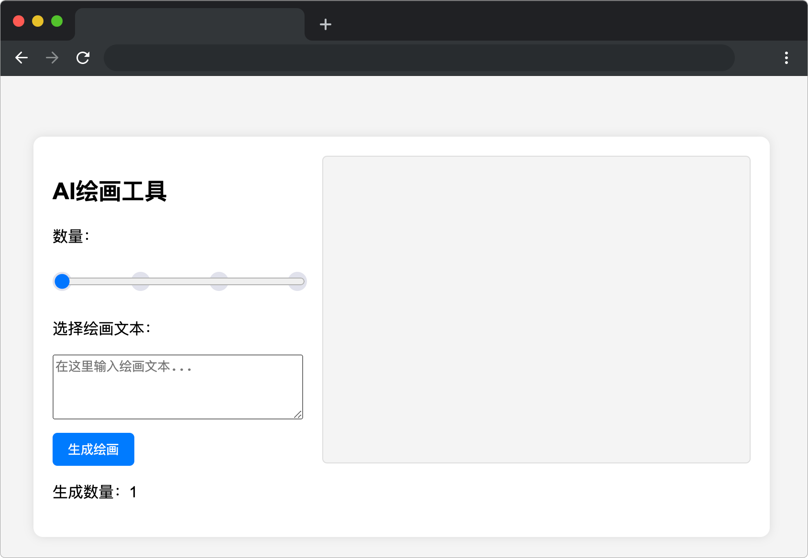

# 悠然画境

## 介绍

作为一名人工智能训练师，你需要使用 `artDataArray` 数组中提供的指定语料进行训练，你可以用其中的词来组成任何句子来进行智能绘画的训练。

## 准备

开始答题前，需要先打开本题的项目代码文件夹，目录结构如下：

```txt
├── css
├── images
├── index.html
├── effect.gif
└── js
    └── index.js
```

其中:

- `index.html` 是主页面。
- `css` 是样式文件夹。
- `images` 是图片文件夹。
- `js/index.js` 是待补充的 js 文件。
- `effect.gif` 是项目最终完成的效果图。

在浏览器中预览 `index.html` 页面效果如下：



## 目标

请在 `js/index.js` 文件中的 TODO 部分，完善 `generateAndDisplayImages` 函数，实现以下目标：

根据函数参数 `imageCount` 和 `selectedText` 与已提供 `artDataArray` 数组中的图片相关词语进行规则匹配，并返回匹配度最高的图片数组。最佳匹配的规则为，文本内容中包含对应图片 `tag` 的数量最多则为匹配度最高，**放在数组前面**，如果多张图片匹配度相同，则任意选择匹配到的图片。

**函数参数说明**

- `imageCount` 表示图片数量。
- `selectedText` 表示文本内容。

**`artDataArray` 数组说明**

`artDataArray` 数组中每个元素为对象，包含两个属性：`imageurl` 和 `tags`。其中，`imageUrl` 表示图片路径，`tags` 表示跟图片相关的词语，词语通过`、` 进行分隔。

**匹配度示例**：

| 匹配条件                     | Tags                                         | 匹配度 |
| ---------------------------- | -------------------------------------------- | ------ |
| 一只 `湖蓝色`的 `知更鸟` | `知更鸟`、`湖蓝色`、十分可爱、皮克斯渲染 | 2      |
| 一只湖蓝色的 `知更鸟`      | `知更鸟`、剪纸风格、个性的眉毛             | 1      |
| 一只湖蓝色的知更鸟           | 沙滩、遮阳伞、人、包                         | 0      |

**注意：测试时请使用已提供数据 `tags` 中的词语进行组句测试。**

示例 1：

如用户输入“一只湖蓝色的知更鸟”，选择生成图片数量为 1，函数的返回值如下：

```js
[
  { imageUrl: "images/img1.png", tags: "知更鸟、湖蓝色、十分可爱、皮克斯渲染" }
];
```

因为这条 `tags` 中的词语与文本内容，匹配量最多，匹配到了 “知更鸟”、“湖蓝色”，匹配到是数量为 2，其他 “知更鸟” 相关的图片匹配的数量为 1。

示例 2：  

如用户输入“一只湖蓝色的知更鸟”，选择生成图片数量为 3，函数的返回值如下：

```js
[
  { imageUrl: "images/img1.png", tags: "知更鸟、湖蓝色、十分可爱、皮克斯渲染" },
  { imageUrl: "images/img2.png", tags: "知更鸟、个性的眉毛、模糊毛皮" },
  { imageUrl: "images/img3.png", tags: "知更鸟、剪纸风格、个性的眉毛" }
];
```

最终效果可参考文件夹下面的 gif 图，图片名称为 `effect.gif`（提示：可以通过 VS Code 或者浏览器预览 gif 图片）。

## 规定

- 请勿修改 `js/index.js` 文件外的任何内容。
- 请严格按照考试步骤操作，切勿修改考试默认提供项目中的文件名称、文件夹路径、class 名、id 名、图片名等，以免造成无法判题通过。

## 判分标准

- 本题完全实现题目目标得满分，否则得 0 分。
