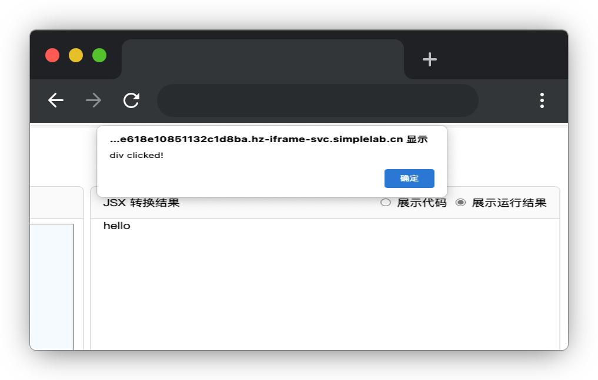

# 简易 JSX 解析器

## 介绍

在 Vue 中，除了常见的使用模板语法（Template Syntax）编写组件，还可以使用 JSX（JavaScript XML）语法。JSX 是一种类似 HTML 的语法扩展，可以在 JavaScript 代码中编写类似 HTML 的结构。本题目我们将一起实现 JSX 转换原理。

## 准备

开始答题前，需要先打开本题的项目代码文件夹，目录结构如下：

```bash
├── css
|   └── style.css
├── js
|   └── index.js
├── lib
└── index.html
```

其中：

- `css/style.css` 是样式文件。
- `lib` 是存放项目依赖的文件夹。
- `index.html` 是主页面。
- `js/index.js` 是待补充的 js 文件。

在浏览器中预览 `index.html` 页面效果如下：


## 目标

完善 `js/index.js` 文件中 `jsx` 函数中的 TODO 部分，实现以下目标：

**函数参数说明：**

- `type` 是要渲染的元素类型，即标签名。
- `config` 是一个对象。该函数可以根据传入的参数创建 DOM 节点并返回。

`config` 对象中属性介绍如下：

- 当 `key` 为 `children` ，表示该元素的子节点。`children` 属性的值可能是字符串也可能是数组。如果是数组表示该元素有多个子节点，字符串则表示为文本节点。
- 当 `key` 为 `style`， 则对应的值为对象，表示当前 DOM 对应的**行内样式**。
- 当 `key` 为函数，表示当前 DOM 对应的事件函数。
- 当 `key` 为其他值，表示 DOM 对应的 attribute 属性。

`config` 对象示例：

```js
{
  style: {color:'red'}, // 样式
  id:1, // id
  onclick: () => { // 点击触发的事件
    console.log("h1 clicked")
  },
  children:'hello' //当前元素的子节点，可以是字符串也可以是数组
}
```

`children` 节点转换示例：

```js
// children 示例 1 字符串：

children:'hello'

// 转换后为 <标签名>hello</标签名>
  
// children 示例 2 数组：

children: ['hello', jsx('span', { children: 'world' })]
//转换后为 <标签名>hello<span>world</span></标签名>
```

**`jsx` 函数需实现以下目标：**

1. 完成元素的 DOM 节点转换，即只转换  `config` 中的 `children`。

测试用例 1：

```js
jsx("div", {
  children: "hello"
})
```

点击页面上测试目标 1 (用例1)按钮，JSX 转换结果如下：

```html
<div>hello</div>
```

测试用例 2：

```js
jsx("div", {
  children: [
  "hello",
  jsx("span", {
    children: "world"
  })
  ]
});
```

点击页面上测试目标 1（用例2）按钮，JSX 转换结果如下：

```html
<div>hello
  <span>world</span>
</div>
```

2. 完成元素的属性转换，其中元素样式如果是小驼峰写法需要转换成 `-` 连接，如 `fontSize` 需转换成 `font-size`。`js/index.js` 文件中的 `isUpperCase` 函数功能为判断字符是否为大写。**注意：样式必须转换为行内样式。**

测试用例：

```js
jsx("div", {
  style: {color:'red';fontSize:'12px'}, // 样式，可以有多个
  id:'id-1', // id
  children: "hello"
})
```

点击页面上测试目标 2 按钮，JSX 转换结果如下：

```html
<div id="id-1" style="color:red,font-size:12px" >hello</div>    
```

3. 完成元素事件正确绑定与触发。

测试用例：

```js
jsx("div", {
  children: "hello",
  onclick: () => { // 点击触发的事件
    alert("div clicked")
  }
})
```

点击页面上测试目标 3 按钮，JSX 转换结果如下，选择展示运行结果，**点击元素后弹出提示框，提示信息为 “div clicked”**：

```html
<div>hello</div>  
```
点击 `hello` 文本弹窗效果如下：

  


## 规定

- 请勿修改除 `js/index.js` 文件之外的任何内容。
- 请严格按照考试步骤操作，切勿修改考试默认提供项目中的文件名称、文件夹路径、class 名、id 名、图片名等，以免造成判题⽆法通过。

## 判分标准

- 完成目标 1，得 5 分。
- 完成目标 2，得 5 分。
- 完成目标 3，得 5 分。
