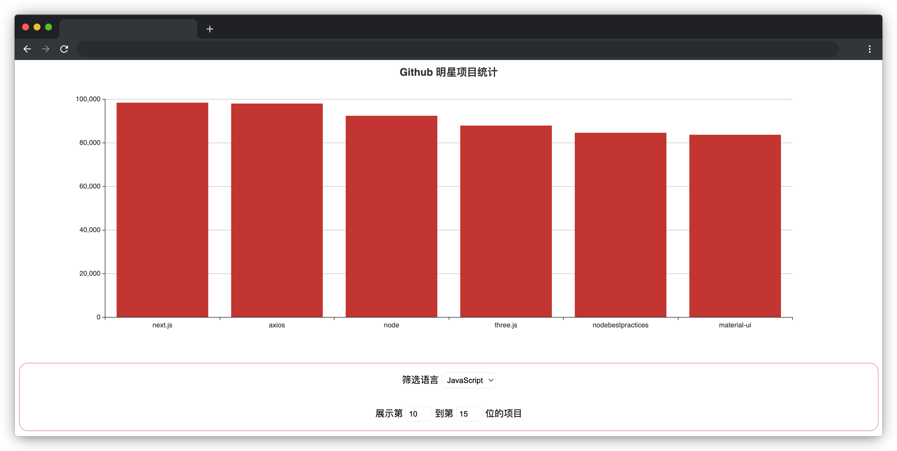

# Github 明星项目统计

## 介绍

Github 的 star 数量代表了一个项目的受欢迎程度，star 数较高的项目通常有很多值得我们学习的地方。利用图表的形式将所有项目根据其 star 数量做统计，能让人们更清晰地看出当前的各种编程语言和开源项目的流行趋势。

本题请实现一个可以对项目语言和排名进行筛选查看的 Github 明星项目统计图表。

## 准备

开始答题前，需要先打开本题的项目代码文件夹，目录结构如下：

```bash
├── css
├── index.html
├── effect.gif
├── js
│   └── data.json
└── lib
```

其中：

- `css ` 是样式文件夹。
- `index.html` 是主页面。
- `lib` 是依赖文件夹。
- `js/data.json` 是请求需要用到的项目数据。
- `effect.gif` 是项目最终完成的效果图。

在浏览器中预览 `index.html` 页面效果如下：



## 目标

请在 `index.html` 文件中补全代码，具体需求如下：

1. 将可供筛选的语言列表 `languages` 在 `select` 标签下的 `option` 元素进行渲染， **`option` 的 `value` 值必须对应绑定 `languages` 数组中的值**。效果如下：

   
2. 完善 `changeHandle` 函数，当用户选择语言和输入显示位次的时候都会调用此函数。当用户改变 `select` 筛选器的选项或改变展示项目的位次输入时，根据用户的**选择**和**输入的位次**重新渲染图表。注意：**重新渲染图表必须通过修改 `xData` 和 `yData` 的值进行，不要修改变量名称**。

   - 如果用户选中的是 `All` ，则展示所有的项目。
   - 如果用户选中了某个具体的语言，则将图表数据改为只显示该语言的项目。以选择 `JavaScript` 语言为例，效果如下：

   

   - 注意：**选择语言和展示位次是结合使用的**，例如用户同时选择了 `JavaScript` 和**展示 10 到 15 位的数据**，则此时图表对应的数据是 **使用 JavaScript 语言的项目中 star 数处于 10 到 15 位的项目（注意包含第 10 和 15 位）**。效果如下：

   

最终效果可参考文件夹下面的 gif 图，图片名称为 `effect.gif`（提示：可以通过 VS Code 或者浏览器预览 gif 图片）。

## 规定

- 请严格按照考试步骤操作，切勿修改考试默认提供项目中的文件名称、文件夹路径、class 名、id 名、图片名等，以免造成无法判题通过。

## 判分标准

- 完成目标 1，得 7 分。
- 完成目标 2 中语言选择的切换，得 8 分
- 完成目标 2 语言切换的基础上完成显示位次的切换，得 5 分
