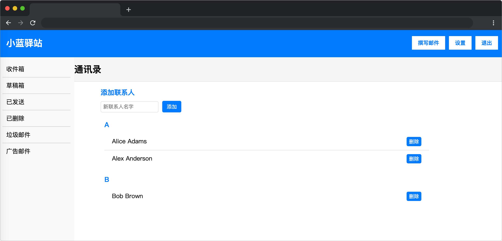

# 小蓝驿站

## 介绍

欢迎使用小蓝驿站邮箱应用！这是一个简单易用的邮箱工具，除了提供高效的收发邮件功能，还内置了便捷的联系人管理。快来体验小蓝驿站，实现联系人的添加，让联系人管理变得简单又有效。

## 准备

开始答题前，需要先打开本题的项目代码文件夹，目录结构如下：

```txt
├── css
├── data.json
├── effect.gif
├── index.html
└── lib
```

其中:

- `css` 是样式文件夹。
- `data.json` 是数据文件
- `lib` 是项目依赖文件夹。
- `index.html` 是主页面。
- `effect.gif` 是目标 2 完成后的效果图。 

在浏览器中预览 `index.html` 页面效果如下：



## 目标

完善 `index.html` 文件中的 TODO 部分的代码，实现以下目标：

1.  `contacts`为联系人列表, `sortedContacts` 是将联系人列表 `contacts` 按照字母 A-Z 排序的数据，数据中的 `letter` 为联系人**组名称**（大写），数据中的 `contacts` 为当前组的联系人数组，数据结构如下：

``` json
[
    {"letter": "A",  // 组名称，大写
    "contacts": [  // 当前组联系人数组
    { "name": "Alice Adams" },  // 联系人名字，不区分大小写
    { "name": "Alex Anderson" } 
    ] },
    { "letter": "B", 
    "contacts": [...]
    }
]
```

将排序后联系人数据 `sortedContacts` 按照下面示例的 DOM 结构，完成渲染。**注意：`sortedContacts` 为动态数据，请注意代码的通用性。**

```html
<ul class="contacts-list">
 <!-- 以 A 为例 start -->
  <li class="contacts-group">   <!-- 字母分组渲染 DOM 结构-->
    <div class="contacts-group-title">A</div>  <!-- 分组的 字母名称 -->
    <ul>
      <li class="contact-item"> <!-- contact-item 人名渲染 dom 结构-->
        <span class="contact-name">Alice Adams</span
        ><button class="del-contact-button">删除</button>
      </li>
      <li class="contact-item"> <!-- contact-item 人名渲染 dom 结构-->
        <span class="contact-name">Alex Anderson</span
        ><button class="del-contact-button">删除</button>
      </li>
    </ul>
  </li>
   <!-- 以 A 为例 end  -->
   <!-- ....省略代码 B、C、D、E ..... -->
</ul>
```

目标 1 完成后效果如下：


2. 完善 `addContact` 函数，完成联系人添加功能。如果联系人组已存在，则直接添加联系人到该组；如果联系人组不存在，则新建一个联系人组和联系人添加到联系人列表`contacts`。**本题目只考察联系人的名字为英文的情况。**

目标 2 最终效果可参考文件夹下面的 gif 图，图片名称为 `effect.gif`（提示：可以通过 VS Code 或者浏览器预览 gif 图片）。

## 规定
 
- 请严格按照考试步骤操作，切勿修改考试默认提供项目中的文件名称、文件夹路径、class 名、id 名、图片名等，以免造成无法判题通过。

## 判分标准

- 完成目标 1 得 10分。
- 完成目标 1 的基础上，完成目标 2，得 10分。
