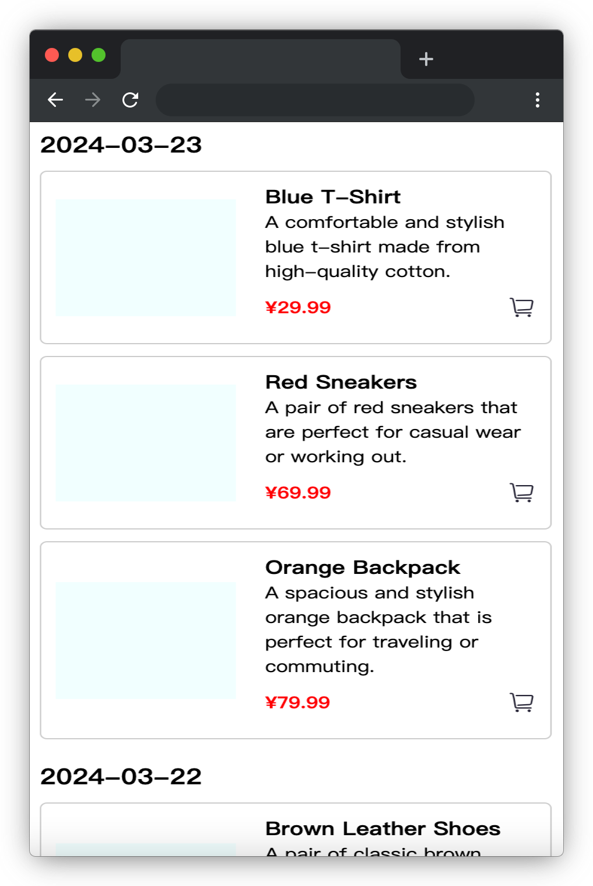

# 商品浏览足迹

## 介绍

商品浏览足迹的记录是一种电子商务网站或应用程序提供的功能，旨在记录用户在网站上浏览过的商品。当用户登录其帐户时，他们可以访问该页面，查看他们最近浏览的商品，以便随时可以返回对比、评估和购买。

本题会提供一组用户的商品浏览记录，需要你按照要求将其处理成所需的数据结构并返回。

## 准备

开始答题前，需要先打开本题的项目代码文件夹，目录结构如下：

```txt
├── css
├── images
├── index.html
└── js
    ├── axios.min.js
    ├── data.json
    └── index.js
```

其中：

- `css` 是样式文件夹。
- `images` 是图片文件夹。
- `index.html` 是主页面。
- `js/axios.min.js` 是 axios 文件。
- `js/index.js` 是待补充的 js 文件。
- `js/data.json` 是页面用到的数据文件。

在浏览器中预览 `index.html` 页面效果如下：


## 目标

 完善 `js/index.js` 文件中的 TODO 部分，实现以下目标：

1. 在 `window.onload`中完成数据请求（**请求地址必须使用提供的常量 MockUrl**），将请求回来的数据赋值给 `data`, 请求完成后 `onload` 调用已经提供的代码。
2. 补充函数 `removeDuplicates`，将**同一天**浏览的相同商品（即字段 `id` 相同）去重并作为数组返回，数据结构与 json 文件中数据结构相同。
3. 补充函数 `sortByDate`，参数 `defaultData` 是函数 `removeDuplicates` 去重后的数据，根据字段 `viewed_on`（格式化为 `YYYY-MM-DD`）降序排序并作为数组返回，数据结构与 json 文件中数据结构相同。
4. 补充函数 `transformStructure`，将去重排序后的所有商品数据，作为一个对象存储并返回，该对象的所有 `key` 为浏览商品的当天日期（即，字段 `viewed_on` 格式化为 `YYYY-MM-DD`， 月份和日期小于10的前面补0），`value` 为当天浏览的所有商品列表（以数组形式表现）。

最终返回的对象数据结构如下所示：

```js
{
    "2024-03-03":[
        {
            "id":"001",
            "name":"商品1",
            "description": "商品1的描述。",
            "price": 59.99,
            "viewed_on": "2024-03-22T20:02:00"
        },
        {
            "id":"002",
            "name":"商品2",
            ...
        }
    ],
    "2024-03-01":[
        {
            "id":"001",
            "name":"商品1",
            ...
        },
        {
            "id":"002",
            "name":"商品2",
            ...
        }
    ],
}
```

最终效果如下所示：

 

## 规定

- 请严格按照考试步骤操作，切勿修改考试默认提供项目中的文件名称、文件夹路径、class 名、id 名、图片名等，以免造成判题⽆法通过。
- 函数 `removeDuplicates`、`sortByDate`、`transformStructure` 检测时使用的输入数据与题目中给出的示例数据可能是不同的。考生的程序必须是通用的，不能只对需求中给定的数据有效。

## 判分标准

- 完成目标 1，得 5 分。
- 完成目标 2，得 10 分。
- 完成目标 3，得 5 分。
- 完成目标 4，得 5 分。
