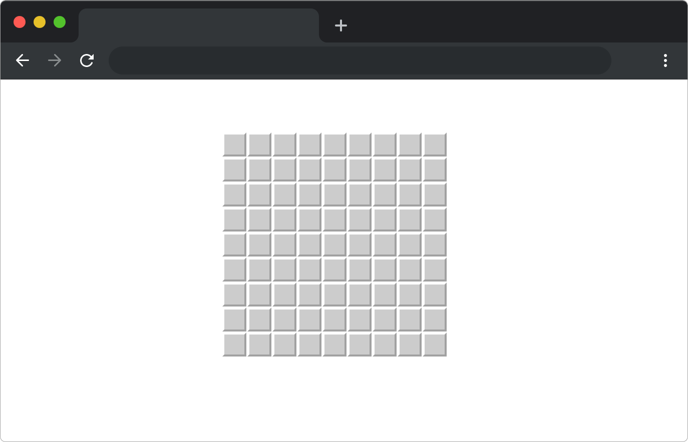

# 扫雷游戏

## 介绍

扫雷游戏是 `Window` 系统上内置的一款经典益智类游戏。在进行游戏时，点击任意小方格会显示四周没有地雷的格子，该功能也是扫雷游戏的核心，现在让我们利用 `JavaScript` 来实现扫雷的核心功能。

## 准备

开始答题前，需要先打开本题的项目代码文件夹，目录结构如下：

```txt
├── css
├── images
├── index.html
├── effect.gif
└── js
    └── index.js
```

其中:

- `index.html` 是主页面。
- `css` 是样式文件夹。
- `images` 是图片文件夹。
- `js/index.js` 是待补充的 js 文件。
- `effect.gif` 是项目最终完成的效果图。

在浏览器中预览 `index.html` 页面效果如下所示：



页面上显示 9*9 的方块格，点击无任何反应。

## 目标

请在 `js/index.js` 文件中的 TODO 部分，完善 `mineSweeperAlgorithms` 函数。

**函数参数说明：**

- `arr` 是表示扫雷游戏板状态的二维数组，其中，`'X'` 表示地雷，空字符串表示没有地雷。

```js
// 扫雷游戏的初始数组
const arr = [
    ['', '', '', '', '', 'X', 'X', '', ''],
    ['', '', '', 'X', '', 'X', '', '', 'X'],
    ['', 'X', 'X', '', '', '', '', '', 'X'],
    ['', '', '', '', '', '', '', '', ''],
    ['', '', '', '', '', '', '', 'X', ''],
    ['', '', 'X', '', '', '', '', '', ''],
    ['', '', '', '', '', '', '', '', ''],
    ['', '', '', '', '', '', '', '', ''],
    ['', '', '', '', '', '', '', '', ''],
]
```

- `{ row, col }` 是玩家点击或者揭开的格子的行和列坐标。

`mineSweeperAlgorithms` **函数需要完成以下目标：**

1. 通过已提供的 `flagData` 数组（`flagData` 数组的值为与扫雷游戏板 9*9 对应的点击状态，默认均为 `false`），将点击或揭开的格子在 `flagData` 数组中对应的位置标记为 `true`。

2. 通过已提供的 `getAroundAndCount` 函数，根据点击的格子的位置以及周围地雷的数量，递归更新游戏板 `arr` 数组中对应格子的值。

`getAroundAndCount` 函数用于计算点击格子周围的地雷数量，该函数会根据点击的格子判断周围是否有地雷。如果点击的格子周围没有地雷，函数会揭开周围没有地雷的格子，将它们的值更新为相应的数字 1-8 或空字符串（表示没有地雷），如果点击的格子周围有地雷，函数会将该格子的值更新为地雷数量。该函数返回 `{ positionWithoutMineArr, count }` , `positionWithoutMineArr` 表示周围没有地雷的位置，`count` 表示周围地雷数量。
 
代码完成后，如果点击 `arr[8][8]`，游戏版 `arr` 会变成如下:

```js
const arr = [
  [
    ["", "", "", "", "", "X", "X", "", ""],
    ["", "", "", "X", "", "X", "", "", "X"],
    ["", "X", "X", 2, 2, 1, 1, "", "X"],
    [1, 2, "", 1, 0, 0, 1, "", ""],
    [0, 1, "", 1, 0, 0, 1, "X", ""],
    [0, 1, "X", 1, 0, 0, 1, 1, 1],
    [0, 1, 1, 1, 0, 0, 0, 0, 0],
    [0, 0, 0, 0, 0, 0, 0, 0, 0],
    [0, 0, 0, 0, 0, 0, 0, 0, 0],
  ],
];
```

最终效果可参考文件夹下面的 gif 图，图片名称为 `effect.gif`（提示：可以通过 VS Code 或者浏览器预览 gif 图片）。

## 规定

- 请勿修改 `js/index.js` 文件外的任何内容。
- 请严格按照考试步骤操作，切勿修改考试默认提供项目中的文件名称、文件夹路径、class 名、id 名、图片名等，以免造成判题⽆法通过。

## 判分标准

- 完成目标 1，得 5 分。
- 完成目标 2，得 20 分。
