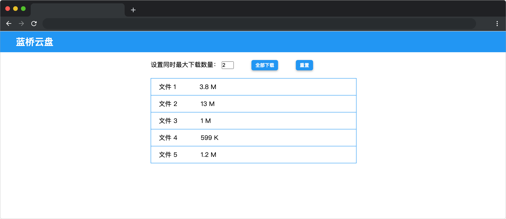

# 蓝桥云盘

## 介绍

蓝桥云盘是一种功能强大、安全可靠的云存储服务，可以为用户提供高效便捷的文件管理和协作体验。蓝桥云盘提供了“最多同时下载几个文件”的配置选项，以避免过多的下载任务导致网络负载过高，影响下载速度和网络稳定性。

## 准备

开始答题前，需要先打开本题的项目代码文件夹，目录结构如下：

```bash
├── css
│   └── style.css
├── index.html
├── effect.gif
└── js
    ├── concurrencyLimit.js
    └── index.js
```

其中：

- `css` 是样式文件夹。
- `js/index.js` 是已经提供的文件下载逻辑。
- `js/concurrencyLimit.js` 是待补充的 js 文件。
- `index.html` 是主页面。
- `effect.gif` 是项目最终完成的效果图。

在浏览器中预览 `index.html` 页面效果如下：



## 目标

请在 `js/concurrencyLimit.js` 文件中的 TODO 部分，完善 `concurrencyLimit` 函数，实现根据参数限制并发操作数量。

**函数参数说明：**

- `tasks` 是要限制的操作的异步任务数组，每个任务都是一个返回 `Promise` 的函数。这个数组中的操作将按顺序执行，但是有限制的并发操作数量会确保在同一时间只有指定数量的操作在执行（例如：只能同时下载两个文件）。
- `limit` 参数为可以同时执行的操作数量，即最大并发操作数。

**函数返回值说明：**

- 函数的返回值是一个 `Promise` 并且 `Promise` 返回一个结果数组，其中包含所有 `Promise` （即 `tasks` 中的每个任务） 执行后的结果或错误。

最终效果可参考文件夹下面的 gif 图，图片名称为 `effect.gif`（提示：可以通过 VS Code 或者浏览器预览 gif 图片）。

## 规定

- 请勿修改 `js/concurrencyLimit.js` 文件外的任何内容。
- 请严格按照考试步骤操作，切勿修改考试默认提供项目中的文件名称、文件夹路径、class 名、id 名、图片名等，以免造成判题⽆法通过。

## 判分标准

- 本题完全实现题目目标得满分，否则得 0 分。