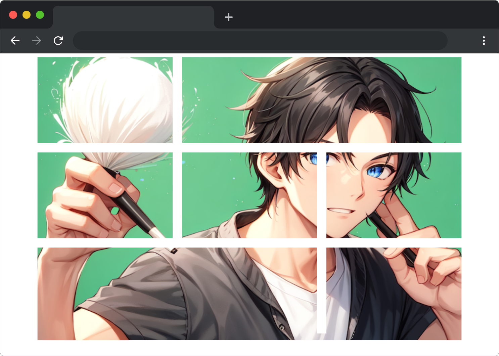

# 爱拼才会赢

## 介绍

由爱拼社举办的拼图大赛进行到最后一关，1 号选手小蓝披荆斩棘成为全场黑马。本关卡需要选手使用 CSS Grid 布局完成拼图页面，但是由于小蓝技术水平有限，拼图的效果没有达到预期。现在邀请你作为协助嘉宾帮助小蓝优化拼图页面的效果。

本题需要在已提供的基础项目中，使用 CSS 让拼图正确显示。

## 准备

开始答题前，需要先打开本题的项目代码文件夹，目录结构如下：

```bash
├── css
│   └── style.css
├── images
└── index.html
```

其中:

- `index.html` 是主页面。
- `images` 是图片文件夹。
- `css/style.css` 是待补充的 css 文件。

在浏览器中预览 `index.html` 页面效果如下：



## 目标

请使用 `Grid` 完善 `css/style.css` 中的 TODO 代码，使 `article` 元素下第二个 `div` 在右侧占据 2 列的位置，第 6 个 `div` 在左侧占据 2 列的位置，最终实现下图效果。


提示：`grid-column: start / end;` ，其中 `start` 对应值为数字，表示网格项的起始位置。`end` 对应值为数字，表示网格项的结束位置。 


## 规定

- 请勿修改 `css/style.css` 文件外的任何内容。
- 请严格按照考试步骤操作，切勿修改考试默认提供项目中的文件名称、文件夹路径、class 名、id 名、图片名等，以免造成判题⽆法通过。

## 判分标准

- 本题完全实现题目目标得满分，否则得 0 分。
