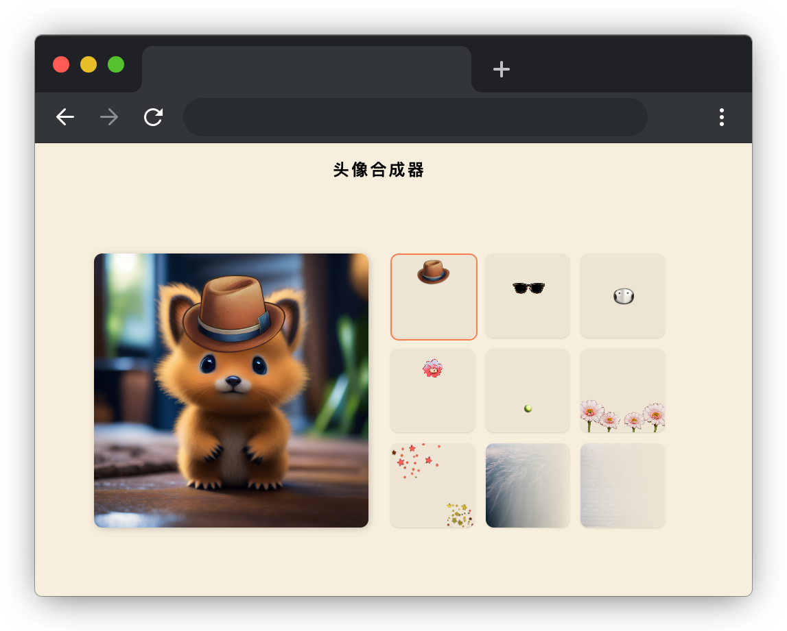

# 头像合成器

## 介绍

头像合成器是一款有趣的应用，让你能够通过选择各种装饰图来个性化你的头像。无论是魔法帽子、太阳眼镜、面具还是鲜花，你可以轻松地尝试不同的风格和效果。让你的头像与众不同，展现独特的个性和创造力。

## 准备

开始答题前，需要先打开本题的项目代码文件夹，目录结构如下：

```bash
├─ css
├─ effect.gif	    
├─ images
├─ index.html			
└─ js
   └─ index.js			
```

其中：

- `index.html` 是主页面。
- `css` 是样式文件夹。
- `images` 是图片文件夹。
- `effect.gif` 是最终的效果图。
- `js/index.js` 是待补充的 js 文件。

在浏览器中预览 `index.html` 页面效果如下：

  


初始化时，页面左侧是头像，右侧是九个装饰图，但点击右侧并不会切换选中态，且左侧的头像也不会随着点击变化。

## 目标

请在 `js/index.js` 文件中的 TODO 部分，完善 `onLoad` 函数，实现以下目标：

当点击右侧九宫格的某个装饰图（`class=app-condidate-filter`）时，将头像（`id=avatar-filter`）的图片地址（`src`）修改为该装饰图的背景图片（为了方便获取背景图片均为行内样式），同时给当前点击的装饰图添加 `class=checked` 类，使其变为选中态，移除其他装饰图的 `checked` 类，使其变为未选中状态。

最终效果可参考文件夹下面的 gif 图，图片名称为 `effect.gif`（提示：可以通过 VS Code 或者浏览器预览 gif 图片）。

## 规定

- 请勿修改 `js/index.js` 文件外的任何内容。
- 请严格按照考试步骤操作，切勿修改考试默认提供项目中的文件名称、文件夹路径、class 名、id 名、图片名等，以免造成判题⽆法通过。

## 判分标准

- 本题完全实现题目目标得满分，否则得 0 分。