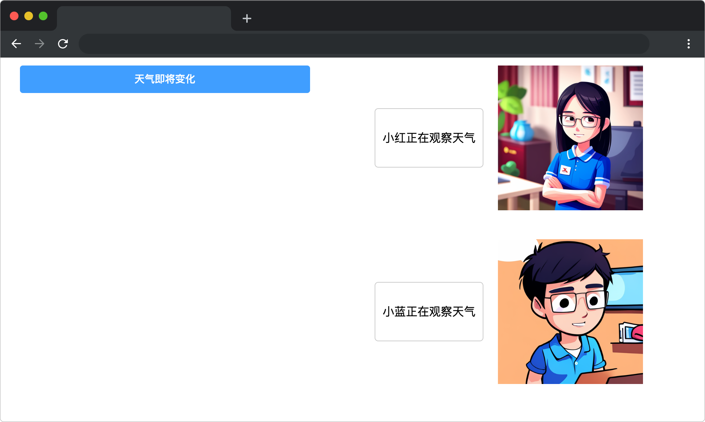
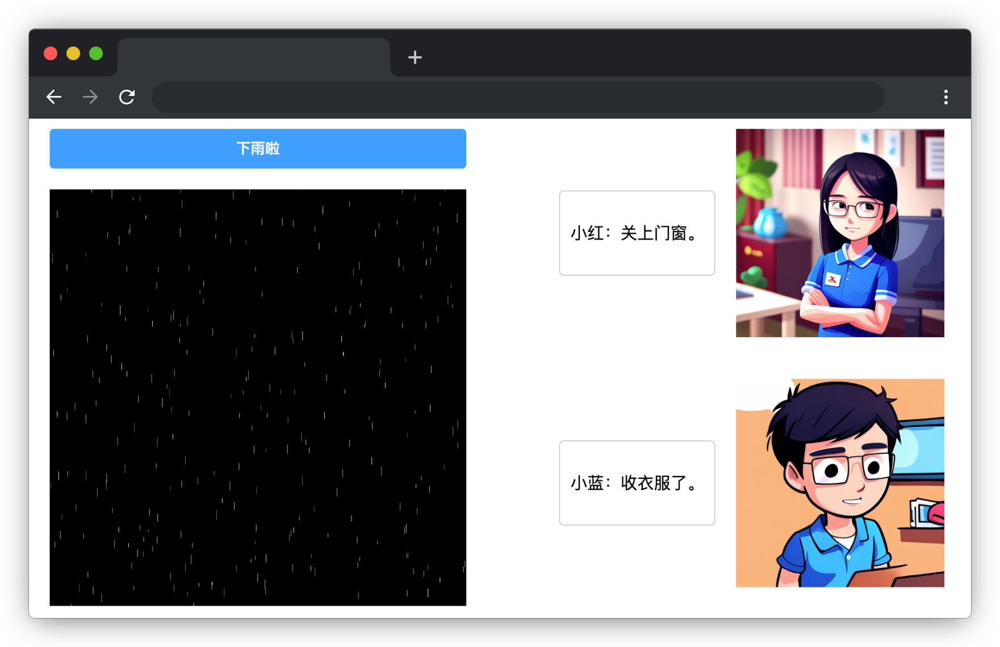

# 窗外的细雨

## 介绍

夏天到了，天气预报今天有雨。小红和小蓝正在留意天气变化，准备在下雨前将门窗关闭并收衣服。请结合面向对象知识，实现点击“天气即将变化”按钮后小红和小蓝分别去关窗和收衣服的效果。

## 准备

开始答题前，需要先打开本题的项目代码文件夹，目录结构如下：

```bash
├── css
├── images
├── index.html
└── js
    └── index.js
```

其中:

- `index.html` 是主页面。
- `css` 是样式文件夹。
- `images` 是图片文件夹。
- `js/index.js` 是待补充的 js 文件。

在浏览器中预览 `index.html` 页面效果如下：



## 目标

请在 `js/index.js` 文件中的 TODO 部分，实现以下目标：

1. 完善 `registerObserver` 方法，实现观察者注册，即将接收到的观察者对象 `observer` 添加到 `MessageSubject` 类的 `observers` 所有观察者数组。
2. 完善 `notifyObservers` 方法，实现页面消息气泡内容的更改，即所有观察者调用 `update` 方法（已提供）。

**请注意代码的通用性，观察者可以被无限添加。**

完成后，点击**天气即将变化按钮**，效果如下：

 

## 规定

- 请勿修改 `js/index.js` 文件外的任何内容。
- 请严格按照考试步骤操作，切勿修改考试默认提供项目中的文件名称、文件夹路径、class 名、id 名、图片名等，以免造成判题⽆法通过。

## 判分标准

- 本题完全实现题目目标得满分，否则得 0 分。
