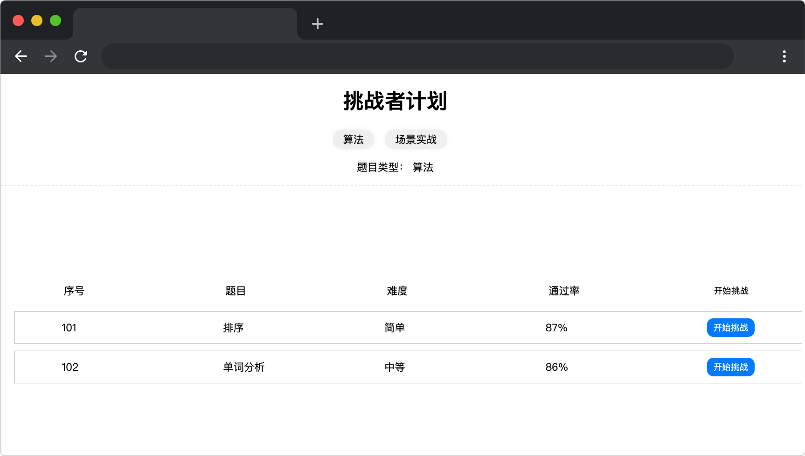

# 挑战者计划

## 介绍

对于小蓝来说，参加挑战者计划的做题比赛是一个很好的锻炼机会，可以考验他的知识广度和解决问题的能力。他将面临各种挑战，需要运用自己的学习和思考能力来解决复杂的问题。

## 准备

开始答题前，需要先打开本题的项目代码文件夹，目录结构如下：

```txt
├── css
├── index.html
├── effect.gif
├── lib
└── mock
    └── data.json
```

其中：

- `lib` 是项目依赖文件夹。
- `css` 是样式文件夹。
- `mock` 是数据文件夹。
- `index.html` 是主页面。
- `effect.gif` 是项目最终完成的效果图。

在浏览器中预览 `index.html` 页面效果如下：



## 目标

完善 `index.html` 的三处 TODO 部分的代码，实现以下目标：

1. 点击算法（`class=btn`）和场景实战按钮（`class=btn`）时，对应的按钮会变成激活状态，即为当前按钮新增类名 (`class=btn-primary`)，另一个按钮变为非激活状态 ，**默认算法按钮为激活状态**。

2. 题目类型后面对应的文字（`id=topicType`）跟随目标 1 按钮点击进行对应的切换，显示当前激活状态下的按钮名称（算法或场景实战）。

3. 在第三处 TODO 部分，根据难度 `difficulty` 动态添加为 `a` 标签添加对应的 `class`。`difficulty` 对应的难度和 `class` 名称规则如下：

    |  difficulty 值   | 难度  | class  |
    |  :----: | ----  | ----  |
    | 0  | 简单 |yellow |
    | 1  | 中等 |blue |
    | 2  | 困难 |red |

**注意：测试时题目的数据（即 `mock/data.json`）会使用动态数据，请确保写法的通用性。**

最终效果可参考文件夹下面的 gif 图，图片名称为 `effect.gif`（提示：可以通过 VS Code 或者浏览器预览 gif 图片）。

## 规定

- 请勿修改 `index.html` 文件外的任何内容。
- 请严格按照考试步骤操作，切勿修改考试默认提供项目中的文件名称、文件夹路径、class 名、id 名、图片名等，以免造成判题⽆法通过。

## 判分标准

- 完成目标 1 与目标 2，得 5 分。
- 完成目标 3，得 5 分。
