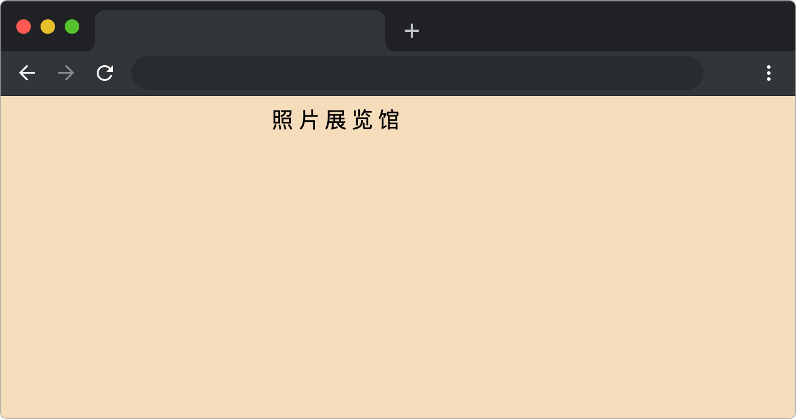

# 照片展览馆

## 介绍

小蓝是一名摄影爱好者，他如同收集宝藏一般收藏了大量精美的摄影作品。有一天，他心中萌生了一个美妙的构想——创建一个独特的平台，将他珍藏的这些摄影珍品展示给世界，不仅方便他随时回味，还能让其他人欣赏到这些视觉杰作。

然而，他并不熟悉 Vue 和 Element Plus。快来帮助他把梦想变为现实吧！

## 准备

开始答题前，需要先打开本题的项目代码文件夹，目录结构如下：

```
├── components
│   ├── List.js
│   └── PhotoError.js
├── css
├── effect.gif
├── images
├── index.html
└── lib

```

其中：

- `index.html` 是主页面。
- `images`是图片文件夹。
- `libs` 是项目依赖文件夹。
- `components` 是 `vue` 组件文件夹。
- `effect.gif` 是项目最终完成的效果图。

在浏览器中预览 `index.html` 页面效果如下：



初始化时，页面并没有展示和加载照片。

## 目标

请在 `components/List.js` 文件中补全代码，具体需求如下：

1. 在 `<div class="scroll-container">` 元素上增加无限滚动的相关配置并在 `loadMoreData` 函数中补全代码，当用户滑动到距离页面底部 `48` 像素时会调用已定义的 `loadNextPageData` 继续**加载下一页数据增加到当前已有的数据列表中**。

`loadNextPageData` 函数将获取下一页的数据。`loadNextPageData` 返回的是一个 `promise`。

数据格式如下（**注意每次调用 `loadNextPageData` 返回的数据是不同的**）:

```js
{
    id: 100, // 照片 id
    author: 'author', // 照片的作者
    location: 'location', // 照片的拍摄地点
    device: 'device' // 照片的拍摄设备
}
```

2. 点击照片时，显示当前照片的全屏预览图。

在 `components/List.js` 路径下写好了用来根据照片 `id` 获取图片源地址的函数 `getImageSourceById`，其入参是照片 `id`，返回值是对应的图片源地址。

本项目中使用到的 `element-plus` 相关 API 如下：

- `Infinite Scroll` (无限滚动)

在要实现滚动加载的列表上添加 `v-infinite-scroll`，并赋值相应的加载方法，可实现滚动到底部时自动执行加载方法。

指令：

| 属性                         | 说明                             | 类型         | 默认值 |
| ---------------------------- | -------------------------------- | ------------ | ------ |
| `v-infinite-scroll`        | 滚动到底部时，加载更多数据       | `Function` | `-`  |
| `infinite-scroll-distance` | 触发加载的距离底部阈值，单位为px | `number`   | `0`  |

- `Image` (图片)

图片容器，在保留所有原生 img 的特性下，支持懒加载，自定义占位、加载失败等。

属性：

| 属性名               | 说明                                         | 类型         | 默认值 |
| -------------------- | -------------------------------------------- | ------------ | ------ |
| `src`              | 图片源地址，同原生属性一致                   | `string`   | `-`  |
| `preview-src-list` | 开启图片预览功能，预览的图片源地址列表       | `string[]` | `[]` |
| `initial-index`    | 第一张预览图片在 `preview-src-list` 的位置 | `number`   | `0`  |

最终效果可参考文件夹下面的 gif 图，图片名称为 `effect.gif`（提示：可以通过 VS Code 或者浏览器预览 gif 图片）。

## 规定

- 不要修改除 `components/List.js` 外的任何文件。
- 请严格按照考试步骤操作，切勿修改考试默认提供项目中的文件名称、文件夹路径、class 名、id 名、图片名等，以免造成判题无法通过。

## 判分标准

- 完成目标 1，得 5 分。
- 在完成目标 1 的基础上，完成目标 2，得 5 分。
