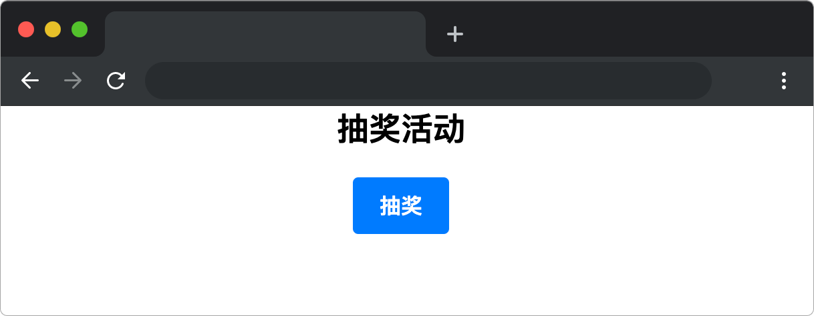

# 年会不能停

## 介绍

蓝小胖在公司上班多年，公司一直没有举行什么年会活动，很多员工都在背后抱怨。老板为了安抚人心，让蓝小胖设计一个抽奖活动，蓝小胖设置的奖品有手机、空调、平板、200 现金，并且设置对应的中奖概率分别为 10%，20%，30%，40%。

## 准备

开始答题前，需要先打开本题的项目代码文件夹，目录结构如下：

```bash
├── css
│   └── style.css
├── images
├── mock
├── lib
└── index.html
```

其中:

- `css` 是样式文件夹。
- `images` 是图片文件夹。
- `mock` 是项目数据文件夹。
- `lib` 是项目依赖文件夹。
- `index.html` 是主页面。

在浏览器中预览 `index.html` 页面效果如下：



## 目标

完成 `index.html` 中的 TODO 部分代码，实现以下目标：

1. 不使用任何第三方库的情况下，请求奖品数据地址为 `mock/data.json`（地址使用已提供变量 `MockUrl="./mock/data.json"`），将请求数据赋值给已有 `list` 变量，并在 `.reward` 元素内（**注意：不是循环 `.reward` 元素**）正确渲染奖品。

请求来的数据如下：
```json
[
    {
        "title": "手机", //  奖品名称
        "prizeLevel": "一等奖",  // 奖品等级
        "src": "./images/1.svg",  // 奖品图片地址
        "probability": "10%" // 中奖概率
    },
    //...省略其他奖品数据
]
```
奖品在 `.reward` 元素中的 DOM 结构如下：

```html
<!-- .reward 包裹四个奖品的最外层元素 -->
<div class="reward"  v-if="list&&showList">
  <!-- 奖品 dom 开始 -->
  <div>
    
    <div class="reward-title">手机</div>
    <div class="reward-level">一等奖</div>
    <div class="reward-probability">中奖概率：10%</div>
  </div>
  <!-- 奖品 dom 结束 -->
  <!-- ... 省略其他奖品代码 -->
</div>
```

目标 1 完成后效果如下：


2. 完善 `reward` 方法，返回值是根据相应概率从 `list` 中选取奖品的**索引**，为数值类型。

- 手机【索引为 0】的概率是 10%。
- 空调【索引为 1】的概率是 20%。
- 平板【索引为 2】的概率是 30%。
- 200 现金【索引为 3】的概率是 40%。

最终效果可参考文件夹下面的 gif 图，图片名称为 `effect.gif`（提示：可以通过 VS Code 或者浏览器预览 gif 图片）。

## 规定

- 请勿修改 `index.html` 文件外的任何内容。
- 请严格按照考试步骤操作，切勿修改考试默认提供项目中的文件名称、文件夹路径、class 名、id 名、图片名等，以免造成判题⽆法通过。

## 判断标准

- 完成目标 1，得 5 分。
- 完成目标 2，得 5 分。
