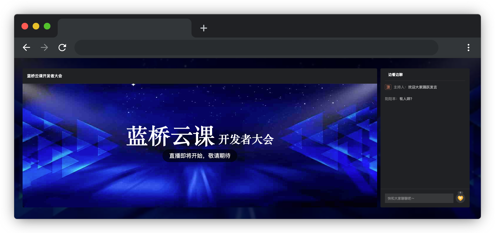

# 蓝桥云课开发者大会

## 介绍

蓝桥云课开发者大会直播测试工作正在进行中，在直播测试时，发现了一些技术问题，导致了聊天功能和点赞功能的暂时失效。作为前端工程师，你需要迅速行动起来，致力于迅速修复这一问题，以确保您的会议体验不受任何干扰。

## 准备

开始答题前，需要先打开本题的项目代码文件夹，目录结构如下：

```bash
├── css
├── images
├── js 
├── index.html
└── effect.gif
```

其中：

- `index.html` 是主页面。
- `css` 是样式文件夹。
- `images` 是图片文件夹。
- `js/index.js` 是待补充的 js 文件。
- `effect.gif` 是目标 2 最终完成的效果图。

在浏览器中预览 `index.html` 页面效果如下：


  


## 目标

请在 `js/index.js` 文件中的 TODO 部分，实现以下目标：

1. 实现聊天功能：请补充 `handleSend` 方法中的 TODO 部分，实现获取输入框（标签 `<input>`）元素的值，并将聊天消息的 dom 片段插入到聊天区域中（`class=msg-area`），然后**清空输入框的值**。

聊天消息的 dom 片段必须使用以下结构：

```html
<!-- 一条消息的 dom片段 -->
<div class="msg-item">
  <span class="author">阳阳羊：</span>这里是输入框输入的值
</div>
```

2. 实现点赞和连续点赞的统计功能：点击点赞按钮（`class=btn-like`）时，鼠标松开会触发`onMouseUp`方法，请补充 `onMouseUp` 方法中的 TODO 代码，统计点赞的总次数和连续点赞的次数。将点赞总次数显示在 `.like-total>span` 处，连续点赞次数显示在 `.like-continuous>span` 处。如果连续点赞次数大于等于 5，则显示出连续点赞的样式（即将 `class=like-continuous` 的元素 `display` 设置为 `block`）。

连续点赞的判断规则如下：

> 如果此次点赞的时间距离上次点赞的时间小于 400ms，则算连续点赞，如果连续点赞中断，则从 1 重新开始计算连续点赞次数。

目标 2 最终效果可参考文件夹下面的 gif 图，图片名称为 `effect.gif`（提示：可以通过 VS Code 或者浏览器预览 gif 图片）。

## 规定

- 请勿修改 `js/index.js` 文件外的任何内容。
- 请严格按照考试步骤操作，切勿修改考试默认提供项目中的文件名称、文件夹路径、class 名、id 名、图片名等，以免造成判题⽆法通过。

## 判分标准

- 完成目标 1，得 5 分。
- 完成目标 2，得 10 分。