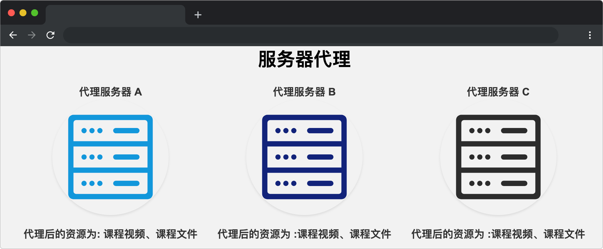

# 服务器代理

## 介绍

随着蓝桥云课学习用户不断增长，为满足不同地区学生的学习体验，研发中心的小伙伴特在 A、B、C 三个地区部署了代理服务器，用于提供课程学习服务。

由于三个代理服务器之间的数据是共享的，因此需要保证三个服务代理的资源是完全相同的。作为研发中心的成员，快来帮我们完成这个任务吧！

## 准备

开始答题前，需要先打开本题的项目代码文件夹，目录结构如下：

```txt
├── css
├── images
├── index.html
└── js
    └── index.js
```

其中:

- `index.html` 是主页面。
- `css` 是样式文件夹。
- `images` 图片文件夹。
- `js/index.js` 是需要补充代码的 js 文件。

在浏览器中预览 `index.html` 页面效果如下：



## 目标

完善 `js/index.js` 的代码，实现以下目标：

题目已定义了一个对象 `state` 用来存储服务器存放的资源：

```js
let state = {
   data: "课程视频",
   filedata: "课程文件"
}; 
```

1. A、B 代理服务器通过 `reactive` 函数中的 Proxy 对 `state` 数据进行代理，并将其赋值给 `state1`、`state2`。我们需要保证 `state1`、`state2` 代理后的对象在内存中指向相同的引用。

提示：通过对象的 `key` 为 `ReactiveFlags.IS_REACTIVE` 的值判断对象是否被代理过。

测试用例：

```js
const state1 = reactive(state);
const state2 = reactive(state);
//被代理过的对象 state1 state2  代理了同一个原始对象 state
console.log(state1 === state2); // 输出 true
```

2. 由于 C 服务器距离 B 服务器较近，因此 C 服务器需要通过 B 服务器来获取资源，并将其赋值给 `state3`，我们需要保证 `state2`、`state3` 代理后的对象在内存中指向相同的引用。

测试用例：

```js
const state2 = reactive(state);
// 被代理过的对象 state2 传入 reactive 再次代理
const state3 = reactive(state2);
console.log(state2 === state3); // 输出 true
```

完成后效果如下：


## 规定

- 请严格按照考试步骤操作，切勿修改考试默认提供项目中的文件名称、文件夹路径、class 名、id 名、图片名等，以免造成判题⽆法通过。

## 判分标准

- 完成目标 1，得 5 分。
- 完成目标 2，得 10 分。
