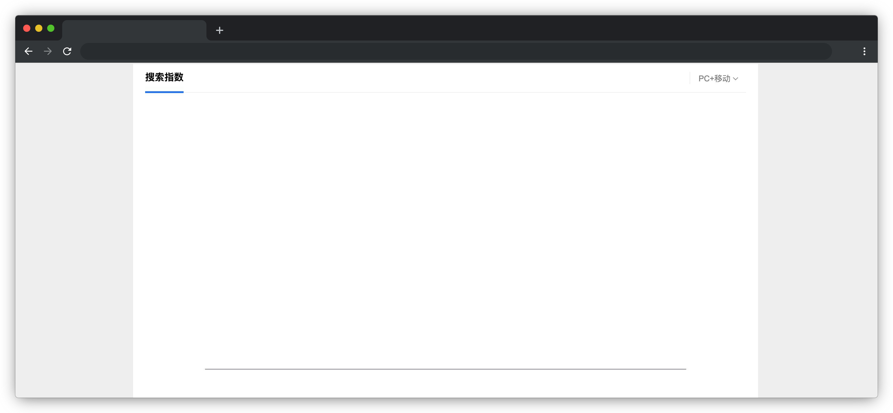

# 搜索指数

## 介绍

搜索指数是指用于衡量特定搜索词或短语在搜索引擎中的受欢迎程度的指标。通常情况下，搜索指数可以衡量出一段时间内搜索特定关键词或短语的数量。搜索指数可以帮助营销人员、SEO 专业人员和企业决策者了解市场趋势和消费者兴趣的变化，以便根据这些变化调整他们的策略和营销活动。

本题会提供一组用户的搜索记录，需要你按照要求将其处理成所需的数据结构并正确渲染在页面上。

## 准备

开始答题前，需要先打开本题的项目代码文件夹，目录结构如下：

```bash
├── css
│   └── style.css
├── effect.gif
├── index.html
├── js
│   ├── data.json
│   └── index.js
└── lib
    ├── axios.min.js
    └── echarts.min.js
```

其中：

- `css` 是样式文件夹。
- `effect.gif` 是最终效果图。
- `index.html` 是主页面。
- `lib` 是项目依赖的文件夹。
- `js/data.json` 是页面用到的数据文件。
- `js/index.js` 是待补充的 js 文件。

在浏览器中预览 `index.html` 页面效果如下：



## 目标

请在 `js/index.js` 文件中的 TODO 部分，完善 `getxAxis` 和 `getSeriesData` 函数，实现以下目标：
 
1. 补充 `getxAxis` 函数中的代码，**根据参数 `searchKey` 和 `platform` 字段，提取参数 `data` 中的日期**，**去重**并**升序排序**，最终存储在数组 `xAxis` 中返回。

`getxAxis` 函数参数描述如下：

| 参数      | 说明                                                                                                   | 类型   |
| --------- | ------------------------------------------------------------------------------------------------------ | ------ |
| data      | `js/data.json` 文件中获取到的数据。                                                                  | Array  |
| searchKey | 搜索关键字：判断 `js/data.json` 中字段 `keyword` 是否与该参数相同，本题为字符串 `"watermelon"`。 | String |
| platform  | 搜索设备：1:PC+移动（即 `data.json` 中字段 `platform` 值为 `PC` 或 `Mobile`）、2:PC、3:移动。  | String |

最终返回的数组数据结构如下：

```json
[
    "2024-02-01",
    "2024-02-02",
    "2024-02-03",
    "2024-02-04",
    "2024-02-07",
    ...
]
```

2. 补充 `getSeriesData` 函数中的代码，根据参数 `searchKey` 和 `platform` 字段对参数 `data` 进行条件筛选，注意与参数 `dateArr` 所存储的日期进行一一对应，提取 `data` 中的 `count` 属性，将同一日期下的 `count` 字段值累加之和保存至数组 `sData` 中返回。

`getSeriesData` 函数参数描述如下：

| 参数      | 说明                                                                                                   | 类型   |
| --------- | ------------------------------------------------------------------------------------------------------ | ------ |
| data      | `js/data.json` 文件中获取到的数据。                                                                    | Array  |
| searchKey | 搜索关键字：判断 `js/data.json` 中字段 `keyword` 是否与该参数相同，本题为字符串 `"watermelon"`。 | String |
| platform  | 搜索设备：1:PC+移动（即 `data.json` 中字段 `platform` 值为 `PC` 或 `Mobile`）、2:PC、3:移动。  | String |
| dateArr   | `getxAxis` 函数返回的日期列表。                                                                      | Array  |

最终返回的数组数据结构如下：

```json
[
    3400,
    18200,
    2200,
    10800,
    33200,
    ...
]
```

最终效果可参考文件夹下面的 gif 图，图片名称为 `effect.gif`（提示：可以通过 VS Code 或者浏览器预览 gif 图片）。

## 规定

- 请勿修改 `js/index.js` 文件外的任何内容。
- 请严格按照考试步骤操作，切勿修改考试默认提供项目中的文件名称、文件夹路径、class 名、id 名、图片名等，以免造成判题⽆法通过。

## 判分标准

- 完成目标 1，得 10 分。
- 完成目标 2，得 10 分。
