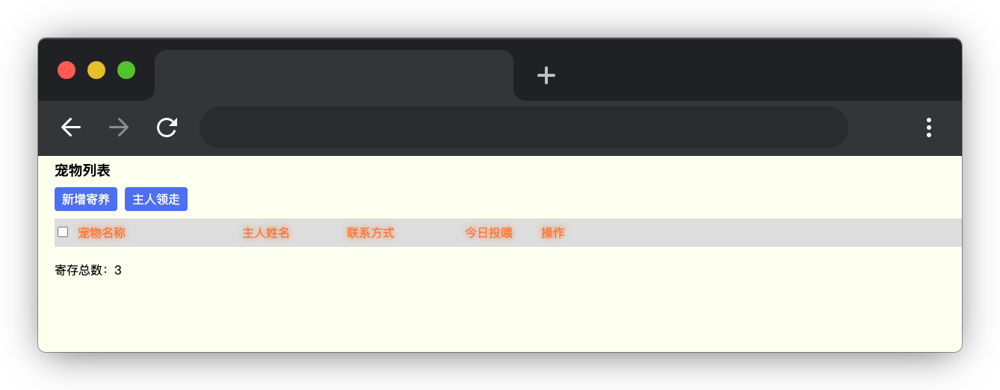

# 宠物管理

## 介绍

随着经济增长，人们养宠物的趋势越来越明显。但是长时间出门的时候，宠物不好携带，多数人会选择将宠物寄养在宠物店。为了寄养宠物更好的管理，宠物店找你帮忙开发一个简单的宠物管理应用程序。

## 准备

开始答题前，需要先打开本题的项目代码文件夹，目录结构如下：

```bash
├── components
│   ├── AddPop.js
│   ├── App.js
│   └── PopUp.js
├── css
├── images
├── effect.gif
├── index.html
└── lib
```

其中：

- `lib` 是存放项目依赖的文件夹。
- `css` 是存放项目样式的文件夹。
- `images` 是图片文件夹。
- `index.html` 是主页面。
- `components` 是存放项目组件的文件夹。
- `effect.gif` 是项目最终完成的效果图。

在浏览器中预览 `index.html` 页面效果如下：


  


## 目标

完善 `components/App.js` 文件的 `handleSave` 函数和 `index.html` 中的 TODO 部分代码，实现以下目标：

1. 完成宠物列表的渲染和新增。在宠物列表（`class = pet-list`）元素下渲染宠物列表（`pets`），点击新增寄存按钮后，填写宠物名称、主人姓名、联系方式后，表单信息同步存储在 `form` 中，点击提交会触发 `handleSave` 方法新增宠物。

新增数据的格式如下：

```js
{ checked: false, name: '小贝', owner: '梦想', phone: '12345678901', feed: 0 }
```

数据字段说明：

| 字段    | 类型    | 介绍     | 值                                          |
| ------- | ------- | -------- | ------------------------------------------- |
| checked | Boolean | 是否选中 | 默认为 `false`，点击宠物列表的多选框改变  |
| name    | String  | 宠物名称 | 来自 `form.name`                          |
| owner   | String  | 主人姓名 | 来自 `form.owner`                         |
| phone   | String  | 联系方式 | 来自 `form.phone`                         |
| feed    | Number  | 喂养次数 | 默认值为 0，点击喂养次数加 1，最多喂养 3 次 |

单条数据 HTML 结构如下所示：

```html
<li class="list-body">
  <input class="pet-check" type="checkbox" />
  <span class="pet-name">小贝</span>
  <span class="pet-owner">梦想</span>
  <span class="pet-phone">12345678901</span>
  <span class="pet-feed">0/3</span>
  <span>
    <span class="feed-text" @click="handleFeed(item)">投喂</span>
    <span class="edit-text" @click="clickEdit(item,index)">编辑</span>
    <span class="getback-text" @click="handleGetback(item)">主人领走</span>
  </span>
</li>
```

**渲染完成后，需正确绑定事件中的参数，其中 `item` 表示当前宠物数据，`index` 表示当前宠物在 `pets` 数组中的索引。**

2. 完善 `components/App.js` 中计算属性 `allCheck`，实现全选和全选功能。为列表中的 `input [type="checkbox"]` 绑定正确的 `checked` 属性。实现列表全部勾选后，全选复选框被勾选；全选复选框取消勾选后，列表项的勾选全部取消。

最终效果可参考文件夹下面的 gif 图，图片名称为 `effect.gif`（提示：可以通过 VS Code 或者浏览器预览 gif 图片）。

## 规定

- 请严格按照考试步骤操作，切勿修改考试默认提供项目中的文件名称、文件夹路径、class 名、id 名、图片名等，以免造成无法判题通过。

## 判分标准

- 完成目标 1，得 10 分。
- 完成目标 1 的基础上，完成目标 2，得 10 分。
