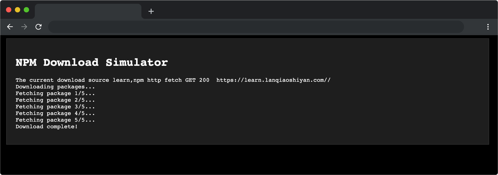

# NPM Download Simulator

## 介绍

NPM Download Simulator 模拟了 npm 包下载的过程。用户可以点击 "下载（Start Download）" 按钮开始下载，并从多个下载源中选择最快的源进行下载，模拟了实际下载的过程，包括下载进度和成功或失败的结果。

## 准备

开始答题前，需要先打开本题的项目代码文件夹，目录结构如下：

```txt
├── css
├── index.html
└── js
    └── index.js

```

其中:

- `css` 是样式文件夹。
- `index.html` 是主页面。
- `js/index.js` 是待补充的 js 文件。

在浏览器中预览 `index.html` 页面效果如下：



## 目标

找到 `js/index.js` 文件中的 `myRace` 函数，**在不使用 `Promise.race` 的情况下**，完善其中的 TODO 部分，目标如下：

`myRace` 接收的参数应为可迭代对象，可迭代对象包含数组（`Array`）、字符串（`String`）、`Set`、`Map`。

1. 如果不是可迭代对象则函数应该根据参数类型，返回一个拒绝的 `Promise`，并抛出 `TypeError`错误。格式为: `Uncaught (in promise) TypeError: 数据类型值 is not iterable (cannot read property Symbol(Symbol.iterator))`

示例：

```js
// 1 执行代码
myRace(1) 
// 控制台报错输出
Uncaught (in promise) TypeError: number iterable is not iterable (cannot read property Symbol(Symbol.iterator))

//2 执行代码 
myRace(null)
// 控制台报错输出
Uncaught (in promise) TypeError: object null is not iterable (cannot read property Symbol(Symbol.iterator))

//3 执行代码
myRace(true)
// 控制台报错输出
Uncaught (in promise) TypeError: boolean true is not iterable (cannot read property Symbol(Symbol.iterator))
```

2. 参数如果是可迭代对象，则 `myRace` 函数返回一个新的 `Promise` 对象，该对象代表了传入的可迭代对象中最先解决或拒绝的 `Promise` 的状态。如果可迭代对象中包含非 `Promise` 的普通值（例如字符串、数字等），那么返回的 `Promise` 会立即解决，并使用该普通值作为解决值。

示例：

```js
myRace([1,2])  //返回 Promise {<fulfilled>: 1}
myRace([promise1, promise2, promise3]) // 返回第一个成功或者失败的 Promise   
myRace('hello')  // 返回  Promise {<fulfilled>: 'h'}
```

完成后，点击 “Start Download” 按钮，效果如下：


## 规定

- 请严格按照考试步骤操作，切勿修改考试默认提供项目中的文件名称、文件夹路径、class 名、id 名、图片名等，以免造成判题无法通过。

## 判分标准

- 完成目标 1，得 5 分。
- 完成目标 2，得 20 分。
