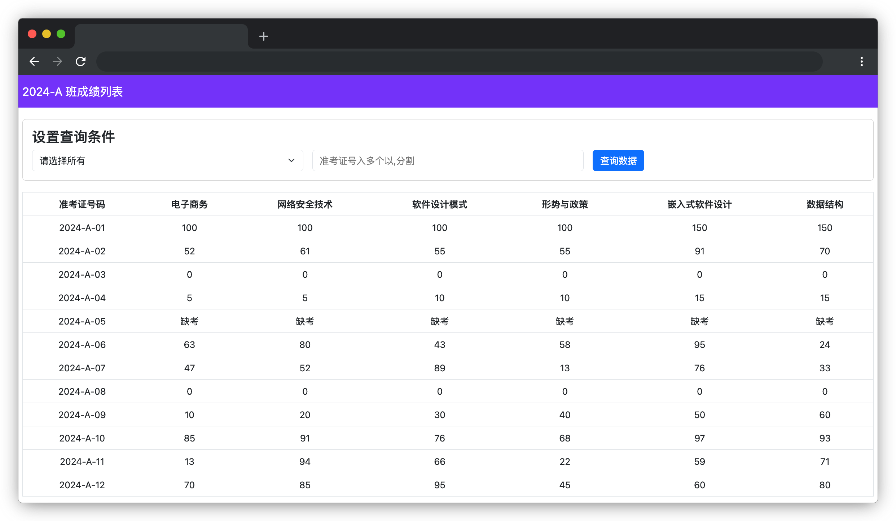

# 成绩小助手

## 介绍

成绩查小助手是一个非常有用的工具。通过使用成绩查询页面，可以让老师们快速、方便地查询学生成绩，了解学生的学习进展和表现，从而更好地支持和指导学生的学习。

## 准备

开始答题前，需要先打开本题的项目代码文件夹，目录结构如下：

```bash
├── css
├── index.html
├── js
│   ├── elementManager.js
│   └── queryScoreList.js
└── mock
    └── data.json
```

其中:

- `index.html` 是主页面。
- `css` 是样式文件夹。
- `js/elementManager.js` 是项目 DOM 渲染相关代码。
- `js/queryScoreList.js` 是待补充代码的 js 文件。
- `mock/data.json` 是请求需要用到 JSON 数据。

在浏览器中预览 `index.html` 页面效果如下：

  


## 目标

请在 `js/queryScoreList.js` 文件中的 TODO 部分，完善 `queryScoreList` 函数。**请注意在选择下拉框会自动触发查询。输入准考证号，需要点击查询按钮后触发查询（功能代码已提供）。**

**函数参数说明：**

- `data` 表示成绩数据，数据结构示例如下：

```js
[
  {
    "2024-A-01": [
      { "1": 100 },
      { "2": 100 },
      { "3": 100 },
      { "4": 100 },
      { "5": 150 },
      { "6": 150 },
    ],
  },
  // ... 省略
];
```

其中 `2024-A-01` 表示学生考号，后面对应的数据表示学生的 6 门课程成绩，如 `{ 1: 100 }`，1 表示第一门课电子商务，成绩为 100 分。**1-4 满分条件为 100分，及格为 60分；5-6 满分为 150 分，及格 90 分**。

- `query` 表示查询条件，为 object 类型。

`queryScoreList` 函数需实现以下目标：

1. 参数 `query` 为 `{ perfectScore: true }` 表示查询满分成绩。

```js
// 查询满分
let res = queryScoreList(data, { perfectScore: true });
```

2. 参数 `query` 为 `{score:0,matchAll: true}` 表示查询全部 0 分； `{score:"缺考",matchAll:  true}` 表示查询全部缺考。

```js
// 查询 0分
let res = queryScoreList(data, {score:0,matchAll: true})
// 查询缺考
let res = queryScoreList(data, {score:"缺考",matchAll: true})
```

3. 参数 `query` 为 `{ failedFew: true}` 表示查询一科以上未及格（包含一科），**缺考不计入未及格**。

```js
//一科以上未及格（包含一科）
let res =  queryScoreList(data, { failedFew: true})
```

4. 参数 `query` 为 `{ students:"2024-A-01"}` 根据准考证号进行查询，多个准考证号以 `,` 分割。如果**准考证号均不存在则返回空数组**。

```js
 //查询考号为 “2024-A-01” 的 1 名学生。
 let res = queryScoreList(data, { students:"2024-A-01"})
 //查询考号为 “2024-A-01,2024-A-03” 的 2 名学生。
 let res = queryScoreList(data, { students:"2024-A-01,2024-A-03"})  
```

最终效果可参考文件夹下面的 gif 图，图片名称为 `effect.gif`（提示：可以通过 VS Code 或者浏览器预览 gif 图片）。

## 规定

- 请勿修改 `js/index.js` 文件外的任何内容。
- 请严格按照考试步骤操作，切勿修改考试默认提供项目中的文件名称、文件夹路径、class 名、id 名、图片名等，以免造成判题⽆法通过。

## 判分标准

- 完成目标 1、2、3、4，各得 5 分。