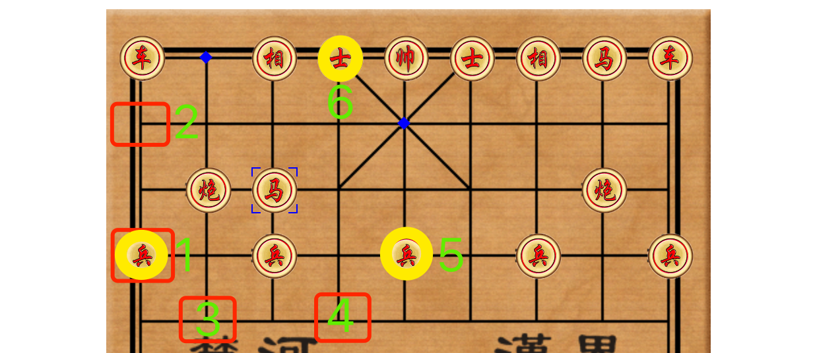

# 中国象棋-马的走法

## 介绍

这个题目将介绍中国象棋中马的走法。马的走法被称为"日"字走法，即在水平或垂直方向上移动两格，并在另一个方向上再移动一格。马具有跳跃能力，可以跳过棋子阻挡。通过学习马的走法，玩家可以利用马的特殊能力在棋局中制造威胁或保护自己的棋子。

## 准备

开始答题前，需要先打开本题的项目代码文件夹，目录结构如下：

```bash
├── css
├── images
├── js
│   ├── forecast.js
│   ├── main.js
│   └── util.js
├── effect.gif
└── index.html
```

其中：

- `index.html` 是主页面。
- `css` 是样式文件夹。
- `js/main.js` 是主功能代码。
- `js/util.js` 是工具函数。
- `effect.gif` 是项目最终完成的效果图。
- `js/foreacst.js` 待补充代码的 js 文件。

在浏览器中预览 `index.html` 页面效果如下：



## 目标

请在 `js/forecast.js` 文件中的 TODO 部分，完善 `horseNextStepForecast` 函数，实现以下目标：

该函数的功能是根据马当前在棋盘上的位置和马走步的规则返回一个结果数组，该数组表示马能走到的坐标集合。数组格式如下：`[{ row: 0, col: 1},...]`

该函数接收三个参数，第一个参数 `chessRow` 表示马当前所在的行（即 `row`）坐标，第二个参数 `chessCol` 表示马当前所在的列（即 `col`）坐标，第三个参数 `chessArr` 表示棋盘整体的二维数组。

棋盘坐标 `chessArr` 二维数组的格式如下所示：

```js
[
  // 单个元素对应的索引为列
  ["R_C1", "R_M1", "R_X1", "R_S1", "R_J2", "R_S2", "R_X2", "R_M2", "R_C2"],  // 整个数组为行
  ["", "", "", "", "", "", "", "", ""],
  ["", "R_P1", "", "", "", "", "", "R_P2", ""],
  ["R_B1", "", "R_B2", "", "R_B3", "", "R_B4", "", "R_B5"],
  ["", "", "", "", "", "", "", "", ""],
  ["", "", "", "", "", "", "", "", ""],
  ["B_B1", "", "B_B2", "", "B_B3", "", "B_B4", "", "B_B5"],
  ["", "B_P1", "", "", "", "", "", "B_P2", ""],
  ["", "", "", "", "", "", "", "", ""],
  ["B_C1", "B_M1", "B_X1", "B_S1", "B_J2", "B_S2", "B_X2", "B_M2", "B_C2"],
];
```

`chessArr` 介绍：其中**字母表示当前位置的棋子，空字符串表示当前位置无棋子**。二维数组的行的位置和列的位置分别对应，其中二维数组中的每个数组所在索引表示行 `row` 的位置，数组中每个元素在当前元素的索引表示列 `col` 位置。如 `"R_M1"` 的坐标对应为 `[0,1]`,即 `row` 对应 0，`col` 对应 1。

**马走法的具体规则说明**：

马在任意位置 `(row, col)` 的周围共有 8 个方向可以移动，但是不能超过棋盘范围。如果马移动的位置有其他棋子（**本题不考虑吃子的情况**）或**者前进的方向（即移动两格的位置）有棋子阻挡（俗称蹩 bié 马腿）则不能朝这个方向移动**，以下是每个方向的描述：

- `row+2, col-1`：往右走两步，再向上走一步。
- `row+2, col+1`：往右走两步，再向下走一步。
- `row-2, col-1`：往左走两步，再向上走一步。
- `row-2, col+1`：往左走两步，再向下走一步。
- `row+1, col-2`：往右走一步，再向上走两步。
- `row+1, col+2`：往右走一步，再向下走两步。
- `row-1, col-2`：往左走一步，再向上走两步。
- `row-1, col+2`：往左走一步，再向下走两步。

**前进的方向（即移动两格的位置）有棋子阻挡（蹩马腿）的坐标示例**：

- 以 `row+2, col-1` 为例，如果 `row+1` 处有棋子阻挡则无法向该方向前进。
- 以 `row-1, col-2` 为例，如果 `col-1` 处有棋子阻挡则无法向该方向前进。
- 其他方向以此类推。

**象棋马走法规则介绍：**

1. 马走步的规则为“日”字的对角线，“日”字可以是横着的（白色），也可以是竖着的（紫色），蓝色的点表示马能走到的位置，下面为棋盘坐标和马走法示例图：


上图中马位于 `{ row: 2, col: 2}`，马能移动的坐标集合为 `[{ row: 0, col: 1},{row:1,col:4}]`

2. 蹩马腿和棋盘上有棋子的位置为马不能移动的位置。当一方马的行动路径上有一个棋子阻挡时，马就无法按照通常的方式前进，称为蹩马腿。

- 黄色圆圈数字标记 5、6 表示此处有棋子，马无法走到。
- 红色方块表示蹩马腿无法走到：1、2 处标记有“炮”蹩马腿无法走到，3、4 处有“兵”蹩马腿无法走到。


最终效果可参考文件夹下面的 gif 图，图片名称为 `effect.gif`（提示：可以通过 VS Code 或者浏览器预览 gif 图片）。

## 规定

- 请严格按照考试步骤操作，切勿修改考试默认提供项目中的文件名称、文件夹路径、class 名、id 名、图片名等，以免造成判题⽆法通过。

## 判分标准

- 根据需求实现马走步的规则为“日”字，得 8 分。
- 本题完全实现题目目标得满分。
