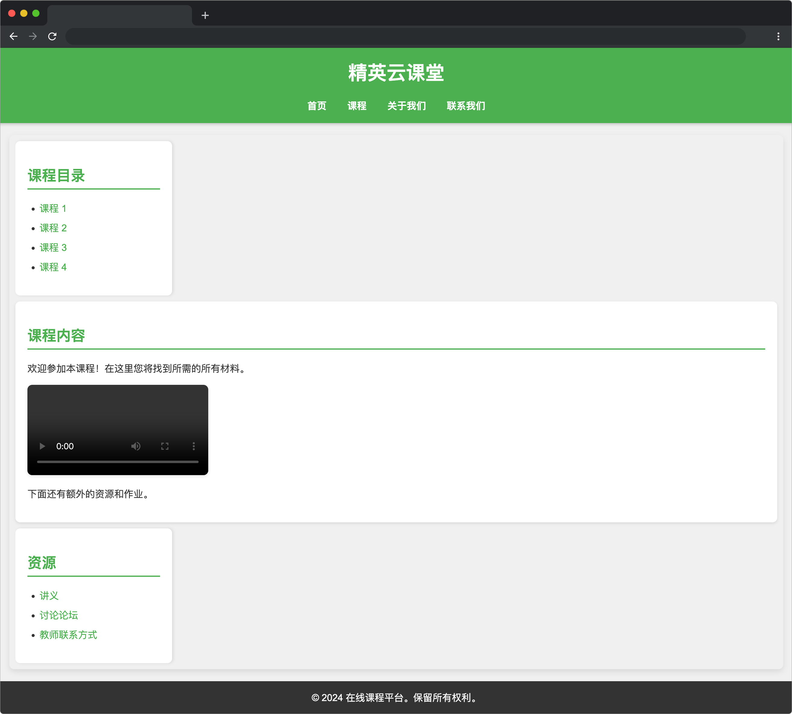

# 精英云课堂
## 介绍

精英云课堂是一个在线学习平台，旨在为用户提供丰富的课程资源和学习体验。用户可以通过该平台访问各种主题的课程，参与互动讨论，获取学习资料，并与老师和同学进行交流。无论是自我提升还是职业发展，精英云课堂都能满足您的学习需求。

## 准备
开始答题前，需要先打开本题的项目代码文件夹，目录结构如下：

```bash
├── css
│   └── style.css
├── effect.gif
└── index.html
```

其中：

- `index.html` 是项目主页面。
- `effect.gif` 是最终效果图。
- `css/style.css` 是待补充代码的样式文件。

在浏览器中预览 `index.html` 页面，页面显示如下所示：



## 目标

完善 `css/style.css` 中的 TODO 部分代码，完成以下目标：

内容区元素（`class="container"`）下的左侧栏（`class="left-sidebar"`）、内容（`<main>`）、和右侧栏（`class="right-sidebar"`）按照左中右的顺序排成一个横排，其中左、右侧栏的宽度已经为固定宽度，设置内容（`<main>`）占据的宽度为除去左、右侧栏和间距外的全部宽度。

最终完成效果可参考文件夹下面的 gif 图，图片名称为 `effect.gif`（提示：可以通过 VS Code 或者浏览器预览 gif 图片）。


## 规定

- 请严格按照考试步骤操作，确保本题程序正常运行，切勿修改考试默认提供项目中的文件名称、文件夹路径、class 名、id 名、图片名等，以免造成判题⽆法通过。
- 本题代码完成之后，<b style="color:red">考生需将题目对应代码文件夹压缩成 zip 或 rar 格式后上传提交，其他格式为 0 分。例如 01 代码文件夹，应该在此文件夹基础上直接压缩后，为 01.zip 或 01.rar，然后提交压缩包到对应题目 </b>。请注意不要给压缩包添加密码。


## 判分标准

- 本题完全实现题目目标得满分，否则得 0 分。
