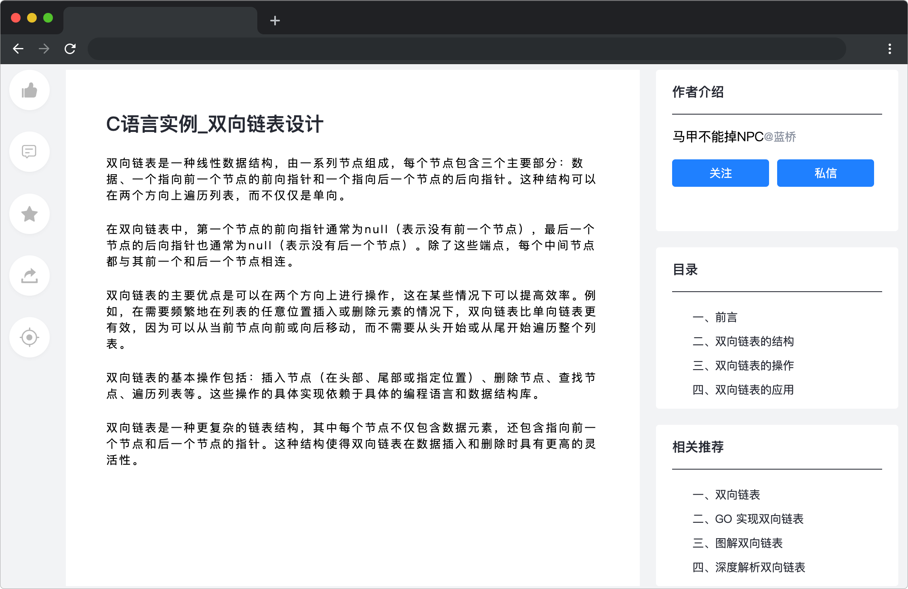

# 沉浸阅读

## 介绍

目前许多平台都提供了沉浸阅读的功能，小蓝也对公司的平台进行改造，希望通过沉浸阅读的功能，让用户更好地沉浸在文章中，提高学习效率。但是平台的交互方式与小蓝的预期不符，因此需要你来帮助小蓝进行代码改造。

## 准备

开始答题前，需要先打开本题的项目代码文件夹，目录结构如下：

```bash
├── css
├── images
├── index.html
├── effect.gif
└── js
    └── index.js
```

其中：
- `css` 是样式文件夹。
- `images` 是图片文件夹。
- `index.html` 是项目主页面。
- `effect.gif` 是最终效果图。
- `js/index.js` 是待补充代码的 js 文件。

在浏览器中预览 `index.html` 页面，页面显示如下所示：



上图中，左侧一列共有 5 个按钮，最下面一个按钮为沉浸阅读按钮。

## 目标

完成 `js/index.js` 文件中的 `HideDom` 函数，此函数在点击沉浸按钮时触发。完善其中的 TODO 部分，实现沉浸模式的切换，规则如下：

- 开启沉浸模式：点击沉浸阅读（`id="immersebtn"`）元素，将前四个图标（`class="panel-btn"`）元素与相关推荐（`id="recommend"`）元素和作者介绍（`id="authorblock"`）元素隐藏。
- 关闭沉浸模式：点击沉浸阅读（`id="immersebtn"`）元素，将前四个图标（`class="panel-btn"`）元素与相关推荐（`id="recommend"`）元素和作者介绍（`id="authorblock"`）元素显示。

注意：开启或关闭沉浸模式只能通过 `display="none"` 或 `display="block"` 、`display="flex"` 属性控制元素的显示与隐藏。

最终完成效果可参考文件夹下面的 gif 图，图片名称为 `effect.gif`（提示：可以通过 VS Code 或者浏览器预览 gif 图片）。

## 规定

- 请严格按照考试步骤操作，确保本题程序正常运行，切勿修改考试默认提供项目中的文件名称、文件夹路径、class 名、id 名、图片名等，以免造成判题⽆法通过。
- 本题代码完成之后，<b style="color:red">考生需将题目对应代码文件夹压缩成 zip 或 rar 格式后上传提交，其他格式为 0 分。例如 01 代码文件夹，应该在此文件夹基础上直接压缩后，为 01.zip 或 01.rar，然后提交压缩包到对应题目 </b>。请注意不要给压缩包添加密码。

## 判分标准

- 本题完全实现题目目标得满分，否则得 0 分。