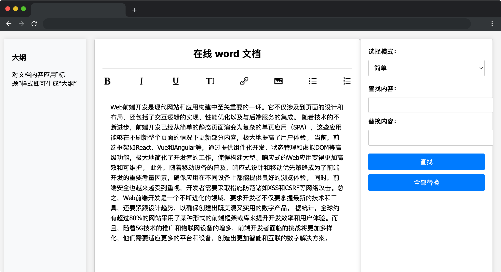

# 智能 word 文档助手

## 介绍

智能 word 文档助手是一个功能强大的在线文档编辑工具，为用户提供便捷的查找和替换文本功能。用户可以根据需求选择三种不同的模式进行操作：简单模式、字典模式和正则表达式模式。这些模式使得文本处理更加灵活和高效，满足各种编辑需求。

## 准备

开始答题前，需要先打开本题的项目代码文件夹，目录结构如下：

```bash
├── css
├── images
├── effect1.gif
├── effect2.gif
├── effect3.gif
├── index.html
├── test.html
└── js
    └── index.js
```

其中：

- `css` 是样式文件夹。
- `images` 是图片文件夹。
- `index.html` 是项目主页面。
- `test.html` 是测试用例页面。
- `js/index.js` 是待补充代码的 js 文件。
- `effect1～3.gif` 分别是目标 1、2、3 完成的效果图。

在浏览器中预览 `index.html` 页面，页面显示如下所示：

  


## 目标

补充 `js/index.js` 的 TODO 部分，实现点击全部替换的功能：

1. 完善 `findAndReplace` 函数，该函数接收三个参数：`content`、`findText` 和 `replaceText`，分别代表原始文本、查找文本和替换文本。将 `content` 中所有匹配的文本全部替换，返回替换后的文本。示例如下：

```js
const content = "Web前端开发是现代";
const findText = "开发";
const replaceText = "开发者";
console.log(findAndReplace(content, findText, replaceText)); // 输出: "Web前端开发者是现代"
```

目标 1 完成效果可参考文件夹下面的 gif 图，图片名称为 `effect1.gif`（提示：可以通过 VS Code 或者浏览器预览 gif 图片）

2. 完善 `findAndReplaceDictionary` 函数，该函数接收二个参数：`content`、`dictionary`，分别代表原始文本、字典对象，键为查找的文本，值为替换的文本。将 `content` 中所有匹配的文本全部替换，返回替换后的文本。示例如下：

```js
const content = "数字技术在前端开发中扮演着至关重要的角色";
const dictionary = { "数字": "数字化", "前端": "后端" };
console.log(findAndReplaceDictionary(content, dictionary)); // 输出: "数字化技术在后端开发中扮演着至关重要的角色"
```

目标 2 完成效果可参考文件夹下面的 gif 图，图片名称为 `effect2.gif`（提示：可以通过 VS Code 或者浏览器预览 gif 图片）

3. 完善 `findAndReplaceRegex` 函数，该函数接收三个参数：`content`、`regexPattern` 和  `replaceText`，分别代表原始文本、**正则表达式字符串（注意需要转换成正则）**和替换的文本。将 `content` 中所有匹配的文本全部替换，返回替换后的文本。示例如下：

```js
const content = "innovation";
const regexPattern = "in[a-z]+";
const replaceText = "enovation";
console.log(findAndReplaceRegex(content, regexPattern, replaceText)); // 输出: "ennovation"

const content2 = "全球约有超过80%的网站";
const regexPattern2 = "\d+";
const replaceText2 = "AAA";
console.log(findAndReplaceRegex(content2, regexPattern2, replaceText2)); // 输出: "全球约有超过AAA%的网站"
```

目标 3 完成效果可参考文件夹下面的 gif 图，图片名称为 `effect3.gif`（提示：可以通过 VS Code 或者浏览器预览 gif 图片）

**完成后运行 `test.html` 查看是否通过测试用例，可以展开和折叠用例进行查看。**

## 规定

- 请严格按照考试步骤操作，确保本题程序正常运行，切勿修改考试默认提供项目中的文件名称、文件夹路径、class 名、id 名、图片名等，以免造成判题⽆法通过。
- 本题代码完成之后，<b style="color:red">考生需将题目对应代码文件夹压缩成 zip 或 rar 格式后上传提交，其他格式为 0 分。例如 01 代码文件夹，应该在此文件夹基础上直接压缩后，为 01.zip 或 01.rar，然后提交压缩包到对应题目 </b>。请注意不要给压缩包添加密码。

## 得分标准

- 完成目标 1，得 5 分。
- 完成目标 2，得 5 分。
- 完成目标 3，得 5 分。
