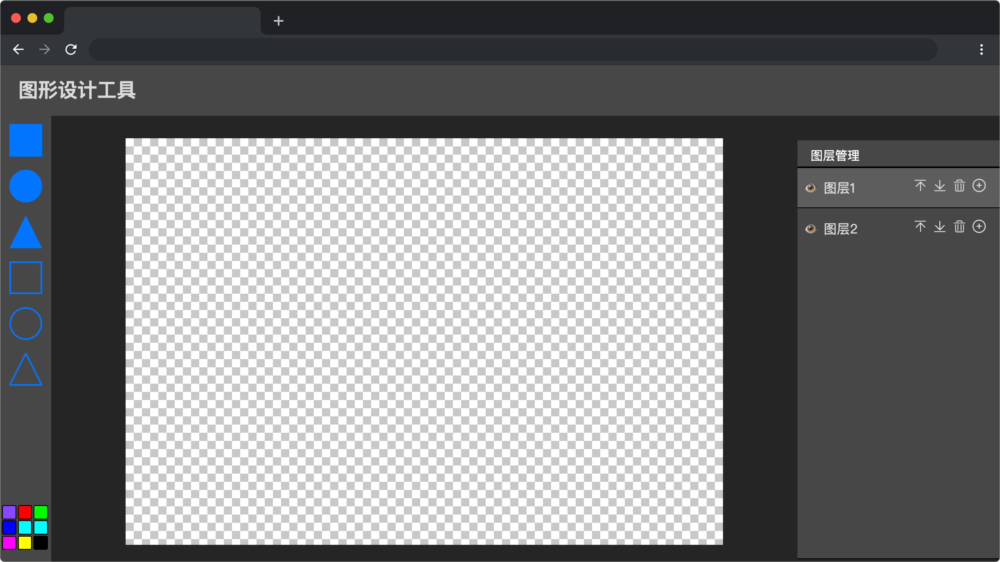

# 图形设计工具

## 介绍

设计一个简单的图层管理器，用于管理页面上的图层。每个图层可以包含不同的元素，并能够通过图层管理器进行添加、删除和调整显示顺序等操作。

## 准备

开始答题前，需要先打开本题的项目代码文件夹，目录结构如下：

```bash
├── css
├── images
├── index.html
├── effect.gif
└── js
    └── index.js
```

其中：

- `css` 是样式文件夹。
- `images` 是图片文件夹
- `effect.gif` 是最终效果图。
- `js/index.js` 是待补充代码的 js 文件。
- `index.html` 是项目主页面。

在浏览器中预览 `index.html` 页面，页面显示如下所示：


  

## 目标

在 `js/index.js` 文件中的 TODO 部分，操作 DOM 实现图形设计工具的功能，目标如下：

**`this.layers` 为图层数组，图层的上下关系按照数组的索引顺序进行排列。即索引 0 为最上面的图层，索引为 1 的元素在 0 下方，依此类推。**

1. 完善 `addLayer(id)` 方法，`this.layers` 图层数组中在匹配函数参数 `id` 的图层上方中添加一个新图层，**单个图层为一个对象，包含的数据如下：**

| 属性    | 类型   | 描述                                                                        |
| ------- | ------ | --------------------------------------------------------------------------- |
| id      | 数字   | 图层的唯一标识符 `id`，使用计数器递增，新图层 id 为已提供变量 `newId`                                       |
| visible | 布尔值 | 图层可见性，图层显示时为 `true`，反之为 `false`，**初始值为 `true`**   |
| name    | 字符串 | 图层名称，格式为固定字符串 `图层` 和 `id` 的拼接，例如 “图层 1“、“图层 2”   |
| active  | 布尔值 | 该图层是否被选中，当图层被选中时为 `true`，只能选中一个图层，**初始值为 `false`** |
| content | 数组   | 数组元素为 `dom` 元素，存储图层中绘制的图形元素 ，初始值为空数组            |

**代码示例如下：**

```js
{ 
  id: 2, 
  visible: true,  
  name: '图层2',   
  active: false,
  content: []
}
```

2. 完善 `removeLayer(id)` 方法，实现在 `this.layers` 图层数组中删除指定 `id` 的图层，当删除时只有一个图层时，则不执行删除操作。 
3. 完善 `moveLayerUp(id)` 方法，实现在 `this.layers` 图层数组中将指定 `id` 的图层上移一层。
4. 完善 `moveLayerDown(id)`方法，实现在 `this.layers` 图层数组中指定 `id` 的图层下移一层。

最终完成效果可参考文件夹下面的 gif 图，图片名称为 `effect.gif`（提示：可以通过 VS Code 或者浏览器预览 gif 图片）。

## 规定

- 请严格按照考试步骤操作，确保本题程序正常运行，切勿修改考试默认提供项目中的文件名称、文件夹路径、class 名、id 名、图片名等，以免造成判题⽆法通过。
- 本题代码完成之后，<b style="color:red">考生需将题目对应代码文件夹压缩成 zip 或 rar 格式后上传提交，其他格式为 0 分。例如 01 代码文件夹，应该在此文件夹基础上直接压缩后，为 01.zip 或 01.rar，然后提交压缩包到对应题目 </b>。请注意不要给压缩包添加密码。

## 判分标准

- 完成目标 1，得 5 分。
- 完成目标 2，得 2 分。
- 完成目标 3 和 4 ，得 3 分。