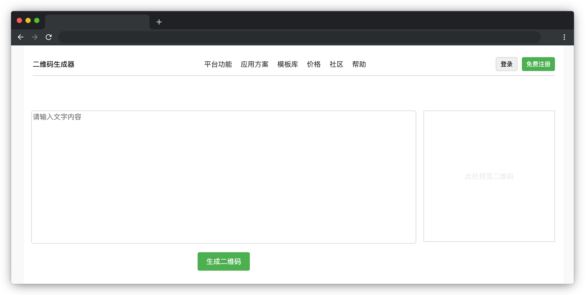

# 二维码生成器

## 介绍

二维码生成器是一种工具，可以将文本内容转换为二维码图像。二维码（QR Code）是一种矩阵条码，可以存储各种类型的信息，如网址、文本、联系方式等。用户只需输入文本内容，点击生成按钮，即可生成对应的二维码。

## 准备

开始答题前，需要先打开本题的项目代码文件夹，目录结构如下：

```bash
├── css
├── index.html
├── effect.gif
└── js
    ├── index.js
    └── qrious.min.js
```

其中：

- `index.html` 是项目主页面。
- `css` 是样式文件夹。
- `js/index.js` 是待补充代码的 js 文件。
- `effect.gif` 是最终效果图。

在浏览器中预览 `index.html` 页面，页面显示如下所示：



## 目标

补充 `js/index.js` 中的 TODO  部分代码，完成以下目标：

1. 在生成二维码之前，需要检查用户输入的文本内容是否为空。如果文本内容为空，则创建一个 `p` 标签和内容输入框（`id="text-input"`）同级，内容为 “请输入文本内容”，文本颜色为 `#ff0000` 。如果文本内容不为空，则移除文本为空时创建的 `p` 标签 **（注意：错误提示的 `p` 标签只能存在一个）**。

2. 根据用户输入的文本长度（`strLength`），设置二维码的大小和二维码外层容器的边框。
- 设置二维码大小（由变量 `qrsize` 决定，数据类型为 `number`）：`strLength*20` 小于等于 `200` 时 `qrsize` 取值为 `200`，`strLength*20` 大于 `200` 小于等于 `300` 时 `qrsize` 取值 `(strLength*20)px`，大于 `300` 时 `qrsize` 取值 `300`。
- 设置二维码外层容器（`class="qrcode-container"`）的宽和高：宽和高（不包含边框）均为 `qrsize`，注意添加单位 `px`，边框设置为大小为 `6px`、线条为实线，颜色根据用户输入的字符串的长度大于 5 为 `#ff69b4`，否则为 `#00bfff`。

## 规定

- 请严格按照考试步骤操作，确保本题程序正常运行，切勿修改考试默认提供项目中的文件名称、文件夹路径、class 名、id 名、图片名等，以免造成判题⽆法通过。
- 本题代码完成之后，<b style="color:red">考生需将题目对应代码文件夹压缩成 zip 或 rar 格式后上传提交，其他格式为 0 分。例如 01 代码文件夹，应该在此文件夹基础上直接压缩后，为 01.zip 或 01.rar，然后提交压缩包到对应题目 </b>。请注意不要给压缩包添加密码。

## 判分标准

- 完成目标 1，得 5 分。
- 完成目标 2，得 5 分。
