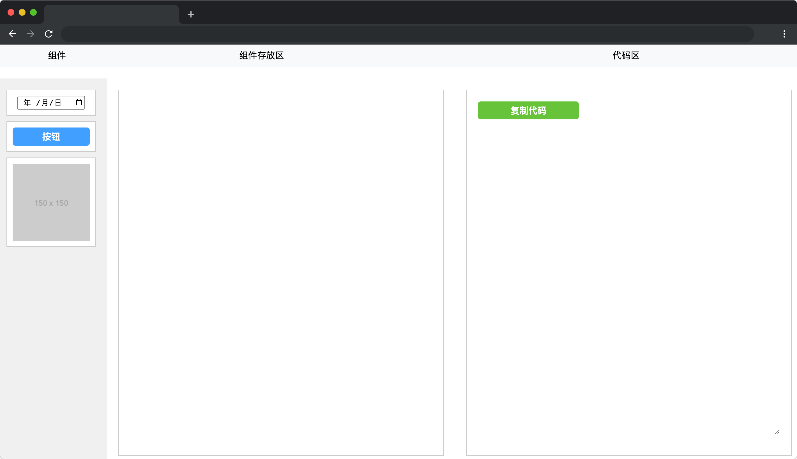

# 代码精灵

## 介绍

代码精灵是一款前端应用程序，可以帮助用户快速生成代码。通过简单的拖拽操作，用户可以选择需要的组件，并在应用程序中进行自定义设置，最后代码精灵将自动为用户生成相应的代码。无需手动编写代码，用户可以轻松地将自己的设计转换为代码，从而节省时间和精力。

## 准备

开始答题前，需要先打开本题的项目代码文件夹，目录结构如下：

```txt
├── css
├── images
├── index.html
├── effect.gif
└── js
    ├── beautify-html.min.js
    └── index.js
```

其中:

- `index.html` 是项目主页面。
- `css` 是样式文件夹。
- `images` 是图片文件夹。
- `effect.gif` 是最终效果图。
- `js/beautify-html.min.js` 是格式化文本域代码的插件。
- `js/index.js` 是待补充代码的 js 文件。

在浏览器中预览 `index.html` 页面，页面显示如下所示：




## 目标

找到 `js/index.js` 中的 `createComponent` 函数，完成其中的 TODO 部分。

根据 `elementType` 的类型（可选值为 `"input"`、`"button"` 和 `"image"`）生成对应的组件，并将组件（DOM 元素）作为函数的返回值返回。

组件 DOM 结构必须如下：

```html
<!--  input 组件 -->
 <div class="lanqiao-ui"><input type="date" placeholder="时间组件" /></div>
<!--  img 组件 -->
 <div class="lanqiao-ui"></div>
<!--  button 组件 -->
 <div class="lanqiao-ui"><button>按钮</button></div>
```
**注意：函数的返回值类型为 HTMLElement。**
 
最终完成效果可参考文件夹下面的 gif 图，图片名称为 `effect.gif`（提示：可以通过 VS Code 或者浏览器预览 gif 图片）。

## 规定

- 请严格按照考试步骤操作，确保本题程序正常运行，切勿修改考试默认提供项目中的文件名称、文件夹路径、class 名、id 名、图片名等，以免造成判题⽆法通过。
- 本题代码完成之后，<b style="color:red">考生需将题目对应代码文件夹压缩成 zip 或 rar 格式后上传提交，其他格式为 0 分。例如 01 代码文件夹，应该在此文件夹基础上直接压缩后，为 01.zip 或 01.rar，然后提交压缩包到对应题目 </b>。请注意不要给压缩包添加密码。

## 判分标准

- 本题完全实现题目目标得满分，否则得 0 分。


