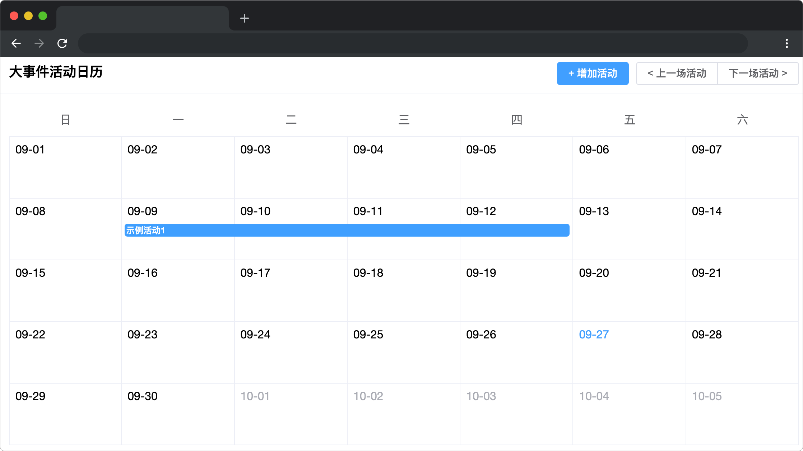

# 大事件活动日历

## 介绍

小蓝是一位商场运营官，每天都要密切关注商场内各种活动的进展。为了更好地管理这些活动，她习惯于将当前和未来的重要事件记录在笔记本上。但随着事务增多，手写笔记变得笨重且难以共享和更新。现在，请你基于 ElementPlus 组件库，为小蓝开发一个日历应用，方便她查看、管理商场的活动日程。该日历应支持快速新增、删除、和更新活动，以帮助小蓝更高效地规划和跟进工作。

## 准备

开始答题前，需要先打开本题的项目代码文件夹，目录结构如下：

```txt
├── css
├── components
├── index.html
├── effect.gif
├── js
|   └── index.js
└── lib
```

其中：

- `css` 是样式文件夹。
- `components` 是组件文件夹。
- `lib` 是项目依赖的文件夹。
- `index.html` 是项目主页面。
- `effect.gif` 是最终效果图。
- `js/index.js` 是待补充代码的 js 文件。

**注意：一定要通过 Live Server 插件启动项目，避免项目无法访问，影响做题。**

在浏览器中预览 `index.html` 页面，页面显示如下所示（日期会根据当前的日历更改，实际运行效果可能与下图日期不同，不影响答题）：



在 `js/index.js` 中，`activities` 代表活动列表，其结构为数组，数组中的每一项包含以下字段：

```js
{
  // 唯一id
  id: 1,
  // 活动名称
  title: '示例活动',
  // 开始时间Date对象
  startTime: new Date()
  // 结束时间Date对象
  endTime: new Date()
},
```

打开 `components/activity-cell.js` 查看 `activity-cell` 组件。该组件用于渲染活动日期单元格，并接收以下 `props`：

| 字段      | 说明                                                                                                                                  | 默认值 |
| --------- | ------------------------------------------------------------------------------------------------------------------------------------- | ------ |
| title     | 活动名称，对应 `activities` 数组项中的 `title` 属性。                                                                             | ""     |
| has-left  | 布尔值类型。左侧是否存在同一场活动的单元格，<br />若为 `false` 则说明当前是左边界，即活动的开始日期，为 true 则表示在活动日期以内。 | false  |
| has-right | 布尔值类型。右侧是否存在同一场活动的单元格，<br />若为 `false` 则说明当前是右边界，即活动的结束日期，为 true 则表示在活动日期以内。 | false  |
| highlight | 布尔值类型。代表当前活动单元格高亮展示 。                                                                                             | false  |

## 目标

完善 `js/index.js` 与 `index.html` 文件中 TODO 部分代码，实现以下目标：

1. 完善 `index.html` 文件的 TODO 部分，使用 `ElementPlus Calendar` 组件的具名插槽 `date-cell` 自定义日历单元格内容。插槽的 `data` 参数包含以下信息：

```js
{
	type: "current-month", // 月份类型：上个月、当前月、下个月
	day: "2024-08-07",      // 日期（格式：yyyy-MM-dd）
	date: "2024-08-07T12:46:37.246Z", // 对应的日期对象
}
```

请根据 `activities` 活动列表，使用 `activity-cell` 组件渲染每个日期单元格。每个单元格可能关联多个活动，渲染规则如下：

- 当某个日期单元格的日期处于某个活动的开始日期和结束日期之间（包含边界）时，渲染一个 `activity-cell` 组件代表该活动。
- 每个 `activity-cell` 需要传递 `title` 属性显示活动名称。
- 每个 `activity-cell` 需要传递 `has-left` 和 `has-right` 属性来控制边界显示：
  - 如果单元格日期是活动的开始日期，`has-left` 传递 `false` 否则传递 `true` 。
  - 如果单元格日期是活动的结束日期，`has-right` 传递 `false`，否则传递 `true` 。

**举例说明**：

给定以下 `activities` 数据（`startTime` 和 `endTime` 数据类型为 `Date` 日期类型）：

```js
[
	{ id: 1, title: '示例活动1', startTime: '2024-08-25', endTime: '2024-08-27' },
	{ id: 2, title: '示例活动2', startTime: '2024-08-26', endTime: '2024-08-27' }
]

```

渲染结果如下：

- 8月25日：渲染一个 `activity-cell` 代表示例活动1。`has-left: false` 表示活动开始日期，`has-right: true` 表示活动尚未结束。
- 8月26日：渲染两个 `activity-cell` 代表示例活动1、示例活动2。示例活动1传递 `has-left: true` ，`has-right: true`。示例活动2传递 `has-left: false`，`has-right: true`。
- 8月27日：渲染两个 `activity-cell` 代表示例活动1、示例活动2。`has-left` 传递 `true`，`has-right` 均传递 `false`（表示活动结束日期）。


2. 完善 `js/index.js` 文件下的 `handleSubmit` 、`openEditModal` 、`handleRemove` 函数与 `index.html` 文件。实现对活动列表 `activities` 的增、删、改功能，具体要求如下：

- 新增活动：点击增加活动按钮 `（class="add-activity"）`后，弹出活动填写表单的弹窗，完成表单值的绑定和输入。用户点击提交按钮 `（class="submit"）`后，新增一场活动，自动生成活动 `id` 作为唯一标识，并更新日历显示。弹窗内表单清空。

`el-form` 组件接受 `model` 属性作为表单数据对象，用于完成表单值的绑定。

`el-input` 组件和 `el-date-picker` 组件接受 `v-model` 属性实现双向绑定，完成表单各项的输入。

**示例：**

```js
<template>
	<el-form :model="form">
		<el-form-item label="Activity name">
		<el-input v-model="form.name" />
		</el-form-item>
	</el-form>
</template>

const form = reactive({ name: 'xxx' })
```

- 修改活动：为每个渲染的 `activity-cell` 组件绑定 `click` 事件。点击某个 `activity-cell` 时，应弹出该活动的填写表单弹窗（表单不需要显示原活动信息），允许用户修改活动名称或时间。点击提交按钮 `（class="submit"）`后，更新活动日程信息，并在日历上反映相应变化。
- 删除活动：当通过点击 `activity-cell` 组件打开表单弹窗，点击删除按钮 `（class="remove"）`后，删除对应的活动日程，并从日历中移除该活动的显示。

3. 完善 `js/index.js` 文件下的 `currentTime` 计算属性（该属性始终返回当前高亮活动的开始时间，格式为 `Date` 对象）、`index.html` 文件，将活动按照时间从早到晚进行排序。请实现活动日程的上下切换功能，并高亮展示当前活动。具体要求如下：

- 高亮显示活动日程：使用 `highlight` 属性对 `activity-cell` 组件进行高亮显示。默认情况下高亮第一个日程。
- 切换到上一场活动：点击上一场活动按钮 `（class="prev-activity"）`时，高亮切换到当前活动日程的上一场活动。
- 切换到下一场活动：用户点击下一场活动按钮 `（class="next-activity"）`时，高亮切换到当前活动日程的下一场活动。
- 注意：如果当前已是第一场或最后一场活动，则不进行任何操作。

最终完成效果可参考文件夹下面的 gif 图，图片名称为 `effect.gif`（提示：可以通过 VS Code 或者浏览器预览 gif 图片）

## 规定

- 请严格按照考试步骤操作，确保本题程序正常运行，切勿修改考试默认提供项目中的文件名称、文件夹路径、class 名、id 名、图片名等，以免造成判题⽆法通过。
- 本题代码完成之后，<b style="color:red"> 考生需将题目对应代码文件夹压缩成 zip 或 rar 格式后上传提交，其他格式为 0 分。例如 01 代码文件夹，应该在此文件夹基础上直接压缩后，为 01.zip 或 01.rar，然后提交压缩包到对应题目</b>。请注意不要给压缩包添加密码。

## 判分标准

- 完成目标 1，得 10 分。
- 完成目标 2，得 10 分。
- 完成目标 3，得 5 分。
