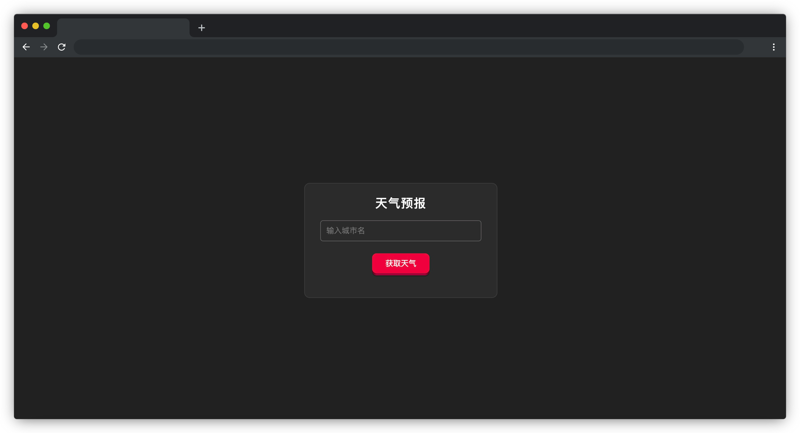

# 天气预报

## 介绍

在一个天气预报应用中，用户可以查询不同城市的天气信息。由于天气数据通常需要从远程服务器获取，频繁请求会导致性能问题。为了解决这个问题，开发团队希望实现一种缓存机制，用于保存已经获取的天气数据，避免重复请求。考虑到内存限制，需要对缓存进行大小控制，当缓存达到限制时，删除最早存入的城市天气数据。

## 准备

开始答题前，需要先打开本题的项目代码文件夹，目录结构如下：

```bash
├── css
├── effect.gif
├── index.html
└── js
    ├── getweather.js
    └── index.js
```

其中：
- `css` 是样式文件夹。
- `effect.gif` 是最终效果图。
- `index.html` 是项目主页面。
- `js/index.js` 和 `js/getweather.js` 是待补代码的 js  文件。


在浏览器中预览 `index.html` 页面，页面显示如下所示：



## 目标

1. 完善 `js/index.js` 文件中的 TODO 部分，实现天气数据的缓存管理。具体如下：

`WeatherCache` 是一个管理天气数据缓存的类，它使用 `JavaScript` 的 `Map` 来存储和管理城市天气信息。该类的主要功能是通过缓存减少重复的 API 请求，并实现缓存大小限制。

类的主要功能：
- 构造函数（`constructor`）：创建一个 Map 对象 `cache`，用于存储天气数据。
- `get(city)` 方法：根据城市名称 `city`，从缓存中获取对应的天气数据。
- `has(city)` 方法：检查缓存中是否存在指定城市的天气数据。

完善 `WeatherCache` 类的功能，补全 `set` 方法。该方法将天气数据存储到缓存中。为了防止缓存无限增长，设置了一个大小限制**（5 个城市）**。当缓存达到限制时，删除最早存入的城市天气数据。当缓存小于 5 个城市时，则直接将天气数据存储到缓存中，无需做其他处理。该方法接收两个参数， `city` 表示天气数据缓存的键，即城市名称；`data` 表示缓存的数据，即该城市的天气信息。

测试用例 : 

- **执行**: 

```
const cache = new WeatherCache();

cache.set('key1', 1);
cache.set('key2', 2);
cache.set('key3', 3);
cache.set('key4', 4);
cache.set('key5', 5);
cache.set('key6', 6);
cache.set('key7', 7);
```

- **预期结果**: 执行以上代码后，`cache` 实例应保持 5 个长度，打印值如下：

```
 {
 'key3' => 3,
 'key4' => 4,
 'key5' => 5,
 'key6' => 6,
 'key7' => 7,
 }
// 由于设置了大小限制，所以当插入 key6 时，key1 就被删除了，再插入 key7 时，key2 就被删除了。
```

2. 在 `js/getweather.js` 文件中的 TODO 部分，补全 `getWeather` 方法，获取天气数据，实现根据用户输入的城市名（`id="cityInput"`）获取其天气数据的功能。该方法使用 `async/await` 进行异步数据请求，根据给定的城市名称发送请求加载对应的天气数据。调用 `displayWeather` 函数（已提供）显示天气信息。如果天气数据已经存在于缓存中，直接从缓存中读取。具体如下：

- 城市输入校验：如果用户未输入城市名（`cityInput`），使用 `showTip` 方法显示提示信息“请输入一个城市名。”（ `showTip` 已提供，可直接使用）。
- 缓存检查：如果缓存中已存在该城市的天气数据，则直接从缓存读取并显示，避免重复请求。天气数据存储在 `weatherCache` 变量中，该变量是 `WeatherCache` 类的实例。
- 天气数据请求：如果缓存中没有该城市的天气数据，则通过调用 `WeatherAPI.fetchWeather` 方法（已提供）获取该城市的天气信息，该方法的参数 `city` 表示城市名称，返回值为一个 `Promise` 对象，`resolve` 会传回该城市的天气数据对象。成功获取数据后，将天气数据存入缓存，以便后续请求使用。
- 页面显示控制：在调用 `WeatherAPI.fetchWeather` 方法请求天气数据时，使用 `showTip` 方法显示“加载中...”，提示用户数据正在获取。如果方法请求失败，使用 `showTip` 方法提示“获取天气数据失败。”以确保用户了解请求状态。

最终完成效果可参考文件夹下面的 gif 图，图片名称为 `effect.gif`（提示：可以通过 VS Code 或者浏览器预览 gif 图片）。

## 规定

- 请严格按照考试步骤操作，确保本题程序正常运行，切勿修改考试默认提供项目中的文件名称、文件夹路径、class 名、id 名、图片名等，以免造成判题⽆法通过。
- 本题代码完成之后，<b style="color:red">考生需将题目对应代码文件夹压缩成 zip 或 rar 格式后上传提交，其他格式为 0 分。例如 01 代码文件夹，应该在此文件夹基础上直接压缩后，为 01.zip 或 01.rar，然后提交压缩包到对应题目 </b>。请注意不要给压缩包添加密码。

## 判分标准

- 完成目标 1，得 10 分。
- 完成目标 2，得 10 分。 
