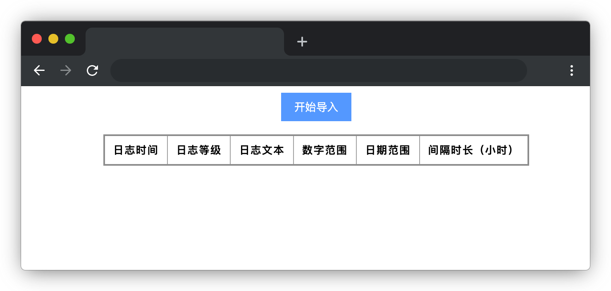

# 批量导入

## 介绍

一台 Web 服务器每天运行时都会产生大量的日志信息，但服务器导出的格式是不易阅读的。为了方便运维人员日常阅读日志，需要一个能够解析原始日志的工具。

本题将实现一个简单的服务器日志解析工具，支持批量导入以二维矩阵形式提供的原始日志信息，并以易于阅读的形式展示在屏幕上。

## 准备

开始答题前，需要先打开本题的项目代码文件夹，目录结构如下：

```bash
├── css
├── data
│   └── log.json
├── index.html
├── js
│   ├── dataConverter.js
│   ├── index.js
│   └── resolveDefine.js
└── lib
```

其中：

- `css` 是样式文件夹。
- `data/log.json` 是日志数据。
- `lib` 是依赖文件夹。
- `index.html` 是项目主页面。
- `js/dataConverter.js` 是矩阵数据转换工具文件。
- `js/resolveDefine.js` 是矩阵数据定义文件。
- `js/index.js` 是待补充代码的 js 文件。

**注意：一定要通过 Live Server 插件启动项目，避免项目无法访问，影响做题。**

在浏览器中预览 `index.html` 页面，页面显示如下所示：



## 目标

找到 `js/index.js` 中的 TODO  部分，完成以下目标： 


1. 点击开始导入后会触发 `fetchData` 方法，在 `fetchData` 方法中，完成 `get` 数据请求，请求地址为常量 `MockUrl`，并将数据中的数组作为 `fetchData` 的返回值。


`fetchData` 获取到的数据结构如下：

```json
 [ 
    [
      1708970776000,
      0,
      "这是一段日志文本详情1",
      2.553,
      3.549,
      1709553910000,
      1709824510000
    ],
    [
      1708970777000,
      1,
      "这是一段日志文本详情2",
      43.7112,
      65.5583,
      1709555910000,
      1709836510123
    ],
    // .... 省略更多数据
  ]
```

2. 完成 `doConvert` 方法中的 TODO 部分，按照 `resolveDefine.js` 已经定义好的 `resolveDefinitionList` 变量显示要求和 `resolveType` 对每个字段的详细定义，将目标1请求到的数据转换为如下**二维数组**的格式。

```js
[
    [
        {
            "type": "LOG_TIME_STAMP",
            "value": "2024-02-27 02:06:16"
        },
        {
            "type": "LOG_LEVEL",
            "value": {
                "text": "INFO",
                "color": "#3176ff"
            }
        },
        {
            "type": "LOG_TEXT",
            "value": "这是一段日志文本详情1"
        },
        {
            "type": "NUMBER_RANGE",
            "value": "2.55 ~ 3.55"
        },
        {
            "type": "DATE_RANGE",
            "value": {
                "startTime": "2024-03-04 20:05",
                "endTime": "2024-03-07 23:15",
                "range": "75"
            }
        }
    ],
    // .... 省略更多数据
]
```

`resolveDefine.js` 中的变量 `resolveDefinitionList`，代表从左至右按解析数据时顺序解析出的字段信息：

``` js
// 数据结构定义列表
const resolveDefinitionList = ['LOG_TIME_STAMP', 'LOG_LEVEL', 'LOG_TEXT', 'NUMBER_RANGE', 'DATE_RANGE']
```

字段如下：

- `LOG_TIME_STAMP`：日志时间戳（精确到毫秒），代表当前日志的记载时间。
- `LOG_LEVEL`：日志等级  0, 1, 2, 3。数字：0 代表 INFO，1 代表 WARNING，2 代表 ERROR，3 代表 FATAL。不同的日志警告等级，在解析完成后需要用不同的颜色区分表示。
- `LOG_TEXT`：日志文本。
- `NUMBER_RANGE`：数字范围。
- `DATE_RANGE`：日期范围。

**注意：在解析日期范围时，会自动计算出日期范围的间隔时长（`DATE_RANGE` 中 `range` 字段），单位：小时**

> 提示：`resolveDefinitionList` 定义的字段信息逐一对应着数据处理后表格的每一列。

`resolveDefine.js` 变量 `resolveType`，代表每个字段定义对应的详情，样例如下，每个字段的含义已在代码中给出：

```js
// 每个定义对应的详情
const resolveType = {
  // 日志时间戳
  'LOG_TIME_STAMP': {
    // 从数据矩阵中步进的单元数
    step: 1, 
    // 注意：日志时间戳显示日期格式固定为 YYYY-MM-DD HH:mm:ss
  },
  //  省略其他代码 ...
  // 数字范围
  'NUMBER_RANGE': {
    // 从数据矩阵中步进的单元数
    step: 2
  },

}
```
`step` 的字段表示在原始数据信息中从当前位置往后读取多少列的内容作为当前字段定义的数据，例如：

- 字段为 `LOG_TIME_STAMP` 对应的 `step` 为 1 则只读取 1 列信息，得到的数据如： `[1709580021199]`。
- 字段为 `NUMBER_RANGE`，对应的 `step` 为 2 则只读取 2 列信息，得到的数据如： `[2.553, 3.549]`。

根据解析到的类型，正确调用 `dataConverter` 中转换工具获取数据。 使用示例如下：

```js
const currentTypeDefineName = 'LOG_TIME_STAMP' // 读取的字段
const convertFn = dataConverter[currentTypeDefineName]; // 根据字段获取调用的函数
const currentTypeDefine = resolveType[currentTypeDefineName]; // 当前字段对应的结构
const resolvedData = convertFn({
  tempData, // 读取到的列数据 如：[1708970776000]
  currentTypeDefine,
});
// resolvedData 即经过转换后的数据结构，是一个由 type 和 value 组成的对象，type 为类型名称，value 为解析出的值（或值的结构）
```

3. 补全 `outputResult` 方法中的 TODO 部分，将上一步骤中转换后的数据渲染到 HTML 表格（`id="result-table"`）中，**注意日志（`style="color: #ff8a31"`）的颜色值是动态显示的**。

```html
<tr>
  <!-- LOG_TIME_STAMP -->
  <th>2024-02-27 02:06:17</th> 
  <!-- LOG_LEVEL  -->
  <td style="color: #ff8a31">WARNING</td>
  <!-- LOG_TEXT -->
  <td>这是一段日志文本详情</td>
  <!-- NUMBER_RANGE -->
  <td>2.33 ~ 3.55</td>
  <!--此处渲染  DATE_RANGE 中的 startTime ~  endTime -->
  <td>2024-03-04 20:05:10 ~ 2024-03-07 23:15:10</td>
  <!-- 此处渲染 DATE_RANGE 中的 range 字段 -->
  <td>75</td> 
</tr>
```
完成后，点击导入按钮，效果如下：


## 规定

- 请勿修改除 `js/index.js` 文件之外的任何内容，以免造成无法判题通过。
- 请严格按照考试步骤操作，确保本题程序正常运行，切勿修改考试默认提供项目中的文件名称、文件夹路径、class 名、id 名、图片名等，以免造成判题⽆法通过。
- 请勿直接输出样例，实际测试用例提供的数据与题目中给出的数据并不完全相同。
- 本题代码完成之后，<b style="color:red">考生需将题目对应代码文件夹压缩成 zip 或 rar 格式后上传提交，其他格式为 0 分。例如 01 代码文件夹，应该在此文件夹基础上直接压缩后，为 01.zip 或 01.rar，然后提交压缩包到对应题目 </b>。请注意不要给压缩包添加密码。

## 判分标准

- 实现目标 1，得 5 分。
- 实现目标 2，得 15 分。
- 实现目标 3，得 5 分。
