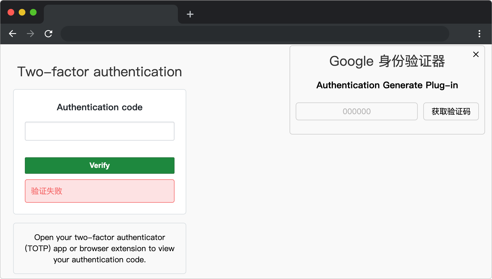

# Github 身份验证

## 介绍

Github 为了加强用户的安全性，对用户的身份验证方式进行了升级，在用户输入用户名与密码验证通过后，需要再次通过验证码进行二次验证，本题将实现 Github 二次验证的功能。

## 准备

开始答题前，需要先打开本题的项目代码文件夹，目录结构如下：

```bash
├── component
│   ├── Authentication.js
│   └── Login.js
├── css
├── effect.gif
├── index.html
├── store
└── lib
```

其中：

- `css` 是样式文件夹。
- `index.html` 是项目主页面。
- `effect.gif` 是最终效果图。
- `lib` 是第三方库文件夹。
- `store` 是数据仓库。
- `component/Authentication.js` 是待补充代码的验证码组件。
- `component/Login.js` 是待补充代码的登录组件。

**注意：一定要通过 Live Server 插件启动项目，避免项目无法访问，影响做题。**

在浏览器中预览 `index.html` 页面，页面显示如下所示：



## 目标

完成 `component/Authentication.js` 与 `component/Login.js` 文件中的 TODO 部分，实现以下目标：

1. 自动生成验证码

在 `component/Authentication.js` 文件完成 `GetCode` 函数 TODO 部分代码，实现随机生成 6 位数字验证码，并将生成后的验证码赋值给 `code` 。

2. 组件传值

将 `component/Authentication.js` 文件中 `GetCode` 函数生成的验证码传递给 `component/Login.js` 文件中的 `providecode` 变量，并在 `component/Login.js` 文件中接收。（提示：lib文件夹下提供了 `pinia` 和 `eventbus.js` ，可以自行选择使用）

3. 验证码验证

在 `component/Login.js` 文件中完成 `verify` 函数 TODO 部分代码，实现当用户输入验证码后，将输入的验证码与 `providecode` 中的验证码进行匹配，如果匹配成功则验证码验证成功，设置变量 `ispass=true`，否则验证码验证失败，设置变量 `ispass=false`。
 
最终完成效果可参考文件夹下面的 gif 图，图片名称为 `effect.gif`（提示：可以通过 VS Code 或者浏览器预览 gif 图片）。

## 规定

- 请严格按照考试步骤操作，确保本题程序正常运行，切勿修改考试默认提供项目中的文件名称、文件夹路径、class 名、id 名、图片名等，以免造成判题⽆法通过。
- 本题代码完成之后，<b style="color:red">考生需将题目对应代码文件夹压缩成 zip 或 rar 格式后上传提交，其他格式为 0 分。例如 01 代码文件夹，应该在此文件夹基础上直接压缩后，为 01.zip 或 01.rar，然后提交压缩包到对应题目 </b>。请注意不要给压缩包添加密码。

## 判分标准

- 完成目标 1，得 5 分。
- 完成目标 1 的基础上完成目标 2，得 10 分。
- 完成目标 2 的基础上完成目标 3，得 5 分。
