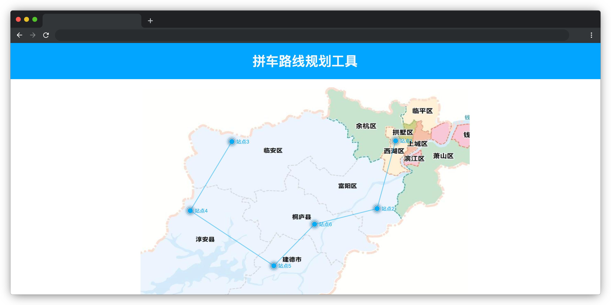

# 拼车路线规划工具

## 介绍

拼车最优路线规划通过智能算法整合多用户的出行需求，通过计算多个乘客的上下车地点，寻找一条最优路径，使总行程时间最短。该应用场景能高效整合资源，减少车辆行驶距离和等待时间，提升出行效率，适用于城市共享出行和物流配送等场景。下面就请你来结合 ECharts 实现这个功能。

## 准备

开始答题前，需要先打开本题的项目代码文件夹，目录结构如下：

```txt
├── images
├── index.html
├── test.html
├── js
│   └── index.js
└── lib
```

其中：

- `js/index.js` 是待补充代码的 js 文件。
- `index.html` 是项目主页面。
- `test.html` 是测试用例页面。
- `lib` 是第三方库文件夹。
- `images` 是图片文件夹。

**注意：一定要通过 Live Server 插件启动项目，避免项目无法访问，影响做题。**

在浏览器中预览 `index.html` 页面，页面显示如下所示：



## 目标

在一个城市中，有 6 个人需要拼车从同一个起点（即：`"站点1"`）出发到不同的目的地。每个人都有自己的下车点，且下车点是唯一的（即每个下车点只有一个人会在那里下车）。请帮司机规划出途径 6 个站点的最短路线，假设理想状态下每个站点之间的直线距离为其行驶距离。

请在提供的 `js/index.js` 文件中的 TODO 部分补全代码，实现以下目标：

1. 完善函数 `findOptimalRoute`，根据它的参数 `points`（即 6 个站点的信息）通过计算每两个站点之间的直线距离（计算函数 `distance` 已经提供，参数为两个站点对象）。最终得到从站点 1 出发途径所有站点的最短路线，并将该路线中所有站点（包括起始站点、途径站点和结束站点）以途径的先后顺序存入数组 `route` 并返回。

其中参数 `points` 的数据结构如下：

```js
[
    { 
      name: '站点1', // 站点名称
      coord: [620, 130] // 站点坐标 [ x, y]
    },
    { name: '站点2', coord: [575, 295] },
    { name: '站点3', coord: [222, 132] }
    // ... 省略更多数据
]
```

返回值 `route` 的数据结构如下：

```js
[
    { 
      name: '站点1', // 站点名称
      coord: [620, 130] // 站点坐标 [ x, y]
    },
    { name: '站点3', coord: [222, 132] },
    { name: '站点2', coord: [575, 295] }
    // ... 省略更多数据
]
```
**完成后目标 1 后运行 `test.html` 查看是否通过测试用例，可以展开和折叠用例进行查看。**

2. 将目标 1 返回的站点数据处理成 ECharts 图表中 `option.series` 属性的路线（`type: 'lines'`）数据，最终的数据结构如下：

```js
[
  {
    "coords":[[520,130],[475,295]] // 两个需要连线的点的坐标
  },
  {"coords":[[475,295],[323,233]]},
  // ... 省略更多数据
]
```

3. 将目标 1 返回的站点数据处理成 ECharts 图表中 `option.series` 属性的节点（`type: "effectScatter"`）数据（注意：节点的先后顺序与站点的数据保持一致不能发生改变），最终的数据结构如下：

```js
[
  {
    "name":"站点1", // 站点名
    "value":[520,130,10] // 站点坐标，[ x, y, 节点大小（固定为 10）]
  },
  {"name":"站点2","value":[475,295,10]},
  // ... 省略更多数据
]
```

最终效果如下：


## 规定

- 请勿修改 `js/index.js` 文件中 TODO 之外的任何内容。
- 请严格按照考试步骤操作，确保本题程序正常运行，切勿修改考试默认提供项目中的文件名称、文件夹路径、class 名、id 名、图片名等，以免造成判题⽆法通过。
- 本题代码完成之后，<b style="color:red">考生需将题目对应代码文件夹压缩成 zip 或 rar 格式后上传提交，其他格式为 0 分。例如 01 代码文件夹，应该在此文件夹基础上直接压缩后，为 01.zip 或 01.rar，然后提交压缩包到对应题目 </b>。请注意不要给压缩包添加密码。

## 判分标准

- 完成目标 1，得 10 分。
- 完成目标 1 的基础上完成目标 2，得 8 分。
- 完成目标 1 的基础上完成目标 3，得 7 分。