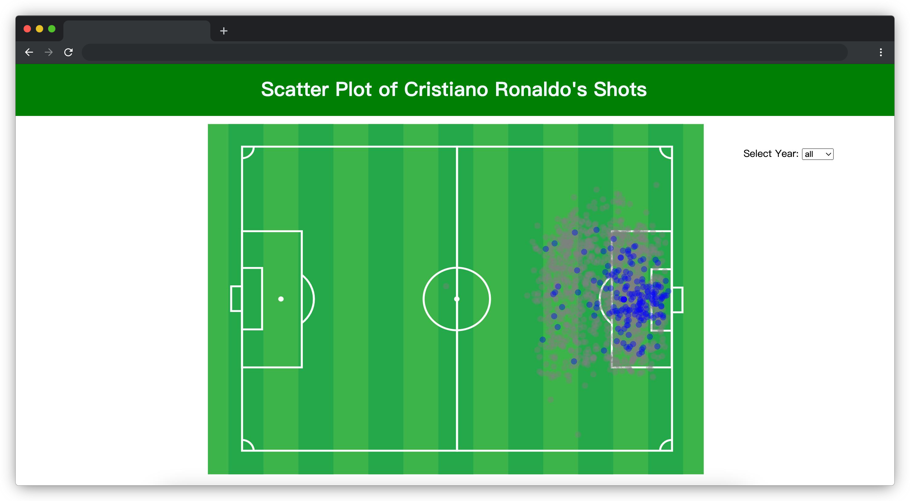

# 欧洲杯顶级球员数据分析

## 介绍

本题我们通过 ECharts 图表深入探讨一位欧洲顶级足球运动员在 2014 年至 2022 年欧洲杯比赛中的射门数据，揭示他在球场上的非凡表现。

## 准备

开始答题前，需要先打开本题的项目代码文件夹，目录结构如下：

```txt
├── images
├── index.html
├── effect.gif
├── js
│   ├── data.json
│   └── index.js
└── lib
```

其中：

- `js/index.js` 是待补充代码的 js 文件。
- `js/data.json` 是待请求的数据文件。
- `index.html` 是项目主页面。
- `lib` 是项目依赖的第三方库文件夹。
- `images` 是图片文件夹。
- `effect.gif` 是最终效果图。

**注意：一定要通过 Live Server 插件启动项目，避免项目无法访问，影响做题。**

在浏览器中预览 `index.html` 页面，页面显示如下所示：



## 目标

请在 `js/index.js` 文件中的 TODO 部分补充代码实现需求，具体需求如下：

1. 使用 `axios` 获取图表总数据（数据来源 `./js/data.json`，请求地址必须使用提供的变量 `MockURL`），并存储在全局变量 `dataList` 中。请求到的数据结构如下：

```js
[
  // 每个对象为一次射门数据
  {
    "id": "32535",
    "minute": "18",
    "result": "SavedShot", // 本次射门是否为得分球：值为 Goal 为得分，其他为失分。
    "X": "0.845", // 本次射门位置的 x 坐标
    "Y": "0.49900001525878906", // 本次射门位置的 y 坐标
    "xG": "0.06659500300884247",
    "player": "Cristiano Ronaldo",
    "h_a": "h",
    "player_id": "2371",
    "situation": "SetPiece",
    "season": "2014", // 本条数据产生的年份
    "shotType": "RightFoot",
    "match_id": "5834",
    "h_team": "Real Madrid",
    "a_team": "Cordoba",
    "h_goals": "2",
    "a_goals": "0",
    "date": "2014-08-25 19:00:00",
    "player_assisted": "Luka Modric",
      "lastAction": "Pass"
  },
  ...
]
```

2. 在 `showData` 函数中补全代码，实现页面加载后默认将**所有年份**中该球员得分和失分球的数据通过 ECharts 散点图的方式展示在页面中。

- 参数 `dataList` 为数组类型，数组中每一个对象表示一次射门数据。
- 参数 `year` 为显示年份，对应一次射门数据的 `season` 字段，如果值为 `all` 代表所有年份。
- 一次射门数据的 `result` 字段值等于 `"Goal"` 代表得分，值不等于 `"Goal"` 代表失分。

注意：需要将得分球和失分球坐标放大 100 倍并分别以蓝色和灰色显示，其中：

- 得分球和失分球坐标为 `data.json` 中获取到的射门对象数据中 `X` 和 `Y` 字段的值。
- 蓝色（即 `option.series` 中元素的 `name` 属性值为 `"Scored"`）的散点代表的是其得分球的坐标。
- 灰色（即 `option.series` 中元素的 `name` 属性值为 `"Missed"`）的散点代表的是其失分球的坐标。

散点坐标数据存储为一个二维数组，格式如下：

```js
[[70,67],[88.5,50],[87.9,50],[74.5,47.4],[86,70.5],[88.5,50]] // [70,67] 为一个点的坐标，即 [ X, Y]
```

最终效果如下所示：


3. 在 `updateData` 函数中补全代码，实现 ECharts 图表数据随着下拉列表框（`id="year"`）的切换而改变。例：当下拉列表切换至 `2021` 年时散点图数据会改变为 `2021` 年该球员射门的所有数据，当切换至 `all` 时，则展示所有年份的射门数据。

最终完成效果可参考文件夹下面的 gif 图，图片名称为 `effect.gif`（提示：可以通过 VS Code 或者浏览器预览 gif 图片）。

## 规定

- 请勿修改 `js/index.js` 文件中 TODO 之外的任何内容。
- 请严格按照考试步骤操作，确保本题程序正常运行，切勿修改考试默认提供项目中的文件名称、文件夹路径、class 名、id 名、图片名等，以免造成判题⽆法通过。
- 本题代码完成之后，<b style="color:red">考生需将题目对应代码文件夹压缩成 zip 或 rar 格式后上传提交，其他格式为 0 分。例如 01 代码文件夹，应该在此文件夹基础上直接压缩后，为 01.zip 或 01.rar，然后提交压缩包到对应题目 </b>。请注意不要给压缩包添加密码。

## 判分标准

- 完成目标 1，得 5 分。
- 完成目标 1 的基础上完成目标 2，得 8 分。
- 完成目标 2 的基础上完成目标 3，得 2 分。