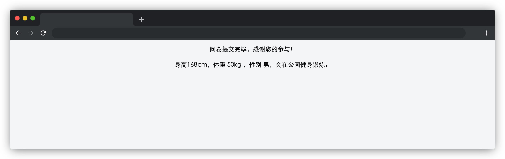

# 健身大调查

## 介绍

表单提交是前端必备的技能之一，下面让我们用学过的表单知识，来完成一个健身调查的问卷。

## 准备

开始答题前，需要先打开本题的项目代码文件夹，目录结构如下：

```text
├── css
│   └── style.css
├── index.html
└── js
    └── index.js
```

其中：

- `index.css` 为样式文件。
- `index.html` 为主页面。
- `index.js` 需要补充的 js 文件。

注意：打开环境后发现缺少项目代码，请手动键入下述命令进行下载：

```bash
wget https://labfile.oss.aliyuncs.com/courses/10591/03.zip&&unzip  03.zip&&rm 03.zip
```

在浏览器中预览 `index.html` 页面效果如下：



## 目标

完成 `js/index.js` 中的 `formSubmit` 函数，用户填写表单信息后，点击蓝色提交按钮，表单项隐藏，页面显示用户提交的表单信息（在 `id` 为 `result` 的元素显示）。信息格式如下：“身高 172cm，体重 60kg，性别男，会在健身房、公园锻炼”。
注意：检测时会模拟表单填写过程，请不要为 `id` 为 `result` 的元素赋固定值。


## 规定

- 请严格按照考试步骤操作，切勿修改考试默认提供项目中的文件名称、文件夹路径等。
- 请勿修改项目中提供的 `id`、`class`、函数名等名称，以免造成无法判题通过。

## 判分标准

- 本题完全实现题目目标得满分，否则得 0 分。
