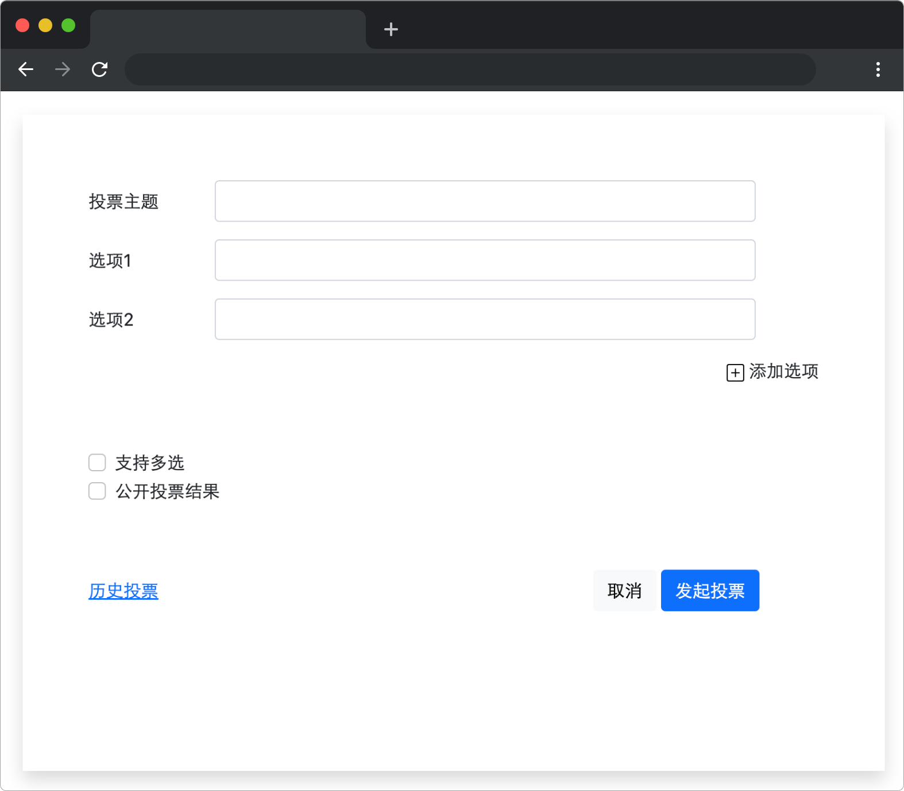
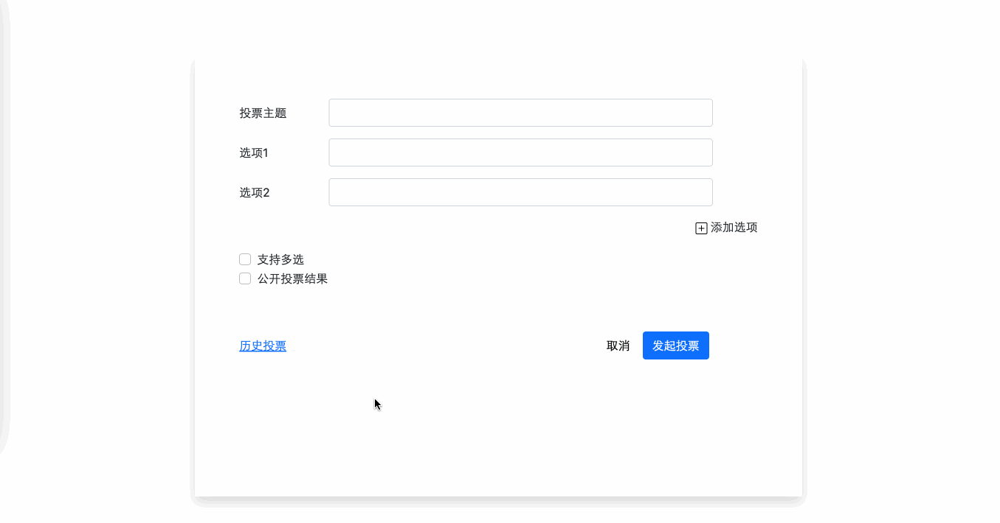

# 宝贵的一票

## 介绍

公司经常举办各种活动，但一到投票环节就犯了难，于是公司决定安排小蓝开发一个投票系统，更好的收集大家的投票信息。为了赶在下一次活动开始前上线，小蓝正在马不停蹄的赶工中，请你也来帮助小蓝完成部分功能吧。

## 准备

本题已经内置了初始代码，打开实验环境，目录结构如下：

```txt
├── css
├── images
├── js
│   └── jquery.min.js
└── index.html
```

其中：

- `index.html` 是主页面。
- `images` 是存放图片的文件夹。
- `css` 是存放样式文件的文件夹。
- `js/jquery.min.js` 是 jQuery 文件。

选中 `index.html` 右键启动 Web Server 服务（Open with Live Server），让项目运行起来。

接着，打开环境右侧的【Web 服务】，就可以在浏览器中看到如下效果：



## 目标

完成 `index.html` 文件中的 TODO 部分。

1. 点击添加选项，页面中新增一个选项。选项前文字按照：选项 1，选项 2，选项 3 ...... 顺序排列，当页面中的选项大于 2 个时，选项后面跟随删除按钮（即 x 图标）。带有删除图标的选项 DOM 结构如下：

```html
<div class="mb-3 row item">
  <label class="col-sm-2 col-form-label txt">选项1</label>
  <div class="col-sm-9">
    <input type="text" class="form-control" />
  </div>
  <div class="col-sm-1">
    <!-- 删除图标 -->
    
  </div>
</div>
```

2. 点击删除按钮，删除当前选项，并且选项前文字按照：选项 1，选项 2，选项 3 ...... 顺序排列，当选项数量小于等于 2 个时，选项后面无删除按钮。

完成后，最终页面效果如下：



## 规定

- 请严格按照考试步骤操作，切勿修改考试默认提供项目中的文件名称、文件夹路径等。
- 满足题目需求后，保持 Web 服务处于可以正常访问状态，点击「提交检测」系统会自动判分

## 判分标准

- 本题完全实现题目目标得满分，否则得 0 分。
