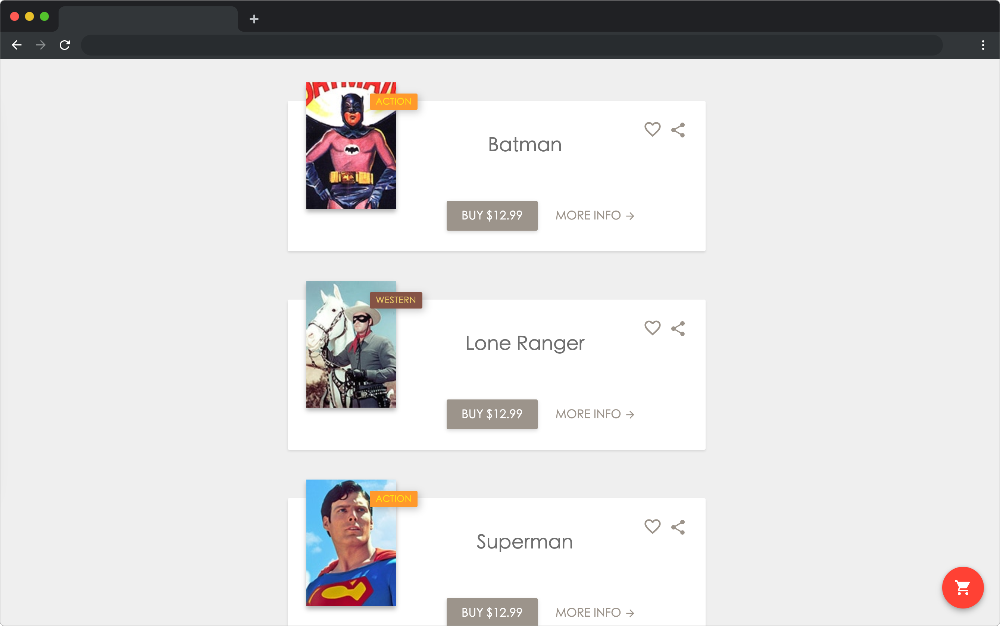
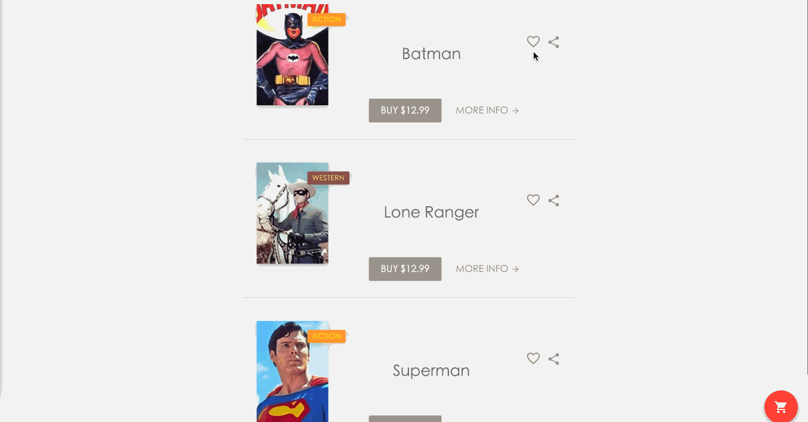

# 大电影

## 介绍

一千个人眼里就有一千个哈姆雷特，小蓝最近痴迷于电影，但无奈学习任务繁重，只好先将电影收藏起来，留着以后观看，但是电影网站的收藏功能居然失效了，请你帮忙修复这个 bug 吧。

## 准备

本题已经内置了初始代码，打开实验环境，目录结构如下：

```txt
├── css
│   └── style.css
├── images
├── index.html
└── js
    └── jquery.min.js
```

其中：

- `index.html` 是主页面。
- `js/jquery.min.js` 是 jQuery 文件。
- `images` 是图片文件夹。
- `css/style.css` 是样式文件。

选中 `index.html` 右键启动 Web Server 服务（Open with Live Server），让项目运行起来。

接着，打开环境右侧的【Web 服务】，就可以在浏览器中看到如下效果：



## 目标

请使用 jQuery 或者 js ，完成 `index.html` 文件中的 TODO 部分。

1. 点击收藏图标，收藏图标在空心（`images/hollow.svg`）和实心 （`images/solid.svg`）中进行切换。
2. 点击收藏图标后，仅在收藏图标为实心图形时，成功提示框（`class=toast__container`）元素显示，**2 秒后**该提示框自动隐藏或者点击提示框上面的关闭按钮（`class=toast__close`）该提示框隐藏。请使用 `display` 属性设置元素的显示隐藏。

完成后，最终页面效果如下：



## 规定

- 请严格按照考试步骤操作，切勿修改考试默认提供项目中的文件名称、文件夹路径等。
- 满足题目需求后，保持 Web 服务处于可以正常访问状态，点击「提交检测」系统会自动判分

## 判分标准

- 本题完全实现题目目标得满分，否则得 0 分。
