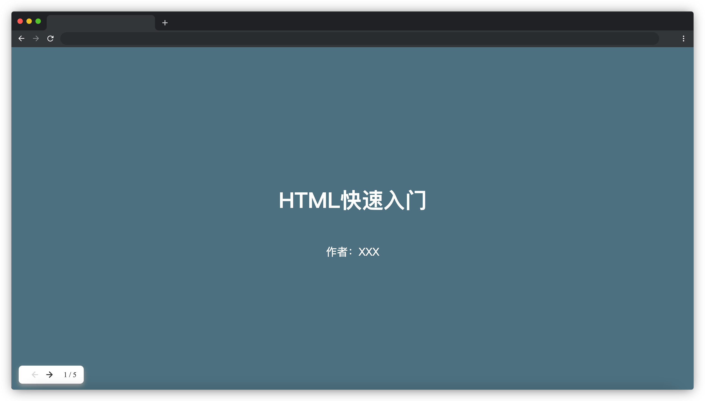
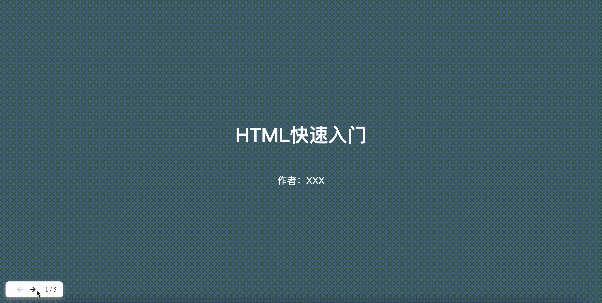

# 网页 PPT

## 介绍

除了使用办公软件来制作 PPT，利用前端技术其实我们也可以制作一个在浏览器播放的 PPT，这样的 PPT 更加方便传播和查看，而且可以最大限度地利用前端技术的布局和交互能力。

本题请实现一个讲授 HTML 基础知识的网页 PPT。

## 准备

开始答题前，需要先打开本题的项目代码文件夹，目录结构如下：

```txt
├── css
│   └── style.css
├── effect.gif
├── images
│   ├── left-small.svg
│   └── right-small.svg
├── index.html
└── js
    ├── index.js
    └── jquery-3.6.0.min.js
```

其中：

- `css/style.css` 是样式文件。
- `index.html` 是主页面。
- `images` 文件夹内包含了页面使用的 icon。
- `js/index.js` 是页面 `js` 文件。
- `js/jquery-3.6.0.min.js` 是 `jquery` 文件。
- `effect.gif` 是页面最终的效果图。

注意：打开环境后发现缺少项目代码，请复制下述命令至命令行进行下载。

```bash
cd /home/project
wget https://labfile.oss.aliyuncs.com/courses/18164/PPT.zip
unzip PPT.zip && rm PPT.zip
```

在浏览器中预览 `index.html` 页面效果如下：



## 目标

请在 `js/index.js` 文件中补全代码，具体需求如下：

1. 补充 `switchPage` 函数，实现根据 `activeIndex` 切换 PPT 页面的功能（切换页面请通过控制 `section` 元素的 `display` 属性实现），切换页面的同时需要改变左下角的页码 `(class="page")`，格式为 `"当前页码 / 总页码"`，注意。
2. 在播放到第一页时给“上一张”按钮 `(class="btn left")` 添加 `disable` 类，并在播放到最后一页时给“下一张”按钮 `(class="btn right")` 添加 `disable` 类，其他情况下则都不添加。页面最终效果如下：


## 规定

- 请严格按照考试步骤操作，切勿修改考试默认提供项目中的文件名称、文件夹路径、class 名、id 名、图片名等，以免造成无法判题通过。

## 判分标准

- 本题完全实现题目目标得满分，否则得 0 分。