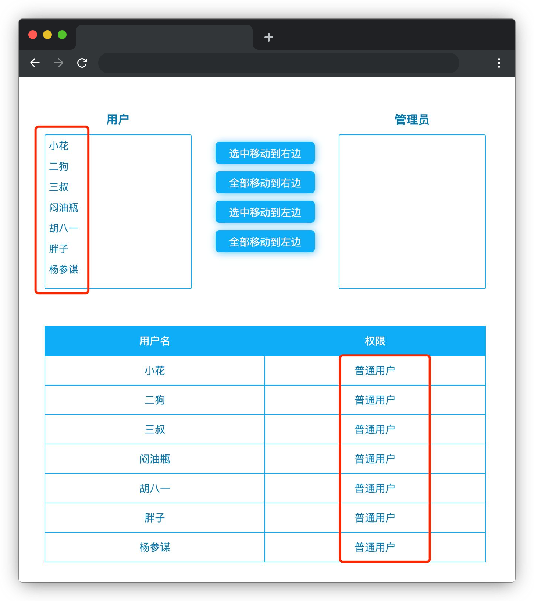

# 权限管理

## 介绍

你有没有想过，在我们日常浏览的网页中，那些新闻或者商品内容是如何被输入到数据库中的呢？大家虽然没有用过，但是肯定听过“后台管理系统”，运营人员就是通过它将批量的商品上传到数据库并呈现在网页中的。那么随便一个人就可以通过该管理系统操作这些商品数据吗？当然不行，这就涉及到了权限管理问题。

本题需要在已提供的基础项目中使用 JS/jQuery 知识完善代码，最终实现权限管理的功能。

## 准备

开始答题前，需要先打开本题的项目代码文件夹，目录结构如下：

```txt
├── effect.gif
├── index.html
├── css
└── js
    ├── index.js
    ├── jquery-3.6.0.min.js
    └── userList.json
```

其中：

- `effect.gif` 是最终实现的效果图。
- `index.html` 是主页面。
- `css` 是样式文件夹。
- `js/index.js` 是需要补充代码的 js 文件。
- `js/jquery-3.6.0.min.js` 是 jQuery 文件。
- `js/userList.json` 是需要请求的数据文件。

注意：打开环境后发现缺少项目代码，请手动键入下述命令进行下载：

```bash
cd /home/project
wget https://labfile.oss.aliyuncs.com/courses/9788/06.zip && unzip 06.zip && rm 06.zip
```

在浏览器中预览 `index.html` 页面，显示如下所示：



## 目标

请在 `js/index.js` 文件中补全代码，最终实现**管理用户权限**的功能。

具体需求如下：

1. 实现**异步数据读取和渲染**功能。

- 使用 ajax 异步获取 `./js/userList.json` 中的用户数据，并以正确的方式显示在页面下的用户权限表格中（注意：调试完成后请将请求地址写死为 `./js/userList.json`）。
- 页面初始化时，左边用户列表显示 7 个用户（**页面数据和结构不能随意篡改**），右边的管理员列表无选项。效果如下：


2. 实现**左/右单个、多个或全部互移**功能。

- 选中任意一个或多个（按 Ctrl 键可多选）左/右边**用户/管理员**列表中的用户，并点击**选中移动到右/左边**按钮，即可将选中的用户/管理员移动至另一边的**管理员/用户**列表中。效果如下：


- 点击**全部移动到右/左边**按钮，则将左/右边**用户/管理员**列表中的用户**全部移动**到右/左边的**管理员/用户**列表中（即：左/右边列表被清空）。效果如下：


3. 实现**用户权限表格中的权限，随用户移动发生变化**功能。

- 页面下的**用户权限表格**中所有用户的权限，会根据页面上方所处列表不同发生相应改变，即**管理员**列表中的用户权限为**管理员**，用户列表中的用户权限为**普通用户**。

完成后的效果见文件夹下面的 gif 图，图片名称为 `effect.gif`（提示：可以通过 VS Code 或者浏览器预览 gif 图片）。

## 规定

- 请勿修改 `js/index.js` 文件外的任何内容。
- 请严格按照上述要求来完成代码，页面中需要显示的文本内容，与具体说明里的内容保持一致，不要自定义，以免造成无法判题通过。
- 请严格按照考试步骤操作，切勿修改考试默认提供项目中的文件名称、文件夹路径、class 名、id 名、图片名等，以免造成无法判题通过。

## 判分标准

- 实现异步数据读取和渲染功能，得 5 分。
- 实现左/右单个、多个或全部互移功能，得 6 分。
- 实现用户权限表格中权限变化功能，得 4 分。
