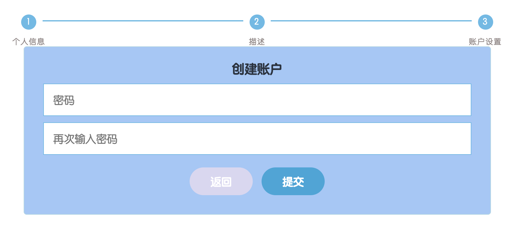

# 请到下一步

## 介绍

我们注册一个账号，经常会用到步骤条填写资料，本题需要使用 jQuery 去实现步骤条表单的切换。

## 准备

开始答题前，需要先打开本题的项目代码文件夹，目录结构如下：

```txt
├── css
│   └── style.css
├── js
│   ├── index.js
│   └── jquery-3.6.0.min.js
├── effect.gif
└── index.html
```

其中：

- `css/style.css` 是样式文件。
- `js/index.js` 是实现步骤条表单切换的 js 文件。
- `js/jquery-3.6.0.min.js` 是 jQuery 文件。
- `effect.gif` 是最终实现的效果图。
- `index.html` 是主页面。

注意：打开环境后发现缺少项目代码，请手动键入下述命令进行下载：

```bash
cd /home/project
wget https://labfile.oss.aliyuncs.com/courses/10591/05.zip && unzip 05.zip && rm 05.zip
```

在浏览器中预览 `index.html` 页面，当前点击下一页的按钮，不会切换到第二页表单，效果显示如下所示：



## 目标

请补充 `js/index.js` 文件中的代码，实现点击按钮页面上的表单可以切换（表单的切换操作，只能使用 `display` 属性来控制）：

在步骤一点击下一页按钮，会切换到步骤二的表单，页面显示如下：


在步骤二点击返回按钮，会切换到步骤一的表单，页面显示如下：


在步骤二点击下一页按钮，会切换到步骤三的表单，页面显示如下：


完成后的效果见文件夹下面的 gif 图，图片名称为 `effect.gif`（提示：可以通过 VS Code 或者浏览器预览 gif 图片）。

具体说明如下：

- 在 `index.html` 文件中，`<form>` 标签里是整个表单的内容，整个表单被分为三个表单域，对应着三个步骤条上的表单。
- 在 `index.html` 文件中，`<ul>` 实现了步骤条的布局，每对 `<li>` 代表一个步骤，默认第一个步骤条（个人信息）被激活（`class="active"`），也就是具有 `.active` 的样式属性。
- 在 `css/style.css` 文件中，对表单和步骤条的样式进行了设置，使用 `:not` 选择器和 `display:none` 实现了分步骤表单的显示/隐藏效果。

## 规定

- 请勿修改 `index.html`、`css/style.css`、`jquery-3.6.0.min.js` 文件中的任何内容。
- 表单的切换操作，只能使用 `display` 属性来控制。
- 请严格按照考试要求来做题，切勿修改考试默认提供项目中的文件名称、文件夹路径等，以免造成无法判题通过。

## 判分标准

- 本题完全实现题目目标得满分，否则得 0 分。
